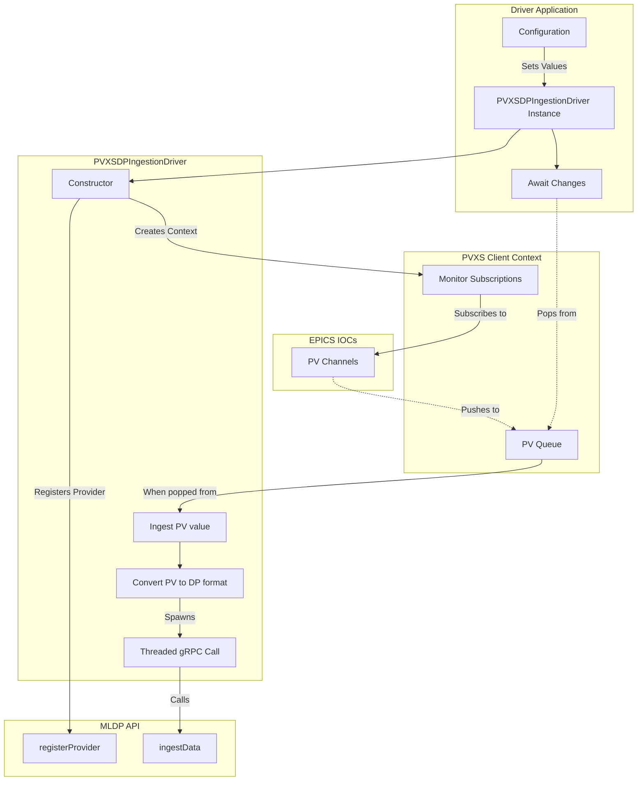

# MLDP PVXS Driver

This driver integrates PVXS-exposed EPICS process variables with the SLAC MLDP ingestion API (see [MLDP](https://github.com/osprey-dcs/dp-service.git)), translating PV updates into MLDP payloads and forwarding them over gRPC so downstream analysis pipelines receive timely ML measurements while remaining compatible with other data sources.


## Configuration

When using the driver program, a YAML config file is necessary to set required settings. It should be passed as the
first argument to the program.

It must be structured as follows:

```yml
provider_name: Provider Name
server_address: address:port
credentials:
  pem_cert_chain: filepath
  pem_root_certs: filepath
  pem_private_key: filepath
monitor_pvs:
  - namespace:pv
  - namespace:pv2
```

The `provider_name`, `server_address` and `monitor_pvs` fields are required. The `credentials` field is optional and is
either a string storing `'none'` or `'ssl'`, or a map containing gRPC's SSL settings, all of which are optional
overrides to the default gRPC SSL settings.

## Architecture

This project uses a pipeline-style architecture: PVXS clients feed PV updates into a bounded work queue; the core driver converts and enriches events and dispatches them to the MLDP ingestion service using a connection pool of gRPC channels; reader implementations consume and re-publish or transform events as needed. See the detailed diagram and design notes in [docs/architecture.md](docs/architecture.md).



For developer information and contribution guidelines see [CONTRIBUTING.md](CONTRIBUTING.md).
