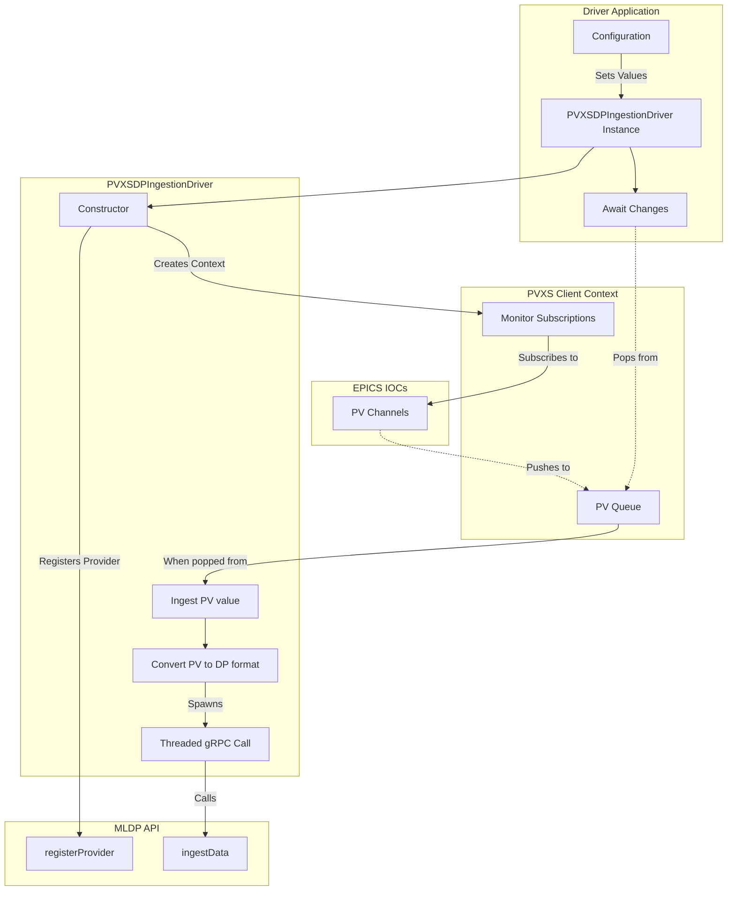

# MLDP PVXS Driver

## Building

`PROTO_PATH` and `PVXS_BASE` are required to either be set as environment variables or passed to the CMake configuration
step. The former should be the path to the parent directory of MLDP's protobuf definitions. The latter should be the
directory containing the pvxs library.

EPICS Base and pvxs are expected to be available in the development container under `/opt/local/lib/linux-<arch>`, but
can be overridden explicitly at configure time:

```
cmake -S . -B build \
  -DPROTO_PATH=/workspace/protos \
  -DEPICS_BASE=/opt/local \
  -DEPICS_HOST_ARCH=linux-aarch64 \
  -DPVXS_BASE=/opt/local   # or /opt/pvxs if you only built pvxs without installing
cmake --build build
```

## Debugging

When debugging inside the dev container, the LLVM `lldb-dap` adapter from the bundled extension needs an explicit path.
Set **LLDB DAP › Executable: Path** in VS Code to `/usr/bin/lldb-dap-18` (Preferences → Settings → Extensions → LLDB DAP).
Alternatively, add the following to `.vscode/settings.json` within this repository:

```jsonc
{
  "lldb.executable": "/usr/bin/lldb-dap-18"
}
```

To make this automatic for everyone using the dev container, you can bake the setting into `.devcontainer/devcontainer.json`:

```jsonc
{
  "customizations": {
    "vscode": {
      "settings": {
        "lldb.executable": "/usr/bin/lldb-dap-18"
      }
    }
  }
}
```

Rebuild the dev container after changing the configuration so the setting is applied on startup.

## Configuration

When using the driver program, a YAML config file is necessary to set required settings. It should be passed as the
first argument to the program.

It must be structured as follows:

```yml
provider_name: Provider Name
server_address: address:port
credentials:
  pem_cert_chain: filepath
  pem_root_certs: filepath
  pem_private_key: filepath
monitor_pvs:
  - namespace:pv
  - namespace:pv2
```

The `provider_name`, `server_address` and `monitor_pvs` fields are required. The `credentials` field is optional and is
either a string storing `'none'` or `'ssl'`, or a map containing gRPC's SSL settings, all of which are optional
overrides to the default gRPC SSL settings.

## Architecture


