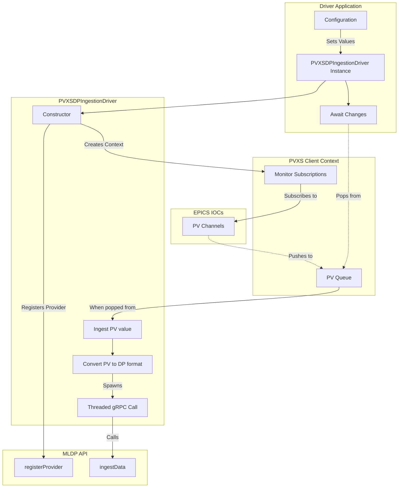

# MLDP PVXS Driver

This driver integrates PVXS-exposed EPICS process variables with the SLAC MLDP ingestion API (see [MLDP](https://github.com/osprey-dcs/dp-service.git)), translating PV updates into MLDP payloads and forwarding them over gRPC so downstream analysis pipelines receive timely ML measurements while remaining compatible with other data sources.


## Configuration

When running the controller/CLI orchestrator, the full config is a single YAML document. Every block shown is required
unless marked optional.

```yaml
controller_thread_pool: 2

mldp_pool:
  provider_name: pvxs_provider
  provider_description: "PVXS aggregate provider"   # optional
  url: https://ingest.example:443
  min_conn: 1
  max_conn: 4
  credentials: # optional
    pem_cert_chain: /etc/certs/client.crt
    pem_private_key: /etc/certs/client.key
    pem_root_certs: /etc/certs/ca.crt

reader:
  - epics:
      - name: epics_reader_a
        pvs:
          - name: pv1
            option: chan://one          # optional PVXS option string
          - name: pv2
      - name: epics_reader_b
        pvs:
          - name: pv3

metrics:                                 # optional; omit to disable Prometheus endpoint
  endpoint: 0.0.0.0:9464
```

`mldp_pool` values mirror the driver’s `provider_name` and target URL but add connection-pool sizing. Readers are defined
as sequences under `reader[].epics`, each with a `name` and an optional `pvs` list; if `pvs` is omitted, the reader will
start without predefined channels.

## Architecture

This project uses a pipeline-style architecture: PVXS clients feed PV updates into a bounded work queue; the core driver converts and enriches events and dispatches them to the MLDP ingestion service using a connection pool of gRPC channels; reader implementations consume and re-publish or transform events as needed. See the detailed diagram and design notes in [docs/architecture.md](docs/architecture.md).



For developer information and contribution guidelines see [CONTRIBUTING.md](CONTRIBUTING.md).
