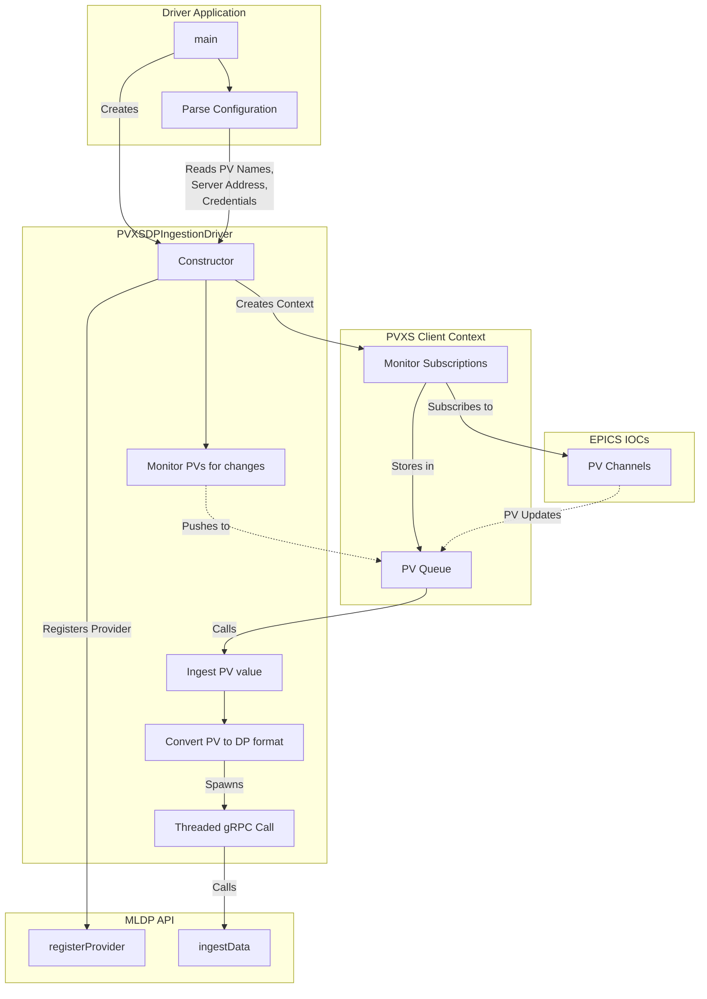

# MLDP PVXS Driver

## Architecture

## Building

`PROTO_PATH` and `PVXS_BASE` are required to either be set as environment variables or passed to the CMake configuration
step. The former should be the path to the parent directory of MLDP's protobuf definitions. The latter should be the
directory containing the pvxs library.
