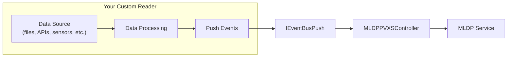

# Implementing Custom Readers

This guide explains how to implement a custom reader for the MLDP PVXS Driver. Readers are the data ingestion components that connect to various data sources and push events to the MLDP ingestion pipeline.

## Overview

The driver uses an **abstract Reader pattern** with a factory-based registration system. This allows new data sources to be added without modifying the core ingestion pipeline.



## Reader Interface

All readers must inherit from the `Reader` base class and implement the required interface.

### Base Class

```cpp
// include/reader/Reader.h
class Reader {
public:
    Reader(std::shared_ptr<util::bus::IEventBusPush> bus,
           std::shared_ptr<metrics::Metrics> metrics = nullptr);

    virtual ~Reader() = default;

    // Return a human-readable identifier for this reader instance
    virtual std::string name() const = 0;

protected:
    std::shared_ptr<util::bus::IEventBusPush> bus_;     // Event bus for pushing data
    std::shared_ptr<metrics::Metrics> metrics_;          // Optional metrics collector
};
```

### Event Bus API

Readers push data using the `IEventBusPush` interface:

```cpp
// Create an event value with timestamp
auto event = IEventBusPush::MakeEventValue(epoch_seconds, nanoseconds);

// Set the data value (protobuf)
event->data_value.set_double_value(42.0);  // or other types

// Create a batch and push
IEventBusPush::EventBatch batch;
batch.root_source = "my_source";
batch.values["signal_name"].push_back(event);

bus_->push(std::move(batch));
```

## Step-by-Step Implementation

### Step 1: Create the Header File

Create `include/reader/impl/<category>/<Name>Reader.h`:

```cpp
#pragma once

#include <reader/Reader.h>
#include <reader/ReaderFactory.h>
#include <config/Config.h>

#include <atomic>
#include <thread>
#include <string>
#include <vector>

namespace mldp_pvxs_driver::reader::impl::<category> {

class <Name>Reader : public Reader {
public:
    <Name>Reader(
        std::shared_ptr<util::bus::IEventBusPush> bus,
        std::shared_ptr<metrics::Metrics> metrics,
        const config::Config& cfg);

    ~<Name>Reader() override;

    std::string name() const override;

    // Start reading data
    void start();

    // Stop reading data
    void stop();

private:
    std::string name_;
    std::atomic<bool> running_{false};
    std::thread worker_thread_;

    // Reader-specific configuration
    // ...

    void workerLoop();
    void processData(/* your data type */);
};

// Register with the factory
REGISTER_READER("<type-name>", <Name>Reader)

} // namespace
```

### Step 2: Implement the Reader

Create `src/reader/impl/<category>/<Name>Reader.cpp`:

```cpp
#include <reader/impl/<category>/<Name>Reader.h>
#include <spdlog/spdlog.h>

namespace mldp_pvxs_driver::reader::impl::<category> {

<Name>Reader::<Name>Reader(
    std::shared_ptr<util::bus::IEventBusPush> bus,
    std::shared_ptr<metrics::Metrics> metrics,
    const config::Config& cfg)
    : Reader(std::move(bus), std::move(metrics))
{
    // Parse configuration
    name_ = cfg.get<std::string>("name").value_or("unnamed");

    // Initialize your data source connection
    // ...

    spdlog::info("[{}] Reader initialized", name_);
}

<Name>Reader::~<Name>Reader() {
    stop();
}

std::string <Name>Reader::name() const {
    return name_;
}

void <Name>Reader::start() {
    if (running_.exchange(true)) {
        return;  // Already running
    }

    worker_thread_ = std::thread([this] { workerLoop(); });
    spdlog::info("[{}] Reader started", name_);
}

void <Name>Reader::stop() {
    if (!running_.exchange(false)) {
        return;  // Already stopped
    }

    if (worker_thread_.joinable()) {
        worker_thread_.join();
    }
    spdlog::info("[{}] Reader stopped", name_);
}

void <Name>Reader::workerLoop() {
    while (running_) {
        // Read data from your source
        // Process and push to bus
        // Handle errors gracefully
    }
}

void <Name>Reader::processData(/* your data */) {
    // Convert to EventBatch and push
    IEventBusPush::EventBatch batch;
    batch.root_source = name_;

    auto event = IEventBusPush::MakeEventValue(
        /* epoch_seconds */,
        /* nanoseconds */
    );

    // Set the appropriate data type
    event->data_value.set_double_value(/* value */);

    batch.values["signal_name"].push_back(event);

    if (!bus_->push(std::move(batch))) {
        spdlog::warn("[{}] Failed to push event batch", name_);
    }
}

} // namespace
```

### Step 3: Update CMakeLists.txt

Add your source files to the library target in `CMakeLists.txt`:

```cmake
target_sources(mldp_pvxs_driver_lib PRIVATE
    # ... existing sources ...
    src/reader/impl/<category>/<Name>Reader.cpp
)
```

### Step 4: Configure via YAML

```yaml
reader:
  - <type-name>:
      - name: my_reader_instance
        # Your reader-specific configuration
        option1: value1
        option2: value2
```

## Complete Example: Simple Counter Reader

Here's a complete example of a simple reader that generates incrementing counter values at a configurable interval.

### Header: `include/reader/impl/test/CounterReader.h`

```cpp
#pragma once

#include <reader/Reader.h>
#include <reader/ReaderFactory.h>
#include <config/Config.h>

#include <atomic>
#include <chrono>
#include <string>
#include <thread>

namespace mldp_pvxs_driver::reader::impl::test {

/**
 * @brief A simple test reader that generates incrementing counter values.
 *
 * Useful for testing the ingestion pipeline without external dependencies.
 */
class CounterReader : public Reader {
public:
    CounterReader(
        std::shared_ptr<util::bus::IEventBusPush> bus,
        std::shared_ptr<metrics::Metrics> metrics,
        const config::Config& cfg);

    ~CounterReader() override;

    std::string name() const override;
    void start();
    void stop();

private:
    std::string name_;
    std::string source_name_;
    std::chrono::milliseconds interval_;

    std::atomic<bool> running_{false};
    std::atomic<uint64_t> counter_{0};
    std::thread worker_thread_;

    void workerLoop();
    void pushCounterValue(uint64_t value);
};

// Register as "counter" reader type
REGISTER_READER("counter", CounterReader)

} // namespace mldp_pvxs_driver::reader::impl::test
```

### Implementation: `src/reader/impl/test/CounterReader.cpp`

```cpp
#include <reader/impl/test/CounterReader.h>
#include <spdlog/spdlog.h>

namespace mldp_pvxs_driver::reader::impl::test {

CounterReader::CounterReader(
    std::shared_ptr<util::bus::IEventBusPush> bus,
    std::shared_ptr<metrics::Metrics> metrics,
    const config::Config& cfg)
    : Reader(std::move(bus), std::move(metrics))
{
    // Parse configuration with defaults
    name_ = cfg.get<std::string>("name").value_or("counter_reader");
    source_name_ = cfg.get<std::string>("source_name").value_or("counter");

    auto interval_ms = cfg.get<int>("interval_ms").value_or(1000);
    interval_ = std::chrono::milliseconds(interval_ms);

    auto start_value = cfg.get<uint64_t>("start_value").value_or(0);
    counter_.store(start_value);

    spdlog::info("[{}] CounterReader initialized: source={}, interval={}ms, start={}",
                 name_, source_name_, interval_ms, start_value);
}

CounterReader::~CounterReader() {
    stop();
}

std::string CounterReader::name() const {
    return name_;
}

void CounterReader::start() {
    if (running_.exchange(true)) {
        spdlog::warn("[{}] Already running", name_);
        return;
    }

    worker_thread_ = std::thread([this] { workerLoop(); });
    spdlog::info("[{}] Started", name_);
}

void CounterReader::stop() {
    if (!running_.exchange(false)) {
        return;
    }

    if (worker_thread_.joinable()) {
        worker_thread_.join();
    }
    spdlog::info("[{}] Stopped", name_);
}

void CounterReader::workerLoop() {
    while (running_) {
        auto now = std::chrono::system_clock::now();
        auto epoch = now.time_since_epoch();

        uint64_t value = counter_.fetch_add(1);
        pushCounterValue(value);

        // Sleep until next interval
        std::this_thread::sleep_for(interval_);
    }
}

void CounterReader::pushCounterValue(uint64_t value) {
    // Get current timestamp
    auto now = std::chrono::system_clock::now();
    auto epoch = now.time_since_epoch();
    auto seconds = std::chrono::duration_cast<std::chrono::seconds>(epoch);
    auto nanos = std::chrono::duration_cast<std::chrono::nanoseconds>(epoch - seconds);

    // Create event with timestamp
    auto event = util::bus::IEventBusPush::MakeEventValue(
        static_cast<uint64_t>(seconds.count()),
        static_cast<uint64_t>(nanos.count())
    );

    // Set the counter value as uint64
    event->data_value.set_ulong_value(value);

    // Create batch and push
    util::bus::IEventBusPush::EventBatch batch;
    batch.root_source = name_;
    batch.values[source_name_].push_back(event);

    if (!bus_->push(std::move(batch))) {
        spdlog::warn("[{}] Failed to push counter value {}", name_, value);
    } else {
        spdlog::trace("[{}] Pushed counter value {}", name_, value);
    }
}

} // namespace mldp_pvxs_driver::reader::impl::test
```

### Configuration Example

```yaml
reader:
  - counter:
      - name: test_counter
        source_name: test:counter:value
        interval_ms: 500
        start_value: 100
```

## Data Types

The `DataValue` protobuf message supports various data types:

| Type | Setter Method | Use Case |
|------|---------------|----------|
| `double` | `set_double_value()` | Floating-point measurements |
| `float` | `set_float_value()` | Single-precision floats |
| `int32` | `set_int_value()` | Signed integers |
| `int64` | `set_long_value()` | Large signed integers |
| `uint32` | `set_uint_value()` | Unsigned integers |
| `uint64` | `set_ulong_value()` | Large unsigned integers |
| `string` | `set_string_value()` | Text data |
| `bytes` | `set_bytes_value()` | Binary data |
| `bool` | `set_bool_value()` | Boolean flags |

For array types, use the corresponding `mutable_*_array()` methods.

## Best Practices

### Thread Safety

- Use `std::atomic` for flags shared between threads
- Protect shared data structures with mutexes
- Consider using thread pools for parallel processing (see `BS::light_thread_pool`)

### Error Handling

- Handle connection failures gracefully with retries
- Log errors with appropriate severity levels
- Don't let exceptions propagate from worker threads

### Performance

- Batch multiple events before pushing when possible
- Use move semantics to avoid unnecessary copies
- Consider the trade-off between latency and throughput

### Metrics

- Expose Prometheus metrics for observability
- Track events received, processed, and errors
- Monitor queue depths and processing times

```cpp
// Example metrics integration
if (metrics_) {
    metrics_->incrementCounter("reader_events_total", {{"reader", name_}});
    metrics_->observeHistogram("reader_processing_time_ms",
                                {{"reader", name_}},
                                processing_time_ms);
}
```

### Configuration

- Use sensible defaults for all configuration options
- Validate configuration at construction time
- Document all configuration options

### Lifecycle

- Initialize resources in the constructor
- Start background threads in `start()`
- Clean up resources in `stop()` and destructor
- Make `start()` and `stop()` idempotent

## Testing

Create unit tests for your reader in `test/reader/impl/<category>/<Name>ReaderTest.cpp`:

```cpp
#include <gtest/gtest.h>
#include <reader/impl/<category>/<Name>Reader.h>
#include <gmock/gmock.h>

// Mock event bus for testing
class MockEventBus : public mldp_pvxs_driver::util::bus::IEventBusPush {
public:
    MOCK_METHOD(bool, push, (EventBatch batch), (override));
};

TEST(<Name>ReaderTest, PushesEventsCorrectly) {
    auto mock_bus = std::make_shared<MockEventBus>();

    EXPECT_CALL(*mock_bus, push(testing::_))
        .WillOnce(testing::Return(true));

    // Create and test your reader
    // ...
}
```

## Related Documentation

- [Architecture Overview](architecture.md) - System architecture and data flow
- [Reader Types](readers.md) - Existing reader implementations and comparison
