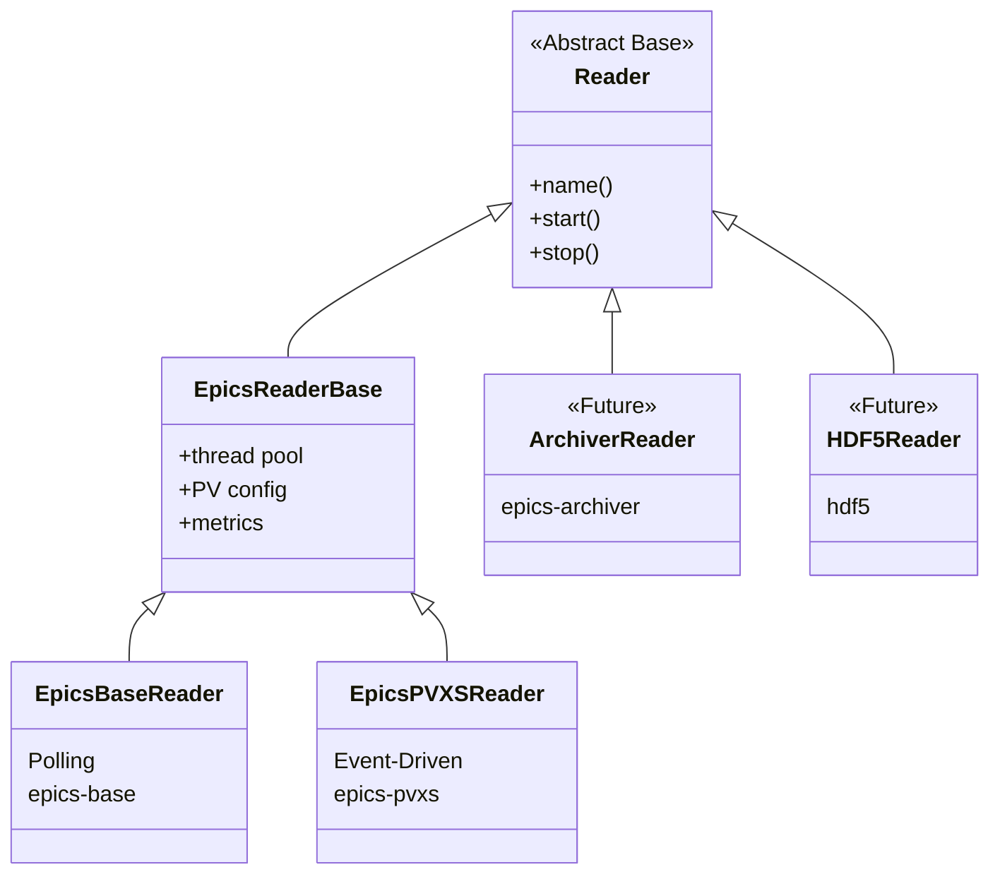
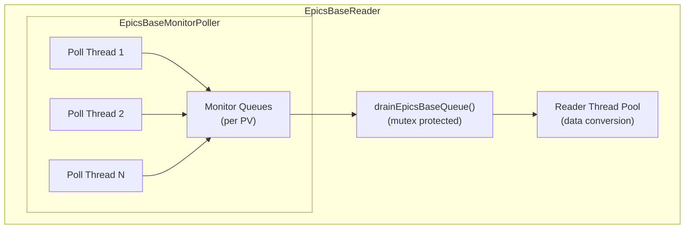
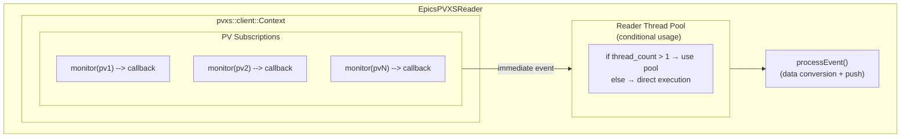

# Reader Implementations

The MLDP PVXS Driver uses an **abstract Reader pattern** to support multiple data sources. The architecture is designed to be extensible, allowing new reader types to be added without modifying the core ingestion pipeline.

> **Related:** [Architecture Overview](architecture.md) | [Implementing Custom Readers](readers-implementation.md)

## Supported and Future Reader Types

| Reader Type | Status | Data Source | Description |
|-------------|--------|-------------|-------------|
| `epics-base` | Implemented | EPICS Control System | Polling-based Channel Access |
| `epics-pvxs` | Implemented | EPICS Control System | Event-driven PVAccess (PVXS) |
| `epics-archiver` | Future | EPICS Archiver | Historical data retrieval |
| `hdf5` | Future | HDF5 Files | Data replay from files |
| Others | Future | Various | Extensible for new sources |

## Reader Class Hierarchy



## Current EPICS Reader Implementations

## EpicsBaseReader (Polling-Based)

The `EpicsBaseReader` provides EPICS Channel Access monitoring using a polling-based approach. It uses the legacy EPICS Base client library with a dedicated monitor poller that periodically drains monitor queues.

**Registration Type:** `"epics-base"`

| File | Location |
|------|----------|
| Header | `include/reader/impl/epics/EpicsBaseReader.h` |
| Implementation | `src/reader/impl/epics/EpicsBaseReader.cpp` |

### EpicsBaseReader Architecture



### EpicsBaseReader Data Flow

1. EPICS PV updates are captured by pvaClient monitors
2. Updates are stored in per-PV monitor queues
3. Dedicated polling threads periodically drain queues
4. `drainEpicsBaseQueue()` is called (protected by mutex)
5. Events are dispatched to the reader thread pool
6. `processEvent()` converts data and pushes to the bus

### EpicsBaseReader Configuration

```yaml
reader:
  - epics-base:
      - name: my_base_reader
        thread_pool_size: 2          # Conversion thread pool size
        monitor_poll_threads: 2      # Number of polling threads
        monitor_poll_interval_ms: 5  # Polling interval in ms
        pvs:
          - name: MY:PV:NAME
          - name: ANOTHER:PV
```

### EpicsBaseReader Key Features

- **Polling Interval Control**: Configurable polling frequency
- **Multiple Poll Threads**: Parallel queue draining
- **Mutex Protection**: Thread-safe queue access via `epics_base_drain_mutex_`
- **Legacy Compatibility**: Works with traditional EPICS Channel Access

### EpicsBaseReader Use Cases

- Legacy EPICS installations without PVAccess support
- Environments requiring Channel Access protocol
- Systems where polling is preferred over event-driven updates

---

## EpicsPVXSReader (Event-Driven)

The `EpicsPVXSReader` provides modern EPICS PVAccess monitoring using an event-driven subscription model. It uses the PVXS client library for direct PV access with immediate event callbacks.

**Registration Type:** `"epics-pvxs"`

| File | Location |
|------|----------|
| Header | `include/reader/impl/epics/EpicsPVXSReader.h` |
| Implementation | `src/reader/impl/epics/EpicsPVXSReader.cpp` |

### EpicsPVXSReader Architecture



### EpicsPVXSReader Data Flow

1. PVXS context establishes subscriptions via `pva_context_.monitor(pv)`
2. Subscription callbacks fire immediately on PV value changes
3. Events are dispatched to the reader thread pool (or direct if single-threaded)
4. `processEvent()` converts PVXS Value to protobuf
5. Event batch is pushed to the bus

### EpicsPVXSReader Configuration

```yaml
reader:
  - epics-pvxs:
      - name: my_pvxs_reader
        thread_pool_size: 2           # Conversion thread pool size
        column_batch_size: 50         # NTTable column batch size
        pvs:
          - name: MY:PV:NAME
            option: chan://local      # Optional PVXS option
          - name: TABLE:PV
            ts_seconds_field: secondsPastEpoch    # Custom timestamp field
            ts_nanoseconds_field: nanoseconds     # Custom nanoseconds field
```

### EpicsPVXSReader Key Features

- **Event-Driven**: Immediate response to PV changes (no polling overhead)
- **Smart Threading**: Conditional thread pool usage based on thread count
- **NTTable Support**: Special handling for tabular data with row timestamps
- **PVXS Options**: Support for custom channel options

### Conditional Parallelization

The reader implements smart thread pool decisions to avoid overhead:

```cpp
// Line 132 in EpicsPVXSReader.cpp
reader_pool_->get_thread_count() > 1 ? reader_pool_.get() : nullptr
```

- **Single thread (= 1)**: Bypass thread pool, execute directly
- **Multiple threads (> 1)**: Use thread pool for parallel conversion

### NTTable Row Timestamp Handling

For PVs that return NTTable structures with per-row timestamps:

```yaml
pvs:
  - name: BSA:TABLE:PV
    ts_seconds_field: secondsPastEpoch    # Column with seconds
    ts_nanoseconds_field: nanoseconds     # Column with nanoseconds
```

- Each table column becomes a separate source in the event batch
- Timestamps are extracted per-row from specified fields
- Conversion handled by `BSASEpicsMLDPConversion::tryBuildNtTableRowTsBatch()`

### EpicsPVXSReader Use Cases

- Modern EPICS installations with PVAccess support
- High-frequency PV updates requiring minimal latency
- Applications needing immediate event notification
- Systems with NTTable data structures

---

## Comparison

| Feature | EpicsBaseReader | EpicsPVXSReader |
|---------|-----------------|-----------------|
| Protocol | Channel Access | PVAccess (PVXS) |
| Event Model | Polling | Event-driven (subscriptions) |
| Latency | Poll interval dependent | Immediate |
| Thread Model | Poll threads + conversion pool | Callback + conditional pool |
| NTTable Support | Basic | Advanced (row timestamps) |
| Configuration Type | `epics-base` | `epics-pvxs` |
| Best For | Legacy systems | Modern high-performance |

## Common Base: EpicsReaderBase

Both readers inherit from `EpicsReaderBase`, which provides:

### Thread Pool Management

- Creates and manages `BS::light_thread_pool`
- Configurable pool size via `thread_pool_size`
- Metrics for queue depth monitoring

### Common Configuration

- PV name lists
- Reader naming
- Logging integration

### Event Processing Interface

- Abstract `processEvent()` method
- Common protobuf conversion utilities
- Error handling and metrics

### EpicsReaderBase Source Files

| File | Location |
|------|----------|
| Header | `include/reader/impl/epics/EpicsReaderBase.h` |
| Implementation | `src/reader/impl/epics/EpicsReaderBase.cpp` |

---

## Factory Registration

Readers are registered at compile time using the `REGISTER_READER` macro:

```cpp
// In EpicsBaseReader.h
REGISTER_READER("epics-base", EpicsBaseReader)

// In EpicsPVXSReader.h
REGISTER_READER("epics-pvxs", EpicsPVXSReader)
```

The `ReaderFactory` creates readers based on YAML configuration:

```cpp
auto reader = ReaderFactory::create("epics-pvxs", config, bus);
```

---

## Metrics

Both readers expose Prometheus metrics:

| Metric | Description |
|--------|-------------|
| `mldp_pvxs_driver_reader_events_received_total` | Raw PV updates received |
| `mldp_pvxs_driver_reader_events_total` | Successfully processed events |
| `mldp_pvxs_driver_reader_errors_total` | Conversion/remote errors |
| `mldp_pvxs_driver_reader_processing_time_ms` | Event processing time histogram |
| `mldp_pvxs_driver_reader_queue_depth` | Monitor queue size (EpicsBase) |
| `mldp_pvxs_driver_reader_pool_queue_depth` | Thread pool queue depth |

---

## Implementing New Readers

The driver architecture is designed to be extensible. New reader types can be added without modifying the core ingestion pipeline.

For a complete guide on implementing custom readers, including:

- Step-by-step implementation instructions
- A complete working example (CounterReader)
- Best practices for threading, error handling, and metrics
- Testing guidelines

See **[Implementing Custom Readers](readers-implementation.md)**.

### Future Reader Ideas

| Reader | Data Source | Use Case |
|--------|-------------|----------|
| `epics-archiver` | EPICS Archiver Appliance | Historical data replay, backfill |
| `hdf5` | HDF5 Files | Offline data analysis, simulation |
| `csv` | CSV Files | Test data injection |
| `kafka` | Kafka Topics | Stream processing integration |
