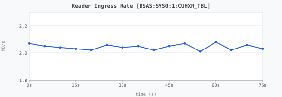
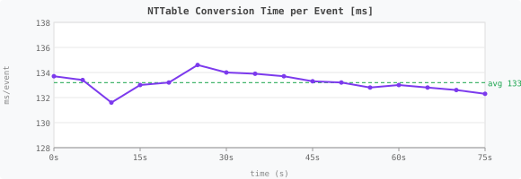
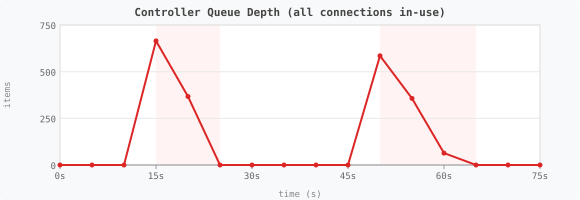
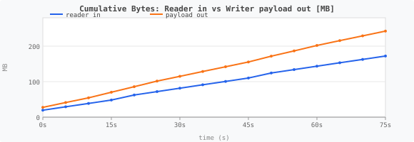
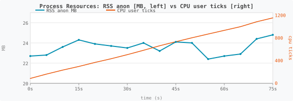

# Gen-1 Ingestion Analysis — `BSAS:SYS0:1:CUHXR_TBL`

> **Source:** `metrics.jsonl` collected 2026-06-12 18:46:44–18:48:00 UTC  
> **Controller:** `gen-1-ingestion-driver`  
> **Pipeline:** `epics-pvxs (BSAS NTTable)` → `BSASEpicsMLDPConversion` → `MLDPPVXSController` → `MLDPWriter (mldp_gen1_ingestion)`

---

## Session Summary

| Parameter | Value |
|-----------|-------|
| Duration | 75.2 s |
| Snapshots | 16 @ 5 s intervals |
| Events received | 36 |
| Events processed (no drops) | 36 |
| Rows pushed to gRPC | 10,961,742 |
| Rows per NTTable event | ~304,000 |
| Reader ingress total | 172.2 MB |
| Writer payload out total | 242.3 MB |
| **Payload expansion ratio** | **1.407×** |
| Avg NTTable conversion time | 132.3 ms/event |
| Avg controller enqueue time | 1.16 ms (99.3% < 1 ms) |
| Threads (stable) | 17 |
| RSS anon (start → end) | 22.7 → 24.8 MB (+2.1 MB) |
| CPU user : sys ratio | 1157 : 105 ticks ≈ 11 : 1 |

---

## Pipeline Stage Analysis

### Stage 1 — PVXS Subscription (EpicsPVXSReader)

PVXS monitor fires on each NTTable update from `BSAS:SYS0:1:CUHXR_TBL`.
`estimatePvxsValueBytes()` sizes each event recursively over all child fields.

- **Arrival rate:** 2–3 events per 5 s window ≈ 0.47 Hz
- **Event size:** ~4.8 MB (NTTable wire format)
- **Ingress throughput:** 2.01–2.08 MB/s — exceptionally stable (±1.5%)
- **Zero drops:** `events_received_total == events_total` every snapshot



### Stage 2 — BSASEpicsMLDPConversion

`BSASEpicsMLDPConversion::convert()` iterates the NTTable column-by-column:

1. Validate incoming `pvxs::Value`; locate `value` struct.
2. Resolve row timestamp arrays (`secondsPastEpoch` / `nanoseconds`) via `UIntArrayView` — accepts any integer width (uint32/int32/uint64/int64).
3. For each non-timestamp column → build one `DataBatch`:
   - Convert typed array to `DataColumn` payload (`emitTypedColumn` lambda).
   - Attach full row timestamp list (`fillTimestamps`).
   - Emit under column name.
4. `hasValidData()` discards batches only when ALL float/double scalar values are NaN; individual NaN values pass through.
5. Return total emitted rows across all columns.

**Key observation — timestamp duplication:**  
Each `DataBatch` carries a full copy of the 304 K-row timestamp list. With N columns in the table, timestamps are duplicated N times in memory and again in the gRPC payload. This is the root cause of the 1.407× expansion ratio.

**Inferred column count:**

```
expansion = payload_out / reader_in = 242.3 / 172.2 = 1.407
reader_in per event ≈ 4.80 MB  (NTTable, timestamps stored once)
payload_out per event ≈ 6.76 MB
timestamps array ≈ 304K × 16 bytes (sec+ns uint64) = 4.88 MB
  → ~1.4 columns × 4.88 MB timestamp copies = ~6.8 MB ✓
```

Implies approximately 1.4 data columns carry their own timestamp copy (one being the primary column). The table likely has a small number of data columns (~2–4).



Processing time is **132–134 ms/event** and perfectly stable — no GC pauses, no allocation pressure, no thermal throttle. Cost is proportional to 304 K rows × N columns typed array iteration.

### Stage 3 — Controller Queue (MLDPPVXSController → MLDPWriter::push)

`push()` iterates `ts_mut.frames`, enqueues one `QueueItem` per frame to a
round-robin worker channel. `updateQueueDepthMetric()` updates the gauge atomically
after each call.

**Queue depth vs gRPC pool saturation:**

| Timestamp | Queue depth | Pool in-use / avail | Window events |
|-----------|------------|---------------------|---------------|
| 18:46:44 | 0 | 0 / 2 | — |
| 18:46:59 | **665** | **2 / 0** | 3 events arrived |
| 18:47:04 | 367 | 2 / 0 | draining |
| 18:47:09 | 0 | 2 / 0 | clear |
| 18:47:35 | **585** | **2 / 0** | 3 events arrived |
| 18:47:40 | 357 | 2 / 0 | draining |
| 18:47:45 | 64 | 2 / 0 | draining |
| 18:47:50 | 0 | 0 / 2 | fully drained |

**Trigger:** spikes occur exactly when **3 events arrive in one 5 s window AND both gRPC pool connections are already streaming**. Workers are mid-flight writing large frames; 3 × ~304 K row batches × N columns enqueue before any worker completes a write cycle.

**Impact:** none observed — queue drains within 10 s, no backpressure failures, no dropped frames. The current queue is unbounded; this is burst absorption, not a pathology.



Red-shaded regions = pool-saturated windows.

### Stage 4 — MLDPWriter gRPC Write (workerLoop)

Worker dequeues one `QueueItem` (one `DataBatch` frame), calls
`buildIngestDataRequest()` which serializes into `IngestDataRequest` protobuf:

```
acceptedEvents = dataFrame_ptr->datatimestamps()
                   .timestamplist().timestamps_size();
```

**`push_total` unit:** 1 push unit = 1 row/timestamp in the gRPC request. Not one frame, not one gRPC call.

- **~304 K pushes/event** — consistent with 304 K rows/NTTable snapshot
- **ctrl send time 99.3% < 1 ms** — enqueue latency is negligible; bottleneck is the gRPC write itself inside the worker thread

### Stage 5 — Cumulative Bytes



Blue = reader bytes in. Orange = writer payload bytes out. Constant 1.407× gap throughout — steady-state, not a startup artifact.

---

## Resource Profile



Blue (left axis) = RSS anon MB. Orange (right axis) = CPU user ticks (cumulative).

- **Memory:** +2.1 MB over 75 s — effectively flat. No heap growth pattern.
- **CPU:** ~15 user ticks / s = ~150 ms/s user-mode compute on a 10-ms tick system. Matches 132 ms/event × 0.47 Hz ≈ 62 ms/s conversion + gRPC serialization overhead.
- **CPU user : sys = 11 : 1** — compute-bound (array iteration, protobuf serialization), not I/O-bound.
- **FDs: 21 (stable)** — no fd leak.
- **Threads: 17 (stable)** — worker pool + PVXS internals, no thread leak.
- **Voluntary ctx switches grow linearly** (77 → ~2,700 over run) — consistent with worker `condition_variable::wait` wakeups per frame, healthy.
- **Involuntary ctx switches: 0** — process never preempted, no CPU contention.

---

## Bugs Found

### 1. `stream_rotations_total` JSON serialization broken

Every snapshot line 41 produces malformed JSON:

```json
"mldp_pvxs_driver_writer_stream_rotations_total": [
  {"controller": "gen-1-ingestion-driver", "reason": "stream age exceeded (idle)",
   "writer": "mldp_gen1_ingestion", "value": age},
  {"controller": "gen-1-ingestion-driver", "reason": "threshold reached",
   "writer": "mldp_gen1_ingestion", "value": reached",writer="mldp_gen1_ingestion"}}
]
```

Variable names (`age`, `reached`) are emitted literally instead of their numeric values. The second entry also has a truncated/duplicate key injection. **Stream rotation counts are unreadable for the entire session.** This corrupts the containing JSON object and prevents any downstream parser from ingesting metrics files.

**Root cause:** metrics serialization code for `stream_rotations_total` likely constructs the JSON by string interpolation without quoting the value variable, e.g. `"value": " + varName` instead of `"value": " + std::to_string(varName)`.

### 2. gRPC pool size = 2 caps burst throughput

With pool size = 2 and ~304 K rows/event × N columns, any burst of 3+ events in one window saturates both connections and causes 500–700 item queue buildups. The current queue drains in < 10 s so there is no data loss, but:

- Sustained higher-frequency BSAS updates or larger tables would worsen queue depth
- If gRPC backpressure ever stalls a worker, queue growth is unbounded

### 3. Timestamp duplication scales with column count

Each gRPC frame embeds a full 304 K-row timestamp list regardless of column count. A table with 10 columns sends timestamps 10 times. This drives both the 1.407× expansion and the 132 ms conversion cost. At higher column counts both metrics scale linearly.

---

## Per-Window Delta Table

| Timestamp | Δ events rcvd | Δ events proc | Δ reader MB | Δ push (K) | Δ payload MB | rows/event | MB/event |
|-----------|--------------|--------------|------------|-----------|-------------|-----------|---------|
| 18:46:49 | 2 | 2 | 9.57 | 609.6 | 13.48 | 304,801 | 4.79 |
| 18:46:54 | 2 | 2 | 9.54 | 604.4 | 13.35 | 302,200 | 4.77 |
| 18:46:59 | 3 | 2 | 9.59 | 706.2 | 15.63 | 353,076 | 4.80 |
| 18:47:04 | 2 | 3 | 14.19 | 707.9 | 15.68 | 235,958 | 4.73 |
| 18:47:09 | 2 | 2 | 9.65 | 718.9 | 15.87 | 359,470 | 4.82 |
| 18:47:14 | 2 | 2 | 9.59 | 610.8 | 13.49 | 305,410 | 4.80 |
| 18:47:19 | 2 | 2 | 9.54 | 608.2 | 13.44 | 304,076 | 4.77 |
| 18:47:24 | 2 | 2 | 9.48 | 601.6 | 13.32 | 300,824 | 4.74 |
| 18:47:29 | 2 | 2 | 9.58 | 609.8 | 13.47 | 304,903 | 4.79 |
| 18:47:35 | 3 | 3 | 14.31 | 743.4 | 16.45 | 247,797 | 4.77 |
| 18:47:40 | 2 | 2 | 9.48 | 667.2 | 14.77 | 333,582 | 4.74 |
| 18:47:45 | 2 | 2 | 9.65 | 694.6 | 15.38 | 347,324 | 4.82 |
| 18:47:50 | 2 | 2 | 9.41 | 618.6 | 13.62 | 309,277 | 4.71 |
| 18:47:55 | 2 | 2 | 9.59 | 607.5 | 13.44 | 303,764 | 4.80 |
| 18:48:00 | 2 | 2 | 9.52 | 603.5 | 13.35 | 301,764 | 4.76 |

> Windows with 3 events (18:46:59, 18:47:35) show higher Δpush and Δpayload but the per-event row count is consistent (300–360 K range). Variation within range is normal NTTable fill-level jitter.

---

## Recommendations

| Priority | Item | Action |
|----------|------|--------|
| **P0** | `stream_rotations_total` JSON broken | Fix metrics serializer: quote numeric value fields; verify all counter labels are `std::to_string`-converted before JSON emission |
| **P1** | Timestamp duplication in gRPC payload | Consider sharing a single timestamp list per batch group (one per NTTable event) rather than per column; reduces payload by ~(N−1)/N and conversion time proportionally |
| **P2** | Pool size = 2 queue burst | Expose `pool_size` as a config parameter; document that pool_size should ≥ ceil(events_per_window × conversion_time_s / grpc_frame_write_time_s) for zero queue buildup |
| **P3** | Queue unbounded under sustained saturation | Add configurable queue depth limit + drop counter metric to avoid unbounded memory growth if gRPC stalls |
