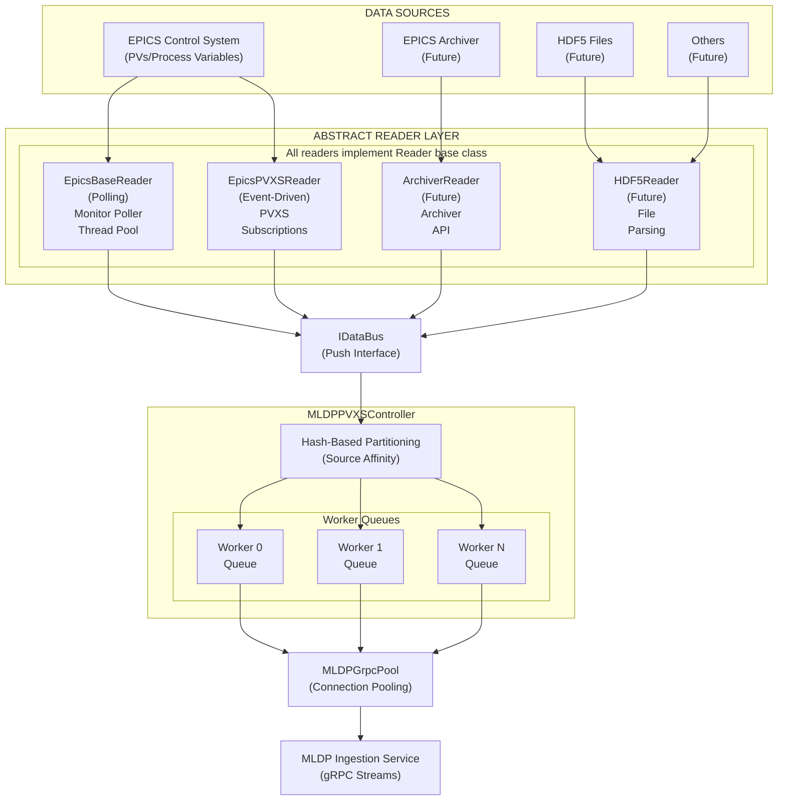
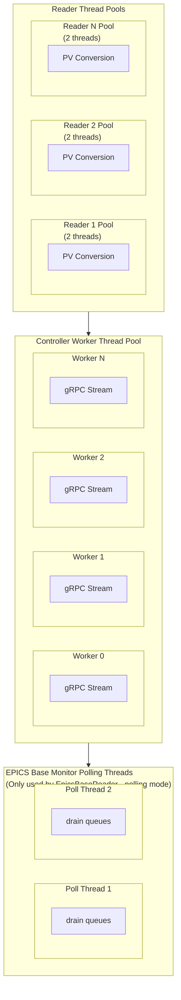
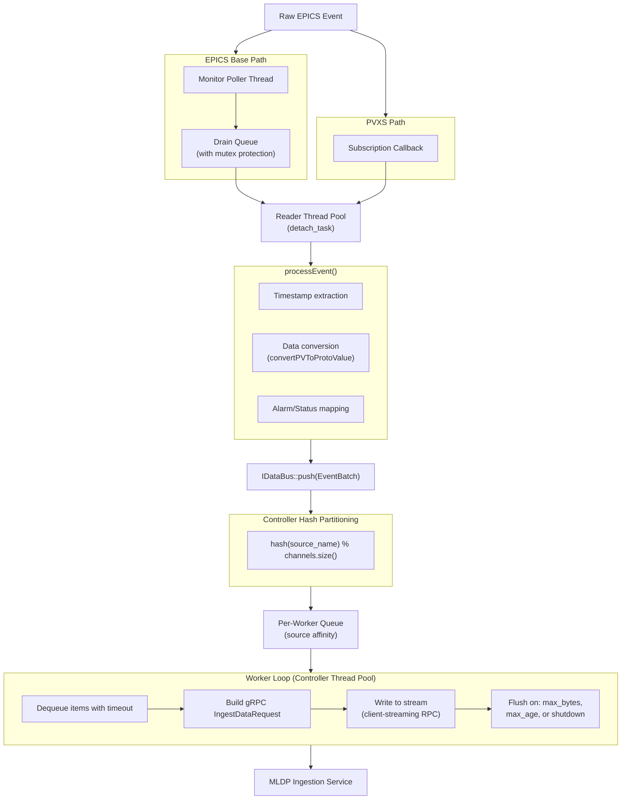

# MLDP PVXS Driver Architecture

## Overview

The MLDP PVXS Driver is a high-performance data ingestion system that bridges various data sources with the MLDP (Machine Learning Data Platform) service. It uses a sophisticated push-based architecture designed for minimal latency and maximum throughput.

The driver implements an **abstract Reader pattern** that allows plugging in different data sources. Currently implemented are EPICS-based readers, with the architecture designed to support future implementations such as EPICS Archiver, HDF5 files, and other data sources.

## High-Level Architecture



## Reader Abstraction

The driver uses a **factory pattern** with abstract readers to support multiple data sources:

| Reader Type       | Status      | Description                           |
|-------------------|-------------|---------------------------------------|
| `epics-base`      | Implemented | Polling-based EPICS Channel Access    |
| `epics-pvxs`      | Implemented | Event-driven EPICS PVAccess (PVXS)    |
| `epics-archiver`  | Future      | Historical data from EPICS Archiver   |
| `hdf5`            | Future      | Data replay from HDF5 files           |
| Others            | Future      | Extensible for new data sources       |

All readers:

- Inherit from the abstract `Reader` base class
- Register via `REGISTER_READER` macro
- Push events through `IDataBus` interface
- Are decoupled from gRPC/controller implementation

For details on existing readers, see [Reader Types](readers.md). To implement a custom reader, see [Implementing Custom Readers](readers-implementation.md).

## Push Model Architecture

The driver implements a **high-performance push model** that decouples readers from the ingestion pipeline. This architecture ensures readers can continue monitoring PVs without waiting for gRPC writes to complete.

### Push Flow

1. **Event Detection**: Readers detect PV changes (via subscriptions or polling)
2. **Immediate Push**: Call `bus_->push(EventBatch)` immediately (non-blocking)
3. **Hash Partitioning**: Controller partitions events by source name hash
4. **Queue Distribution**: Events are enqueued to per-worker channels
5. **Async Batching**: Workers asynchronously batch and flush to MLDP

### Source-Affinity Hash Partitioning

The controller uses hash-based partitioning to ensure efficient stream utilization:

```cpp
auto idx = std::hash<std::string>{}(src_name) % channels_.size();
per_channel[idx].emplace_back(src_name, std::move(events));
```

**Benefits:**

- Same source always routes to same worker (stream coherence)
- Different sources can use different workers (parallelism)
- Hash distribution provides automatic load balancing
- Stream affinity enables efficient batching

### Per-Worker Architecture

Each worker maintains its own queue and gRPC stream:

```
WorkerChannel {
    mutex              // Protects queue access
    condition_variable // Signals queue has items
    deque<QueueItem>   // Batched work items
    shutdown flag      // Graceful stop signal
}
```

**Worker Loop Lifecycle:**

1. Block on condition variable with timeout (enables idle detection)
2. Dequeue item (source + columns)
3. Build single gRPC `IngestDataRequest`
4. Write to stream (client-streaming RPC)
5. Manage stream rotation based on thresholds

### Stream Rotation

Streams are rotated based on:

- **max_bytes**: Stream reached byte threshold (default: ~2MB)
- **max_age**: Stream exceeded age limit (default: 200ms)
- **write_failed**: gRPC write error occurred
- **idle**: No activity for max_age duration
- **shutdown**: Controller stopping

## Multithreading Model

### Three-Tier Thread Pool Architecture



### Thread Pool Types

| Pool                 | Location             | Purpose                          | Default Size |
|----------------------|----------------------|----------------------------------|--------------|
| Reader Pool          | Per-Reader           | Convert EPICS data to protobuf   | 2 threads    |
| Controller Pool      | MLDPPVXSController   | Process batches, write to gRPC   | 2 threads    |
| Monitor Poll Threads | EpicsBaseReader only | Poll EPICS Base queues           | 2 threads    |

### Conditional Parallelization

The PVXS reader implements smart threading decisions:

```cpp
// Bypass thread pool overhead for single-threaded scenarios
reader_pool_->get_thread_count() > 1 ? reader_pool_.get() : nullptr
```

- When thread count is 1: bypass thread pool (direct execution)
- When thread count > 1: use thread pool for parallel conversion

## Event Processing Pipeline



## Key Design Patterns

### Factory Pattern (ReaderFactory)

- Runtime reader type selection via YAML configuration
- Static registration via `REGISTER_READER` macro
- Extensible for new reader backends

### Template Method Pattern (EpicsReaderBase)

- Common threading/configuration logic in base class
- Subclasses implement `addPV()` and `processEvent()`

### RAII (PooledHandle)

- Automatic gRPC connection release on handle destruction
- Prevents connection leaks

### Producer-Consumer (Event Bus)

- `IDataBus` interface decouples readers from controller
- Async event delivery via thread pools

## Cross-Cutting Utilities

### Logging Abstraction

The driver uses a logging abstraction layer (`util::log`) so library code is not coupled to a specific backend. The executable can install a concrete logger implementation (for example the spdlog-backed adapter).

- Detailed guide: [Logging Abstraction Guide](logging.md)
- Logging interface and helpers: `include/util/log/ILog.h`, `include/util/log/Logger.h`
- Default/simple logger implementation: `include/util/log/CoutLogger.h`, `src/util/log/CoutLogger.cpp`
- spdlog adapter used by the executable: `include/SpdlogLogger.h`, `src/SpdlogLogger.cpp`

### HTTP Transport Provider (`util/http`)

HTTP-based readers can use the shared `util/http` transport abstraction instead of managing raw `libcurl` directly. This centralizes TLS defaults, timeouts, header handling, and streaming callback plumbing.

- Detailed documentation: [HTTP Transport Provider](http-provider.md)

## Configuration

### Controller Settings

```yaml
controller_thread_pool: 2              # Number of worker threads
controller_stream_max_bytes: 2097152   # ~2MB stream threshold
controller_stream_max_age_ms: 200      # 200ms stream rotation
```

### Connection Pool Settings

```yaml
mldp_pool:
  provider_name: pvxs_provider
  url: dp-ingestion:50051
  min_conn: 1
  max_conn: 4
```

### Reader Settings

```yaml
reader:
  - epics-pvxs:
      - name: my_reader
        thread_pool_size: 2
        pvs:
          - name: PV_NAME
```

## Metrics & Observability

The driver exposes Prometheus metrics for monitoring:

### Reader Metrics

- `mldp_pvxs_driver_reader_events_received_total`
- `mldp_pvxs_driver_reader_events_total`
- `mldp_pvxs_driver_reader_errors_total`
- `mldp_pvxs_driver_reader_processing_time_ms`
- `mldp_pvxs_driver_reader_pool_queue_depth`

### Bus Metrics

- `mldp_pvxs_driver_bus_push_total`
- `mldp_pvxs_driver_bus_failure_total`
- `mldp_pvxs_driver_bus_payload_bytes_total`
- `mldp_pvxs_driver_bus_stream_rotations_total`

### Controller Metrics

- `mldp_pvxs_driver_controller_send_time_seconds`
- `mldp_pvxs_driver_controller_queue_depth`
- `mldp_pvxs_driver_controller_channel_queue_depth`

### Pool Metrics

- `mldp_pvxs_driver_pool_connections_in_use`
- `mldp_pvxs_driver_pool_connections_available`
