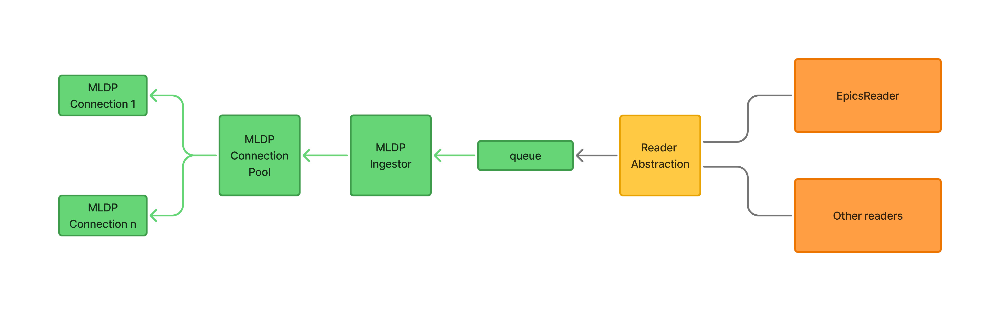
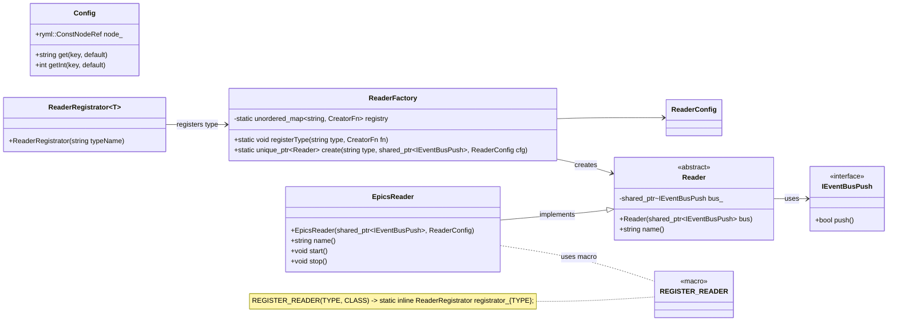

# CLI Architecture Walkthrough

The diagram above represents the data flow the CLI orchestrates. Use these checkpoints when navigating or extending the pipeline:
- **MLDP connections**: Each configured MLDP target establishes its own gRPC channel and feeds the connection pool. Failures are isolated per connection, so retries or backoffs should be implemented at this edge.
- **Connection pool**: The pool multiplexes active channels and exposes a uniform API to the ingestor. Any throttling, health checking, or reuse policies belong here.
- **MLDP ingestor**: This component owns the `PVXSDPIngestionDriver`; it consumes updates from PVXS, enriches them, and pushes canonical events into the internal queue. It should stay stateless aside from bookkeeping identifiers returned by the service.
- **Queue**: A bounded work queue decouples ingestion from downstream readers. Tune its depth to match the slowest reader you plan to support.
- **Reader abstraction**: The queue fan-outs into the registered readers through the factory described above. Each reader (e.g., `EpicsReader`, synthetic readers, etc.) subscribes to the bus interface and can perform protocol-specific transformation or output.
- **Extending the CLI**: When adding a new external system, keep the connection-specific logic left of the queue and terminate in a reader implementation on the right. This ensures the rest of the CLI keeps the same contract regardless of how many integrations you ship.

## Controller Layer
- **Role**: The controller (`include/controller/MLDPPVXSController.h`) is the orchestrator that wires configuration parsing, the shared thread pool, the MLDP gRPC pool, and metrics. It implements `util::bus::IEventBusPush` so readers can forward events without depending on gRPC details.
- **Lifecycle**: Constructed with the root YAML config; `start()` brings up the MLDP pool, creates per-worker channels, submits long-lived worker tasks to the `BS::light_thread_pool`, and starts readers. `stop()` signals each channel to shut down, waits on the thread pool, and clears resources. The controller keeps a boolean guard to avoid double starts/stops.
- **Configuration**: `include/controller/MLDPPVXSControllerConfig.h` (`src/controller/MLDPPVXSControllerConfig.cpp`) validates the controller-specific node: gRPC pool settings, provider name, thread-pool size, reader list, and optional metrics (`metricsConfig`). Parsing errors throw early to catch miswired configs.
- **Metrics surface**: A shared `metrics::Metrics` instance is created in the controller and handed to readers and pool components; it is also exposed through `metrics()` for any new layers that need to emit counters.
- **Threading model**: The controller uses hash-based partitioning to route each source to a dedicated worker channel (`push()` computes `hash(src_name) % N`). Each worker is a long-lived task submitted to the `BS::light_thread_pool` and owns a private `WorkerChannel` (mutex + condition variable + deque). This gives source-level stream affinity — the same source always hits the same worker and gRPC stream — while eliminating contention on a single shared queue. Workers block on their channel's condition variable with a timeout equal to the configured stream max age, enabling idle stream rotation without sentinel items.
- **Extending**: New controllers should mirror this pattern: encapsulate configuration parsing, own the primary thread pool, expose a narrow bus interface, and centralize metrics so downstream pieces remain stateless.

## Configuration Architecture
- **Single YAML document (controller config)**: The CLI entrypoint (`src/mldp_pvxs_driver_main.cpp`) loads one YAML file and constructs `controller::MLDPPVXSController` from it. The top-level keys are:
  - `controller_thread_pool` (required scalar int)
  - `mldp_pool` (required map)
  - `reader` (optional sequence)
  - `metrics` (optional map)

- **Example (full controller config)**:
  ```yaml
  controller_thread_pool: 2

  mldp_pool:
    provider_name: pvxs_provider
    provider_description: "PVXS aggregate provider"   # optional; defaults to provider_name
    url: dp-ingestion:50051
    min_conn: 1
    max_conn: 4
    # credentials: none        # optional (default)
    # credentials: ssl         # optional (enable TLS, system defaults)
    # credentials:             # optional (TLS with explicit PEM files)
    #   pem_cert_chain: /etc/certs/client.crt
    #   pem_private_key: /etc/certs/client.key
    #   pem_root_certs: /etc/certs/ca.crt

  reader:                       # optional; omit to start with no readers
    - epics:
        - name: epics_reader_a
          pvs:
            - name: pv1
              option: chan://one   # optional; scalar string or a map
            - name: pv2

  metrics:                         # optional; omit to disable Prometheus endpoint
    endpoint: 0.0.0.0:9464
  ```

- **Validation rules and semantics**:
  - `controller_thread_pool`: must be present and > 0.
  - `mldp_pool`: validated by `util::pool::MLDPGrpcPoolConfig`:
    - `provider_name` and `url` must be non-empty.
    - `min_conn` and `max_conn` must be > 0 and `max_conn >= min_conn`.
    - `credentials` may be `none`, `ssl`, or a map containing any of `pem_cert_chain`, `pem_private_key`, `pem_root_certs`.
      When a credentials map is provided, file paths are read eagerly during parsing and stored as PEM contents in gRPC SSL options.
  - `reader` (optional): must be a sequence. Each element must be a map specifying a supported type.
    Currently supported type is `epics`, expressed as `- epics: [ ... ]`.
  - `metrics` (optional): when provided it must be a map containing a non-empty `endpoint` string.

- **Class hierarchy**:
  - `config::Config` (`include/config/Config.h`, `src/config/Config.cpp`): thin typed view over a `ryml` tree; provides `get`, `getInt`, `getBool`, `subConfig`, and presence helpers used by all downstream config classes.
  - `controller::MLDPPVXSControllerConfig` (`include/controller/MLDPPVXSControllerConfig.h`): owns parsing of the controller document; composes `MLDPGrpcPoolConfig`, a vector of `EpicsReaderConfig`, and an optional `MetricsConfig`. Throws `Error` on missing/invalid fields.
  - `util::pool::MLDPGrpcPoolConfig` (`include/pool/MLDPGrpcPoolConfig.h`): validates `provider_name`, `url`, `min_conn`, `max_conn`, optional TLS `credentials`, and enforces `max_conn >= min_conn`.
  - `reader::impl::epics::EpicsReaderConfig` (`include/reader/impl/epics/EpicsReaderConfig.h`): validates each reader entry (name plus optional `pvs[].{name,option}`), collecting both structured PV objects and a flat PV name list.
  - `metrics::MetricsConfig` (`include/metrics/MetricsConfig.h`): optional block containing the Prometheus `endpoint`.
  - `mldp_pvxs_driver_main` (`src/mldp_pvxs_driver_main.cpp`): parses the YAML config file and instantiates `controller::MLDPPVXSController`.
 - **Validation and failure modes**: `Config` helpers provide typed access with presence checks. Missing required fields throw `Error` from the relevant config class (e.g., `MLDPGrpcPoolConfig::Error`, `MLDPPVXSControllerConfig::Error`), stopping startup early rather than failing at runtime. TLS file paths are read eagerly; unreadable files surface immediately (driver paths return `MLDP_PVXS_DRIVER_ERROR_FILE_*`, pool credentials throw).
- **Extending the schema**: Add parsing and validation in the dedicated config class, surface sensible defaults, and keep the YAML map-oriented rather than deeply nested. Update `README.md` and this section with any new keys to keep operator docs in sync.

## MLDP gRPC Pool
- **Responsibility**: `util::pool::MLDPGrpcPool` owns connection reuse to the MLDP service. It maintains a configurable set of gRPC channels and exposes lightweight handles for the controller’s push operations.
- **Config knobs**: Thread-pool size and pool size are parsed via `MLDPPVXSControllerConfig` (`pool()` accessor). Each MLDP target gets its own channel entry so failures remain isolated.
- **Usage**: The controller initializes the pool during construction and keeps a shared pointer (`mldp_pool_`). Push requests scheduled on the thread pool borrow a channel from the pool, perform the ingestion call, and return it, allowing concurrent inflight writes without per-request channel setup.
- **Failure handling**: Pool initialization or borrow failures surface early through configuration validation and runtime errors logged by the controller. Add retries/backoff per channel if you extend the pool to more volatile networks.
- **Extending**: When adding new MLDP operations, route them through the pool so authentication and channel lifecycle remain centralized; avoid ad-hoc channel creation in readers or other downstream components.

## Reader Abstraction

- **Event bus boundary**: `include/bus/IEventBusPush.h` defines the narrow interface that any reader implementation can use to push decoded events back into the driver. Readers never talk to PVXS or gRPC directly; they receive a shared pointer to `mldp_pvxs_driver::bus::IEventBusPush` in their constructor.
- **Base contract**: `include/reader/Reader.h` provides the `Reader` abstract base class plus a lightweight `ReaderConfig` struct you can extend as the configuration surface grows. Every reader must supply a `name()`, `start()`, and `stop()` implementation and is responsible for owning any worker threads it spins up.
- **Factory & registration**: `include/reader/ReaderFactory.h(.cpp)` exposes `ReaderFactory::registerType` and `ReaderFactory::create`. Implementations register themselves through the `REGISTER_READER("type", ClassName)` macro, which instantiates a static `ReaderRegistrator` that hooks into the factory at load time.
- **Concrete example**: `include/src/reader/impl/epics/EpicsReader.{h,cpp}` shows a skeleton EPICS-backed reader. It stores the bus pointer in the base class, spawns a worker thread in the constructor, and cleans it up in the destructor. Use this file as the starting point for additional reader types (e.g., channel archiver, simulation, file replay).
- **Adding a reader**:
  1. Create `include/reader/impl/<name>/<Name>Reader.h` derived from `Reader`, include the macro, and define any extra configuration knobs.
  2. Implement the behavior in `src/reader/impl/<name>/<Name>Reader.cpp` and make sure the TU is part of `libmldp_pvxs_driver` in `CMakeLists.txt`.
  3. Invoke `ReaderFactory::create("<type>", bus, cfg)` from the orchestration layer to spin up the new reader; the factory throws if the type string is unknown, which protects against misconfigured YAML.

### EPICS reader PV options
- `pvs[].option` accepts a scalar PVXS option string or a map.
- For NTTable row-timestamp handling, use:
  ```yaml
  option:
    type: nttable-rowts
    tsSeconds: secondsPastEpoch   # optional
    tsNanos: nanoseconds          # optional
  ```

## Logging Abstraction

The project provides a flexible logging abstraction to ensure that the driver library remains independent of any specific logging backend. This is achieved through the following components:

- **ILog.h (`include/util/log/ILog.h`)**:
  - Provides an abstract interface for logging, allowing the driver library to emit messages without depending on a particular logging implementation.
  - Defines log severity levels (`Trace`, `Debug`, `Info`, `Warn`, `Error`, `Critical`, `Off`).
  - Allows the embedding application to install a custom logger or factory for creating named loggers.
  - Example usage from library code:
    ```cpp
    auto log = mldp_pvxs_driver::util::log::newLogger("epics_reader:my_reader");
    log->log(mldp_pvxs_driver::util::log::Level::Info, "started");
    ```

- **CoutLogger.h (`include/util/log/CoutLogger.h`)**:
  - Implements a minimal logger that writes messages to `std::cout`/`std::cerr`.
  - Provides a default fallback when no custom logging implementation is installed.
  - Thread-safe and includes an optional name prefix for the log messages.
  - Example usage:
    ```cpp
    mldp_pvxs_driver::util::log::setLogger(std::make_shared<mldp_pvxs_driver::util::log::CoutLogger>("my_app"));
    ```

- **Design Goals**:
  - The driver library should not impose a specific logging backend.
  - The executable or embedding application selects and installs the desired logging implementation.
  - Library components can request named loggers for per-component logging (e.g., per reader instance).

- **Usage from an Executable**:
  ```cpp
  // In main(): install a logger implementation and an optional factory.
  mldp_pvxs_driver::util::log::setLogger(myLogger);
  mldp_pvxs_driver::util::log::setLoggerFactory([](std::string_view name) {
      return makeLoggerWithName(name);
  });
  ```

## Tips
- If you hit linker or dependency issues, double-check that `PROTO_PATH` and `PVXS_BASE` correctly point to the same SDK versions referenced in this repository’s Docker/dev container setup.
- Keep configuration changes (e.g., YAML driver configs) separate from code logic in their own commits so reviewers can focus on one area per review pass.
