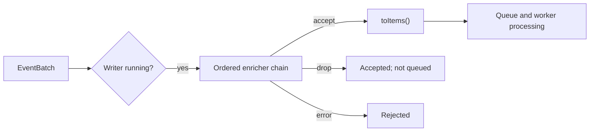

# Payload Enrichers

> **Related:** [Configuration Reference](../guides/configuration.md#global-enrichers-and-writer-chains) | [Writer Implementation Guide](../writers/writers-implementation.md) | [Architecture Overview](../reference/architecture.md#payload-enrichment-layer)

Payload enrichers are named transformations applied to an `EventBatch` immediately before a queued writer converts it to its sink-specific work items. They keep cross-cutting concerns such as run metadata, timestamp correction, and MLDP shard placement out of readers and writer implementations.

## Configuration Model

Declare enrichers once under top-level `enrichers:`. Each key is an application-unique name; its `type` selects an implementation. A queued writer names the enrichers it needs in ordered `enrichers:` list.

```yaml
enrichers:
  run-context:
    type: static-metadata
    metadata:
      experiment_id: run-42
  shard-slots:
    type: shard-slot
    num-shards: 6

writer:
  mldp:
    - name: mldp_main
      enrichers: [run-context, shard-slots]
  hdf5:
    - name: hdf5_raw
      enrichers: [run-context]
```

The controller creates every named definition once at startup. A name used by more than one writer therefore denotes one shared, stateful instance. Names in a single writer chain must be non-empty and unique; unknown names and invalid definitions stop startup.

## Execution and Concurrency



`BaseQueuedWriter::push()` runs the chain after its running check and before `toItems()`. It locks the chain only while traversing it, then releases that lock before item conversion, queue admission, back-pressure waits, and worker processing.

Each `IPayloadEnricher` serializes its own `enrich()` calls. As a result, a shared stateful enricher is safe across writer chains without serializing unrelated enrichers or queues.

An enricher returning `false` drops the batch for that writer but is still treated as an accepted `push()`, matching an empty `toItems()` result. An exception or internal enrichment failure rejects the batch and is logged.

## Built-in C++ Enrichers

| Type | Required settings | Affected payloads | Behavior |
|---|---|---|---|
| `static-metadata` | `metadata` map | All | Merges configured string values into batch metadata; configured values overwrite existing values. |
| `column-attributes` | `column-pattern`, `attributes` map | Time series | Applies attributes to `DataColumn` objects whose names match the glob pattern. Configured values overwrite existing attributes. |
| `timestamp-clamp` | None | Time series | Limits each timestamp `nanoseconds` value to `999999999`. |
| `shard-slot` | Optional `num-shards` | Time series | Adds a stable process-lifetime, zero-padded five-digit `shardSlot` attribute to first-seen columns. |

`column-attributes`, `timestamp-clamp`, and `shard-slot` accept the other three `EventBatch` payload variants unchanged. `static-metadata` is the appropriate generic enricher when metadata must accompany source metadata, configuration, or configuration-activation batches.

### `shard-slot` details

`num-shards` defaults to `6` and must be in the inclusive range `1..65536`. First-seen column names are assigned round-robin shard ranges, with a random slot selected inside each range. Existing `shardSlot` attributes are preserved.

Mappings last only for the driver process. A restart remaps first-seen columns, and changing `num-shards` can split one PV's historical and new data across MongoDB shards. HDF5 BSAS Gen1 readers no longer configure `num-shards` or stamp this attribute; attach `shard-slot` to the writer that needs it.

## Python Enricher

`python-enricher` is built only when `BUILD_PYTHON_PROCESSOR=ON`. It loads one Python file from `script-path`; the module must export an `enrich(batch)` callable.

```yaml
enrichers:
  tag-payload:
    type: python-enricher
    script-path: /opt/mldp/enrichers/tag_payload.py
writer:
  mldp:
    - name: mldp_main
      enrichers: [tag-payload]
```

### Python input and return contract

The function receives this dictionary:

```python
{
    "reader_name": "bsas_reader",
    "payload_type": "time-series",
    "metadata": {"run": "42"},
}
```

`payload_type` is one of `time-series`, `source-metadata`, `configuration`, or `configuration-activation`.

Return one of:

| Return value | Effect |
|---|---|
| `None` | Accept and drop the batch for this writer. |
| Dictionary without `metadata` | Keep the batch unchanged. |
| Dictionary with `metadata` | Merge its string-to-string entries into batch metadata, overwriting matching keys. |
| Any other value, or a dictionary whose metadata keys/values are not strings | Reject the batch. |

Example:

```python
def enrich(batch):
    return {
        "metadata": {
            "payload_kind": batch["payload_type"],
            "processed_by": "tag_payload",
        }
    }
```

Python exceptions are printed/logged and reject the affected batch without stopping the writer. Calls acquire the CPython GIL. Since named enrichers are shared, one `python-enricher` instance executes serially when multiple writer chains reference it.

## Testing

The focused tests live under `test/enricher/`:

| Test file | Coverage |
|---|---|
| `enricher_registry_test.cpp` | Global declarations, ordered resolution, shared instances, invalid writer references, and `shard-slot` stability. |
| `payload_enricher_test.cpp` | All four payload variants and the C++ built-in scope rules. |
| `python_enricher_test.cpp` | Python payload-type input, metadata updates, `None` filtering, and invalid returns; compiled only with `BUILD_PYTHON_PROCESSOR=ON`. |

Run focused tests in the configured build environment:

```bash
ctest --test-dir build -R 'Enricher|PayloadEnricher|PythonEnricher' --output-on-failure
```
