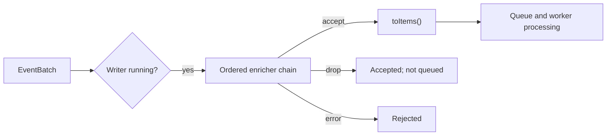

# Payload Enrichers

> **Related:** [Configuration Reference](../guides/configuration.md#global-enrichers-and-writer-chains) | [Writer Implementation Guide](../writers/writers-implementation.md) | [Architecture Overview](../reference/architecture.md#payload-enrichment-layer)

Payload enrichers are named transformations applied to an `EventBatch` immediately before a queued writer converts it to its sink-specific work items. They keep cross-cutting concerns such as run metadata, timestamp correction, and MLDP shard placement out of readers and writer implementations.

## Configuration Model

Declare enrichers once under top-level `enrichers:`. Each key is an application-unique name; its `type` selects an implementation. A queued writer names the enrichers it needs in an ordered `enrichers:` list.

```yaml
enrichers:
  run-context:
    type: static-metadata
    metadata:
      experiment_id: run-42
  shard-slots:
    type: shard-slot
    num-shards: 6
    db-path: /var/lib/mldp/shard_slots.db

writer:
  mldp:
    - name: mldp_main
      enrichers: [run-context, shard-slots]
  hdf5:
    - name: hdf5_raw
      enrichers: [run-context]
```

The controller creates every named definition once at startup. A name used by more than one writer denotes one shared, stateful instance. Names in a single writer chain must be non-empty and unique; unknown names and invalid definitions stop startup.

## Execution and Concurrency



`BaseQueuedWriter::push()` runs the chain after its running check and before `toItems()`. It locks the chain only while traversing it, then releases that lock before item conversion, queue admission, back-pressure waits, and worker processing.

Each `IPayloadEnricher` serializes its own `enrich()` calls. A shared stateful enricher is safe across writer chains without serializing unrelated enrichers or queues.

An enricher returning `false` drops the batch for that writer but is still treated as an accepted `push()`, matching an empty `toItems()` result. An exception or internal enrichment failure rejects the batch and is logged.

## Script Resolution for Python Enrichers

When `BUILD_PYTHON_PROCESSOR=ON`, the registry resolves unrecognized `type` values as Python scripts using this priority order:

1. **Registered C++ type** — matched first; no file I/O.
2. **Explicit `script-path`** on an unregistered type — that path is used directly. The module's declared `ENRICHER_TYPE` must match the configured `type`.
3. **Logical type via `python-plugin-path`** — the file `<python-plugin-path>/<type>.py` is loaded. `ENRICHER_TYPE` must be declared in the module and must match `type`.

`python-plugin-path` defaults to `enrichers` relative to the process working directory. Set it once under the `enrichers:` block:

```yaml
enrichers:
  python-plugin-path: /opt/mldp/enrichers
  tag-payload:
    type: tag_payload          # loads /opt/mldp/enrichers/tag_payload.py
  corrector:
    type: ts_corrector
    script-path: /data/scripts/ts_corrector.py   # explicit path overrides plugin path
```

The explicit `type: python-enricher` form bypasses all type-matching logic; `script-path` is required and `ENRICHER_TYPE` is optional:

```yaml
enrichers:
  my-script:
    type: python-enricher
    script-path: /opt/mldp/enrichers/beamline_policy.py
```

See [Python Enricher Guide](python-enricher.md) for the full contract and examples.

## Built-in C++ Enrichers

| Type | Required settings | Payload scope | Detail page |
|---|---|---|---|
| `static-metadata` | `metadata` map | All variants | [static-metadata](builtin/static-metadata.md) |
| `column-attributes` | `column-pattern`, `attributes` map | Time series only | [column-attributes](builtin/column-attributes.md) |
| `timestamp-clamp` | None | Time series only | [timestamp-clamp](builtin/timestamp-clamp.md) |
| `shard-slot` | Required `db-path`; optional `num-shards` | Time series only | [shard-slot](builtin/shard-slot.md) |

`column-attributes`, `timestamp-clamp`, and `shard-slot` pass non-time-series variants unchanged. `static-metadata` is the appropriate generic enricher when metadata must accompany source-metadata, configuration, or configuration-activation batches.

## Python Enricher

`python-enricher` is built only when `BUILD_PYTHON_PROCESSOR=ON`. See [Python Enricher Guide](python-enricher.md) for the input/return contract, examples, and development workflow.

## Testing

The focused tests live under `test/enricher/`:

| Test file | Coverage |
|---|---|
| `enricher_registry_test.cpp` | Global declarations, ordered resolution, shared instances, invalid writer references, and `shard-slot` stability. |
| `payload_enricher_test.cpp` | All four payload variants and the C++ built-in scope rules. |
| `python_enricher_test.cpp` | Python payload-type input, metadata updates, `None` filtering, and invalid returns; compiled only with `BUILD_PYTHON_PROCESSOR=ON`. |

Run focused tests in the configured build environment:

```bash
ctest --test-dir build -R 'Enricher|PayloadEnricher|PythonEnricher' --output-on-failure
```
