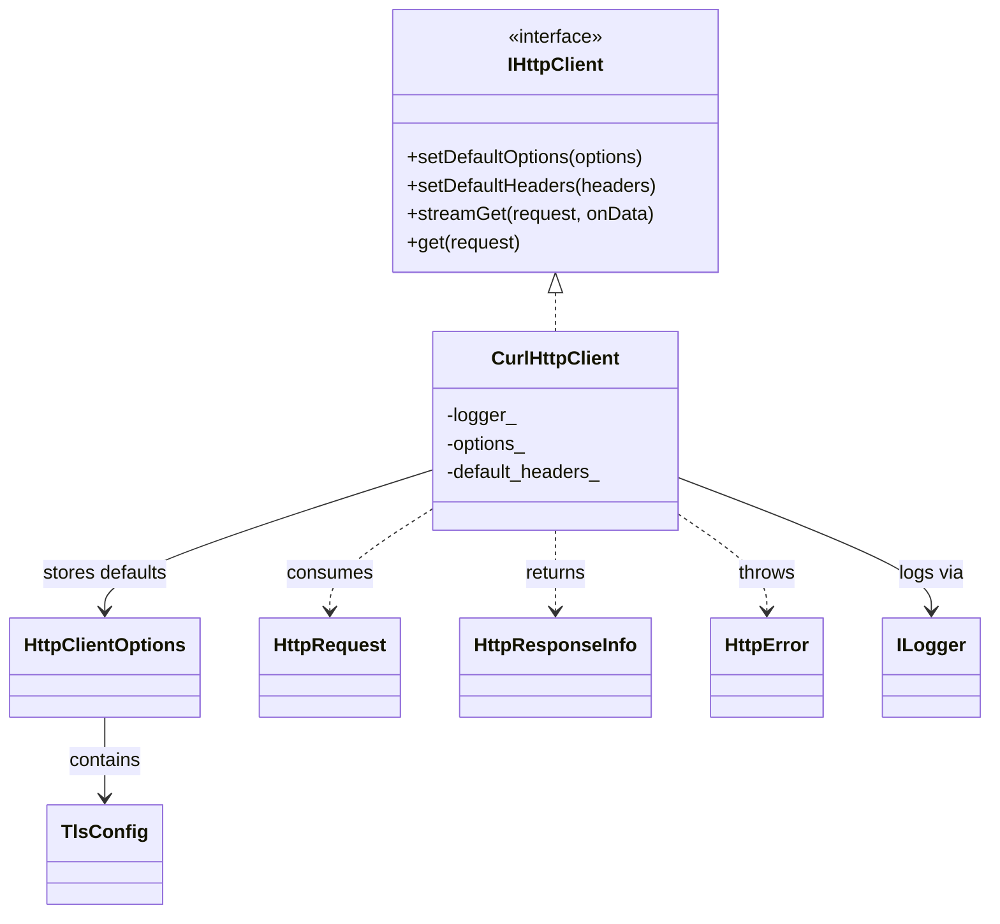
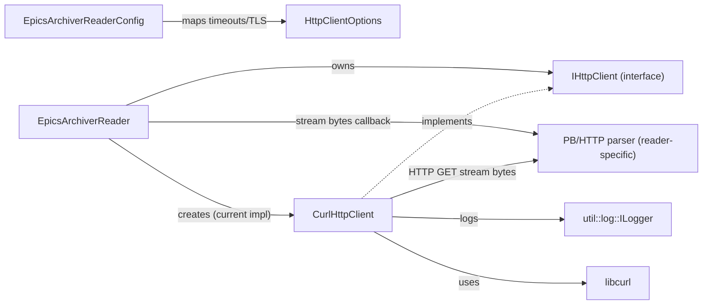

# HTTP Transport Provider (`util/http`)

## Overview

The project now includes a reusable HTTP transport abstraction in `util/http` so reader implementations do not need to manage raw `libcurl` handles and common HTTP/TLS settings directly.

This was added to support the EPICS Archiver reader and future HTTP-based readers.

## Goals

- Centralize `libcurl` lifecycle and common option handling
- Keep reader plugins focused on parsing and business logic
- Reuse secure TLS defaults and timeout behavior across readers
- Provide a consistent streaming callback model for long-running HTTP responses

## Components

### Interfaces and data types

Files:

- `include/util/http/HttpClient.h`
- `include/util/http/CurlHttpClient.h`
- `src/util/http/CurlHttpClient.cpp`

Main types in `HttpClient.h`:

- `TlsConfig`
- `HttpClientOptions`
- `HttpRequest`
- `HttpResponseInfo`
- `HttpError`
- `IHttpClient`

`IHttpClient` currently exposes:

- `setDefaultOptions(...)`
- `setDefaultHeaders(...)`
- `streamGet(...)`
- `get(...)` (synchronous buffered helper built on `streamGet(...)`)

### Class relationships



## Curl Implementation (`CurlHttpClient`)

`CurlHttpClient` is the first provider implementation and is intended to be reused by multiple readers.

### What it handles

- one-time `curl_global_init()` using `std::call_once`
- per-request `CURL*` creation/cleanup
- request header list ownership (`curl_slist`) via RAII
- timeout configuration (connect/total/low-speed)
- TLS verification settings
- redirects
- TCP keepalive
- compression (`CURLOPT_ACCEPT_ENCODING`)
- response streaming callback (`CURLOPT_WRITEFUNCTION`)
- transport-level logging through `util::log`

### Callback safety

Exceptions must not escape a C callback. `CurlHttpClient` captures exceptions thrown by the streaming data callback and rethrows them after `curl_easy_perform()` returns.

## Reader Integration Pattern

Readers should:

1. Parse reader-specific config (URLs, time ranges, protocol-specific options)
2. Map shared HTTP-related config into `HttpClientOptions`
3. Construct a `CurlHttpClient` (or inject an `IHttpClient`)
4. Keep protocol parsing in the reader (for example PB/HTTP framing for EPICS Archiver)

### Reader-to-transport relationship



Example (conceptual):

```cpp
util::http::HttpClientOptions opts;
opts.connect_timeout_sec = config.connectTimeoutSec();
opts.total_timeout_sec = config.totalTimeoutSec();
opts.tls.verify_peer = config.tlsVerifyPeer();
opts.tls.verify_host = config.tlsVerifyHost();

auto client = std::make_unique<util::http::CurlHttpClient>(logger);
client->setDefaultOptions(opts);
client->setDefaultHeaders({"Accept: application/octet-stream"});
```

## Usage Patterns

### Streaming GET (long-running or chunked responses)

Use `streamGet(...)` when:

- the response may be long-lived
- data arrives incrementally (chunked transfer, server streaming)
- you want to parse bytes as they arrive

Example:

```cpp
using namespace mldp_pvxs_driver::util::http;

CurlHttpClient client(logger);

HttpClientOptions opts;
opts.connect_timeout_sec = 30;
opts.total_timeout_sec = 0; // infinite total timeout for streaming
opts.tls.verify_peer = true;
opts.tls.verify_host = true;
client.setDefaultOptions(opts);
client.setDefaultHeaders({"Accept: application/octet-stream"});

HttpRequest req;
req.url = "https://archiver.example.com/retrieval/data/getData.raw?pv=MY:PV";

std::string parse_buffer;
auto info = client.streamGet(req, [&](const char* data, std::size_t size) {
    parse_buffer.append(data, size);
    // Parse incrementally here (for example PB/HTTP chunk framing on "\\n\\n")
});
```

Important notes:

- callback boundaries are arbitrary (do not assume protocol message boundaries)
- keep parser state outside the callback if the protocol spans multiple chunks
- throw from the callback only for fatal parse/stop conditions (the transport will abort and rethrow)

### Simple GET (finite response) using `get(...)`

Use `get(...)` when you want a one-shot buffered response body.

Example (`GET` -> bytes):

```cpp
using namespace mldp_pvxs_driver::util::http;

HttpRequest req;
req.url = "https://example.com/api/status";
req.headers = {"Accept: application/json"};

auto result = client.get(req);

if (result.info.http_status != 200)
{
    throw HttpError("Unexpected HTTP status");
}
```

Example (`GET` -> string):

```cpp
auto        result = client.get(req);
std::string text(result.body.begin(), result.body.end());
```

Recommended pattern for now:

- use `streamGet(...)` for incremental/long-lived parsing
- use `get(...)` for finite payloads that fit in memory
- keep protocol parsing/decoding in the caller

## TLS Configuration

Current archiver reader config maps these fields into `HttpClientOptions::tls`:

- `tls_verify_peer` (default: `true`)
- `tls_verify_host` (default: `true`)

Constraint:

- `tls_verify_host=true` requires `tls_verify_peer=true`

This keeps secure defaults while allowing explicit opt-out for internal/self-signed environments.

## Logging

`CurlHttpClient` uses the project [logging](logging.md) abstraction (`util::log`) instead of `spdlog` directly.

Recommended naming pattern for per-reader transport loggers:

- `util:http:<reader-type>:<reader-name>`

This allows transport diagnostics without coupling the transport layer to a specific reader implementation.

## Current Limitations

- `GET` only (streaming via `streamGet`, buffered via `get`)
- No explicit header callback / response header parsing yet
- No POST/PUT helpers yet
- No retry/backoff policy abstraction yet
- No connection pooling / `curl_multi` integration yet

## Recommended Next Steps

1. Add header callback support if readers need `Content-Type` or status-specific behavior.
2. Add convenience typed helpers (`getString`, JSON decode wrappers) for common finite-response APIs.
3. Consider `curl_multi` support if many concurrent HTTP readers are introduced.
4. Add transport unit tests with a fake callback-driven harness and/or local test server.
