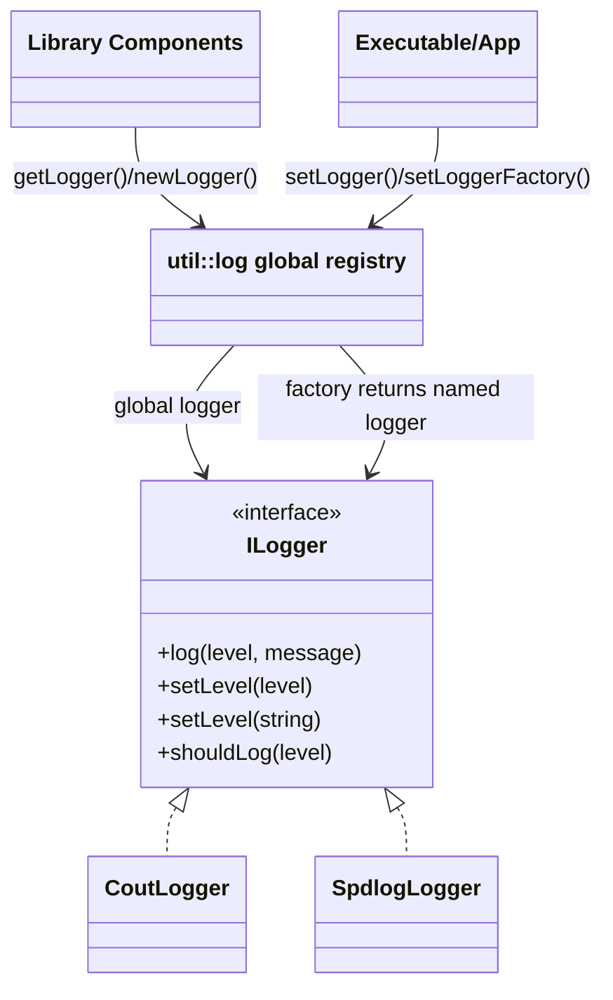
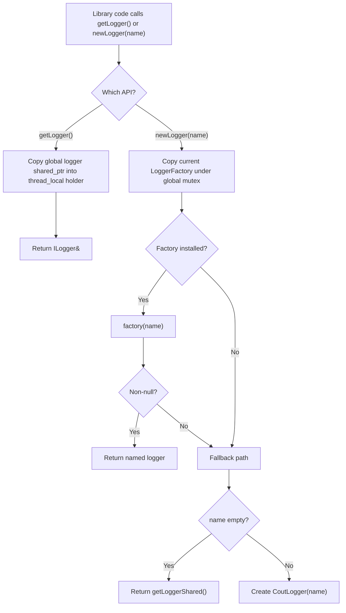

# Logging Abstraction and Custom Logger Implementation

## Overview

This project uses a library-level logging abstraction in `util::log` so core code does not depend on any specific logging backend.

- Library code depends on `mldp_pvxs_driver::util::log::ILogger`
- The executable (or embedding application) installs a concrete logger implementation
- Library components can request named loggers using `newLogger(name)`

This design allows:

- backend swapping (`CoutLogger`, `spdlog`, custom sinks)
- test-friendly log capture
- per-component/per-reader logging without exposing backend types

## Source Files

Core abstraction:

- `include/util/log/ILog.h`
- `include/util/log/Logger.h`

Built-in fallback implementation:

- `include/util/log/CoutLogger.h`
- `src/util/log/CoutLogger.cpp`

CLI adapter example (spdlog-backed):

- `include/SpdlogLogger.h`
- `src/SpdlogLogger.cpp`

Executable integration example:

- `src/mldp_pvxs_driver_main.cpp`

## High-Level Relationships



## Logging API Layers

### 1. `ILogger` interface (`ILog.h`)

`ILogger` is the contract every backend implementation must satisfy.

Required method:

- `virtual void log(Level level, std::string_view message) = 0;`

Optional but strongly recommended overrides:

- `setLevel(Level)` for backend-native filtering
- `shouldLog(Level)` to avoid expensive formatting when a level is disabled

Default behavior in `ILogger`:

- `setLevel(Level)` is a no-op
- `setLevel(std::string_view)` parses text and delegates to `setLevel(Level)`
- `shouldLog(Level)` returns `true`

### 2. Helper functions (`Logger.h`)

`Logger.h` provides convenience functions:

- global logger helpers: `debugf(...)`, `infof(...)`, etc.
- explicit logger helpers: `debugf(logger, ...)`, `infof(logger, ...)`, etc.

These wrappers:

- call `shouldLog(...)` first
- format strings consistently
- fall back gracefully if formatting fails

Important usage rule:

- Prefer `debugf(logger, "...", ...)` / `infof(logger, "...", ...)` for explicit logger instances instead of calling `logf(...)` directly unless you include the `Level` argument.

## Global Logger and Factory Behavior

The library maintains:

- a global/default logger instance
- a global logger factory for named logger creation

Implemented in `src/util/log/CoutLogger.cpp`.

### Key functions

- `setLogger(...)`
- `setLoggerFactory(...)`
- `getLogger()`
- `getLoggerShared()`
- `newLogger(name)`

### Behavior summary

- `setLogger(logger)` installs the default logger
- `setLogger(nullptr)` resets to built-in `CoutLogger`
- `setLogger(...)` also resets the factory to "return global logger for any name" unless a custom factory is installed afterward
- `setLoggerFactory(factory)` installs named logger creation logic
- `setLoggerFactory({})` resets to a default factory that creates `CoutLogger(name)`

### Lookup/creation flow



## Thread-Safety Model

### Global registry synchronization

`src/util/log/CoutLogger.cpp` uses a global mutex to protect:

- the global logger shared pointer
- the logger factory

This avoids races when the executable changes logger/factory while worker threads are active.

### `getLogger()` thread-local handoff

`getLogger()` stores a `shared_ptr<ILogger>` in a `thread_local` variable before returning `ILogger&`.

Why this matters:

- returning a raw reference directly from a mutable global pointer is unsafe
- the thread-local `shared_ptr` keeps the logger object alive while the caller uses the reference

### Logger implementation thread safety

Implementations are expected to be thread-safe.

`CoutLogger` uses an internal mutex for:

- level updates (`setLevel`)
- filtering (`shouldLog`)
- writes to stdout/stderr (`log`)

If your backend already guarantees thread-safe logging (for example many `spdlog` configurations do), your adapter may delegate directly and avoid extra locking.

## `CoutLogger` Reference Implementation

`CoutLogger` is the simplest example of an `ILogger` implementation.

Features:

- per-instance name prefix (optional)
- log level filtering
- `Error`/`Critical` to `stderr`, others to `stdout`
- mutex-protected output and filtering

Use it as a template for:

- test loggers
- file loggers
- structured JSON loggers
- remote sink adapters

## `SpdlogLogger` Adapter (CLI Example)

`SpdlogLogger` shows how to wrap an external logging library without exposing that dependency to the rest of the codebase.

Adapter responsibilities:

- map `util::log::Level` to backend levels
- forward `shouldLog(...)`
- forward `setLevel(...)`
- forward `log(...)`

This is the recommended pattern for any backend integration.

## How To Implement a Custom Logger Class

### Minimum implementation checklist

1. Derive from `mldp_pvxs_driver::util::log::ILogger`
2. Implement `log(Level, std::string_view)`
3. Implement `shouldLog(Level) const` (recommended)
4. Implement `setLevel(Level)` (recommended)
5. Ensure thread safety
6. Avoid throwing from `log(...)` in normal operation

### Example: simple custom logger skeleton

```cpp
#include <util/log/ILog.h>

#include <mutex>
#include <string>

class MyLogger final : public mldp_pvxs_driver::util::log::ILogger
{
public:
    explicit MyLogger(std::string name = {}) : name_(std::move(name)) {}

    void setLevel(mldp_pvxs_driver::util::log::Level level) override
    {
        std::lock_guard<std::mutex> lock(mu_);
        min_level_ = level;
    }

    bool shouldLog(mldp_pvxs_driver::util::log::Level level) const override
    {
        std::lock_guard<std::mutex> lock(mu_);
        if (min_level_ == mldp_pvxs_driver::util::log::Level::Off)
        {
            return false;
        }
        return static_cast<int>(level) >= static_cast<int>(min_level_);
    }

    void log(mldp_pvxs_driver::util::log::Level level, std::string_view message) override
    {
        std::lock_guard<std::mutex> lock(mu_);
        if (min_level_ == mldp_pvxs_driver::util::log::Level::Off
            || static_cast<int>(level) < static_cast<int>(min_level_))
        {
            return;
        }

        // Write to your sink here (file/socket/ring buffer/etc.)
        writeToSink(level, message);
    }

private:
    void writeToSink(mldp_pvxs_driver::util::log::Level level, std::string_view message);

    std::string name_;
    mutable std::mutex mu_;
    mldp_pvxs_driver::util::log::Level min_level_{mldp_pvxs_driver::util::log::Level::Info};
};
```

### Common implementation mistakes to avoid

- Not implementing `shouldLog(...)`, causing unnecessary formatting overhead
- Taking locks in `log(...)` and then calling code that can re-enter the logger (deadlock risk)
- Throwing exceptions during normal logging paths
- Returning `nullptr` from a custom factory without understanding the fallback behavior
- Assuming `setLogger(...)` preserves a previously installed factory (it resets it)

## How To Install a Custom Logger in the Executable

### Single global logger (simplest)

```cpp
auto logger = std::make_shared<MyLogger>();
logger->setLevel("info");

mldp_pvxs_driver::util::log::setLogger(logger);
```

This is enough if:

- you do not need per-component names
- a single logger instance is acceptable for all library logs

### Named logger factory (recommended)

If you want readers/components to get distinct logger names:

```cpp
mldp_pvxs_driver::util::log::setLoggerFactory(
    [](std::string_view name) -> std::shared_ptr<mldp_pvxs_driver::util::log::ILogger>
    {
        if (name.empty())
        {
            return mldp_pvxs_driver::util::log::getLoggerShared();
        }
        return std::make_shared<MyLogger>(std::string(name));
    });
```

### Installation order (important)

If you call both:

1. `setLogger(...)`
2. `setLoggerFactory(...)`

Do it in that order.

Reason:

- `setLogger(...)` resets the factory to a default "return global logger" implementation.

## How Library Code Should Use Logging

### Global logger usage

Use this for generic code that does not need a component-specific logger:

```cpp
#include <util/log/Logger.h>

using namespace mldp_pvxs_driver::util::log;

info("Started subsystem");
debugf("Queue depth={}", depth);
```

### Named/per-instance logger usage

Use this for readers, pools, controllers, or reusable utility classes:

```cpp
#include <util/log/Logger.h>

auto logger = mldp_pvxs_driver::util::log::newLogger("reader:archiver:my_reader");
mldp_pvxs_driver::util::log::infof(*logger, "Initialized");
```

Recommended naming style:

- `<subsystem>:<component>:<instance>`
- examples:
  - `reader:epics-pvxs:gunb`
  - `reader:epics-archiver:history-a`
  - `util:http:epics-archiver:history-a`

## Testing Custom Loggers

Recommended tests for a new logger implementation:

- emits expected output format
- respects level filtering
- `shouldLog(...)` matches `log(...)` filtering behavior
- thread-safety under concurrent writes (at least smoke-test level)
- factory returns named instances correctly

For backend adapters:

- verify level mapping (`Level::Warn` -> backend warn, etc.)
- verify `setLevel(string)` path if used by CLI/app code

## Extension Ideas

- JSON structured logger adapter
- file rotation logger adapter
- in-memory ring-buffer logger for tests/diagnostics
- OpenTelemetry/log forwarding adapter
- metrics-backed logger wrapper (count warnings/errors)

## Related Documentation

- [Architecture Overview](architecture.md)
- [HTTP Transport Provider](http-provider.md)
- [Implementing Custom Readers](readers-implementation.md)
