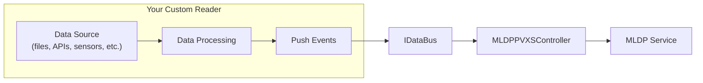

# Implementing Custom Readers

This guide explains how to implement a custom reader for the MLDP PVXS Driver. Readers are the data ingestion components that connect to various data sources and push events to the MLDP ingestion pipeline.

## Overview

The driver uses an **abstract Reader pattern** with a factory-based registration system. This allows new data sources to be added without modifying the core ingestion pipeline.

> **Related:** [Architecture Overview](architecture.md) | [Implementing Custom Writers](writers-implementation.md) | [MLDP Query Client](query-client.md)

## Logging Rule

**Custom readers must use the project's logging abstraction in `util::log`. Do not call `spdlog::...` directly from reader/library code.**

- Reader code should depend on `mldp_pvxs_driver::util::log::ILogger` and helpers like `infof`, `warnf`, `errorf`, and `tracef`.
- Create a named logger with `mldp_pvxs_driver::util::log::newLogger(...)` so logs are scoped per reader instance.
- Keep backend-specific code such as `spdlog` wiring in the executable layer, not in reusable reader implementations.

See [Logging Abstraction Guide](logging.md) for the full model and examples.



## Reader Interface

All readers must inherit from the `Reader` base class and implement the required interface.

### Base Class

```cpp
// include/reader/Reader.h
class Reader {
public:
    Reader(std::shared_ptr<util::bus::IDataBus> bus,
           std::shared_ptr<metrics::Metrics> metrics = nullptr);

    virtual ~Reader() = default;

    // Return a human-readable identifier for this reader instance
    virtual std::string name() const = 0;

protected:
    std::shared_ptr<util::bus::IDataBus> bus_;     // Event bus for pushing data
    std::shared_ptr<metrics::Metrics> metrics_;          // Optional metrics collector
};
```

### Event Bus API

Readers push data using the `IDataBus` interface:

```cpp
// Create a batch and push
IDataBus::EventBatch batch;
batch.root_source = "my_root_pv";  // metrics/correlation label
dp::service::common::DataFrame frame;
auto* col = frame.add_doublecolumns();
col->set_name("signal_name");  // ingestion source identity
col->add_values(42.0);
auto* ts = frame.mutable_datatimestamps()->mutable_timestamplist()->add_timestamps();
ts->set_epochseconds(epoch_seconds);
ts->set_nanoseconds(nanoseconds);
batch.frames.push_back(std::move(frame));

bus_->push(std::move(batch));
```

For query-side code, use `MLDPQueryClient` instead of adding query methods to `IDataBus`. The bus remains push-only, while query operations are handled out of band.

### EventBatch tabular fields

`IDataBus::EventBatch` carries two optional fields that coordinate multi-column, row-synchronized table writes. Both default to `false` and must be left as `false` by any reader that does not produce structured table data.

#### `is_tabular`

Set to `true` when the batch carries one column of a multi-column table whose rows are time-synchronized across all columns. Writers that support tabular layout (e.g. `HDF5Writer`) accumulate column batches marked `is_tabular=true` and hold them until the flush sentinel arrives. Writers that do not support tabular layout ignore this field and process each batch individually.

#### `end_of_batch_group`

A flush sentinel. Set to `true` on the final batch of a logical group to signal "all columns for this row group have been emitted — flush now." Only meaningful when `is_tabular=true`. The sentinel batch itself normally carries no data frames (`frames` is empty).

#### Two-phase protocol

Emit one batch per column, then one empty sentinel batch:

```cpp
// Phase 1: one batch per column, all marked is_tabular=true
IDataBus::EventBatch col_a;
col_a.root_source   = "pv:table";
col_a.frames        = {/* col_A data */};
col_a.is_tabular    = true;
bus_->push(std::move(col_a));

IDataBus::EventBatch col_b;
col_b.root_source   = "pv:table";
col_b.frames        = {/* col_B data */};
col_b.is_tabular    = true;
bus_->push(std::move(col_b));

IDataBus::EventBatch col_c;
col_c.root_source   = "pv:table";
col_c.frames        = {/* col_C data */};
col_c.is_tabular    = true;
bus_->push(std::move(col_c));

// Phase 2: flush sentinel — no data frames
IDataBus::EventBatch sentinel;
sentinel.root_source        = "pv:table";
sentinel.is_tabular         = true;
sentinel.end_of_batch_group = true;
bus_->push(std::move(sentinel));
```

All batches in the group must share the same `root_source` so that the writer can correlate them. When the writer receives the sentinel it flushes all buffered columns as a single compound dataset.

#### When NOT to use these fields

Most readers produce scalar values or waveforms and must never set `is_tabular` or `end_of_batch_group`. Only set them when the data source natively produces synchronized multi-column tables — for example, EPICS NTTable structures, SLAC BSAS table payloads, or structured message-bus records where every column shares the same set of row timestamps.

#### Writer behaviour summary

| Writer supports tabular layout | `is_tabular=false` | `is_tabular=true` (column) | `is_tabular=true, end_of_batch_group=true` (sentinel) |
|---|---|---|---|
| Yes (e.g. HDF5Writer) | Flush immediately | Buffer column | Flush all buffered columns as compound dataset |
| No | Flush immediately | Flush immediately (ignores flag) | Flush immediately (ignores flag) |

## Step-by-Step Implementation

### Step 1: Create a Typed Config Class

Follow the same pattern as `EpicsReaderConfig` and `EpicsArchiverReaderConfig`: parse and validate YAML once in a dedicated config object, then pass that typed view into the reader runtime.

Create `include/reader/impl/<category>/<Name>ReaderConfig.h`:

```cpp
#pragma once

#include <config/Config.h>

#include <chrono>
#include <stdexcept>
#include <string>

namespace mldp_pvxs_driver::reader::impl::<category> {

class <Name>ReaderConfig {
public:
    class Error : public std::runtime_error {
    public:
        using std::runtime_error::runtime_error;
    };

    <Name>ReaderConfig();
    explicit <Name>ReaderConfig(const config::Config& cfg);

    bool valid() const;

    const std::string& name() const;
    const std::string& sourceName() const;
    std::chrono::milliseconds interval() const;
    uint64_t startValue() const;

private:
    void parse(const config::Config& cfg);

    bool valid_{false};
    std::string name_;
    std::string source_name_;
    std::chrono::milliseconds interval_{1000};
    uint64_t start_value_{0};
};

} // namespace mldp_pvxs_driver::reader::impl::<category>
```

Create `src/reader/impl/<category>/<Name>ReaderConfig.cpp`:

```cpp
#include <reader/impl/<category>/<Name>ReaderConfig.h>

namespace mldp_pvxs_driver::reader::impl::<category> {

<Name>ReaderConfig::<Name>ReaderConfig() = default;

<Name>ReaderConfig::<Name>ReaderConfig(const config::Config& cfg) {
    parse(cfg);
}

bool <Name>ReaderConfig::valid() const {
    return valid_;
}

const std::string& <Name>ReaderConfig::name() const {
    return name_;
}

const std::string& <Name>ReaderConfig::sourceName() const {
    return source_name_;
}

std::chrono::milliseconds <Name>ReaderConfig::interval() const {
    return interval_;
}

uint64_t <Name>ReaderConfig::startValue() const {
    return start_value_;
}

void <Name>ReaderConfig::parse(const config::Config& cfg) {
    name_ = cfg.get<std::string>("name").value_or("my_reader");
    source_name_ = cfg.get<std::string>("source_name").value_or("my:source");
    interval_ = std::chrono::milliseconds(cfg.get<int>("interval_ms").value_or(1000));
    start_value_ = cfg.get<uint64_t>("start_value").value_or(0);
    valid_ = true;
}

} // namespace mldp_pvxs_driver::reader::impl::<category>
```

### Step 2: Create the Reader Header

Create `include/reader/impl/<category>/<Name>Reader.h`:

```cpp
#pragma once

#include <reader/Reader.h>
#include <reader/ReaderFactory.h>
#include <reader/impl/<category>/<Name>ReaderConfig.h>
#include <util/log/ILog.h>

#include <atomic>
#include <thread>
#include <string>

namespace mldp_pvxs_driver::reader::impl::<category> {

class <Name>Reader : public Reader {
public:
    <Name>Reader(
        std::shared_ptr<util::bus::IDataBus> bus,
        std::shared_ptr<metrics::Metrics> metrics,
        const config::Config& cfg);

    ~<Name>Reader() override;

    std::string name() const override;

    // Start reading data
    void start();

    // Stop reading data
    void stop();

private:
    <Name>ReaderConfig config_;
    std::shared_ptr<util::log::ILogger> logger_;
    std::atomic<bool> running_{false};
    std::thread worker_thread_;

    void workerLoop();
    void processData(/* your data type */);
};

// Register with the factory
REGISTER_READER("<type-name>", <Name>Reader)

} // namespace
```

### Step 3: Implement the Reader

Create `src/reader/impl/<category>/<Name>Reader.cpp`:

```cpp
#include <reader/impl/<category>/<Name>Reader.h>

using namespace mldp_pvxs_driver::util::log;

namespace mldp_pvxs_driver::reader::impl::<category> {

std::shared_ptr<util::log::ILogger> make<Name>ReaderLogger(const <Name>ReaderConfig& cfg) {
    return newLogger("reader:<type-name>:" + cfg.name());
}

<Name>Reader::<Name>Reader(
    std::shared_ptr<util::bus::IDataBus> bus,
    std::shared_ptr<metrics::Metrics> metrics,
    const config::Config& cfg)
    : Reader(std::move(bus), std::move(metrics))
    , config_(cfg)
    , logger_(make<Name>ReaderLogger(config_))
{
    // Initialize your data source connection
    // ...

    infof(*logger_, "Reader initialized");
}

<Name>Reader::~<Name>Reader() {
    stop();
}

std::string <Name>Reader::name() const {
    return config_.name();
}

void <Name>Reader::start() {
    if (running_.exchange(true)) {
        return;  // Already running
    }

    worker_thread_ = std::thread([this] { workerLoop(); });
    infof(*logger_, "Reader started");
}

void <Name>Reader::stop() {
    if (!running_.exchange(false)) {
        return;  // Already stopped
    }

    if (worker_thread_.joinable()) {
        worker_thread_.join();
    }
    infof(*logger_, "Reader stopped");
}

void <Name>Reader::workerLoop() {
    while (running_) {
        // Read data from your source
        // Process and push to bus
        // Handle errors gracefully
    }
}

void <Name>Reader::processData(/* your data */) {
    // Convert to EventBatch and push
    IDataBus::EventBatch batch;
    batch.root_source = config_.name();  // root PV / reader identity for metrics

    dp::service::common::DataFrame frame;
    auto* c = frame.add_doublecolumns();
    c->set_name(config_.sourceName());
    c->add_values(/* value */);
    auto* ts = frame.mutable_datatimestamps()->mutable_timestamplist()->add_timestamps();
    ts->set_epochseconds(/* epoch_seconds */);
    ts->set_nanoseconds(/* nanoseconds */);
    batch.frames.push_back(std::move(frame));

    if (!bus_->push(std::move(batch))) {
        warnf(*logger_, "Failed to push event batch");
    }
}

} // namespace
```

Important:

- The logger name should include the reader type and instance name, for example `reader:counter:test_counter`.
- Format through `infof(*logger_, ...)` or similar helpers, not through `spdlog::info(...)`.
- This keeps reader code backend-agnostic and consistent with the rest of the library.

### Step 4: Update CMakeLists.txt

Add your source files to the library target in `CMakeLists.txt`:

```cmake
target_sources(mldp_pvxs_driver_lib PRIVATE
    # ... existing sources ...
    src/reader/impl/<category>/<Name>ReaderConfig.cpp
    src/reader/impl/<category>/<Name>Reader.cpp
)
```

### Step 5: Configure via YAML

```yaml
reader:
  - <type-name>:
      - name: my_reader_instance
        # Your reader-specific configuration
        option1: value1
        option2: value2
```

## Complete Example: Simple Counter Reader

Here's a complete example of a simple reader that generates incrementing counter values at a configurable interval.

### Header: `include/reader/impl/test/CounterReaderConfig.h`

```cpp
#pragma once

#include <config/Config.h>

#include <chrono>
#include <stdexcept>
#include <string>

namespace mldp_pvxs_driver::reader::impl::test {

class CounterReaderConfig {
public:
    class Error : public std::runtime_error {
    public:
        using std::runtime_error::runtime_error;
    };

    CounterReaderConfig();
    explicit CounterReaderConfig(const config::Config& cfg);

    bool valid() const;

    const std::string& name() const;
    const std::string& sourceName() const;
    std::chrono::milliseconds interval() const;
    uint64_t startValue() const;

private:
    void parse(const config::Config& cfg);

    bool valid_{false};
    std::string name_;
    std::string source_name_;
    std::chrono::milliseconds interval_{1000};
    uint64_t start_value_{0};
};

} // namespace mldp_pvxs_driver::reader::impl::test
```

### Header: `include/reader/impl/test/CounterReader.h`

```cpp
#pragma once

#include <reader/Reader.h>
#include <reader/ReaderFactory.h>
#include <reader/impl/test/CounterReaderConfig.h>
#include <util/log/ILog.h>

#include <atomic>
#include <thread>

namespace mldp_pvxs_driver::reader::impl::test {

/**
 * @brief A simple test reader that generates incrementing counter values.
 *
 * Useful for testing the ingestion pipeline without external dependencies.
 */
class CounterReader : public Reader {
public:
    CounterReader(
        std::shared_ptr<util::bus::IDataBus> bus,
        std::shared_ptr<metrics::Metrics> metrics,
        const config::Config& cfg);

    ~CounterReader() override;

    std::string name() const override;
    void start();
    void stop();

private:
    CounterReaderConfig config_;
    std::shared_ptr<util::log::ILogger> logger_;

    std::atomic<bool> running_{false};
    std::atomic<uint64_t> counter_{0};
    std::thread worker_thread_;

    void workerLoop();
    void pushCounterValue(uint64_t value);
};

// Register as "counter" reader type
REGISTER_READER("counter", CounterReader)

} // namespace mldp_pvxs_driver::reader::impl::test
```

### Implementation: `src/reader/impl/test/CounterReader.cpp`

```cpp
#include <reader/impl/test/CounterReader.h>

using namespace mldp_pvxs_driver::util::log;

namespace mldp_pvxs_driver::reader::impl::test {

std::shared_ptr<util::log::ILogger> makeCounterReaderLogger(const CounterReaderConfig& cfg) {
    return newLogger("reader:counter:" + cfg.name());
}

CounterReader::CounterReader(
    std::shared_ptr<util::bus::IDataBus> bus,
    std::shared_ptr<metrics::Metrics> metrics,
    const config::Config& cfg)
    : Reader(std::move(bus), std::move(metrics))
    , config_(cfg)
    , logger_(makeCounterReaderLogger(config_))
{
    counter_.store(config_.startValue());

    infof(*logger_,
          "CounterReader initialized: source={}, interval={}ms, start={}",
          config_.sourceName(),
          config_.interval().count(),
          config_.startValue());
}

CounterReader::~CounterReader() {
    stop();
}

std::string CounterReader::name() const {
    return config_.name();
}

void CounterReader::start() {
    if (running_.exchange(true)) {
        warnf(*logger_, "Already running");
        return;
    }

    worker_thread_ = std::thread([this] { workerLoop(); });
    infof(*logger_, "Started");
}

void CounterReader::stop() {
    if (!running_.exchange(false)) {
        return;
    }

    if (worker_thread_.joinable()) {
        worker_thread_.join();
    }
    infof(*logger_, "Stopped");
}

void CounterReader::workerLoop() {
    while (running_) {
        uint64_t value = counter_.fetch_add(1);
        pushCounterValue(value);

        // Sleep until next interval
        std::this_thread::sleep_for(config_.interval());
    }
}

void CounterReader::pushCounterValue(uint64_t value) {
    // Get current timestamp
    auto now = std::chrono::system_clock::now();
    auto epoch = now.time_since_epoch();
    auto seconds = std::chrono::duration_cast<std::chrono::seconds>(epoch);
    auto nanos = std::chrono::duration_cast<std::chrono::nanoseconds>(epoch - seconds);

    // Create event with timestamp
    util::bus::IDataBus::EventBatch batch;
    batch.root_source = config_.name();  // metrics/correlation root source
    dp::service::common::DataFrame frame;
    auto* c = frame.add_int64columns();
    c->set_name(config_.sourceName());
    c->add_values(static_cast<int64_t>(value));
    auto* ts = frame.mutable_datatimestamps()->mutable_timestamplist()->add_timestamps();
    ts->set_epochseconds(static_cast<uint64_t>(seconds.count()));
    ts->set_nanoseconds(static_cast<uint64_t>(nanos.count()));
    batch.frames.push_back(std::move(frame));

    if (!bus_->push(std::move(batch))) {
        warnf(*logger_, "Failed to push counter value {}", value);
    } else {
        tracef(*logger_, "Pushed counter value {}", value);
    }
}

} // namespace mldp_pvxs_driver::reader::impl::test
```

### Implementation: `src/reader/impl/test/CounterReaderConfig.cpp`

```cpp
#include <reader/impl/test/CounterReaderConfig.h>

namespace mldp_pvxs_driver::reader::impl::test {

CounterReaderConfig::CounterReaderConfig() = default;

CounterReaderConfig::CounterReaderConfig(const config::Config& cfg) {
    parse(cfg);
}

bool CounterReaderConfig::valid() const {
    return valid_;
}

const std::string& CounterReaderConfig::name() const {
    return name_;
}

const std::string& CounterReaderConfig::sourceName() const {
    return source_name_;
}

std::chrono::milliseconds CounterReaderConfig::interval() const {
    return interval_;
}

uint64_t CounterReaderConfig::startValue() const {
    return start_value_;
}

void CounterReaderConfig::parse(const config::Config& cfg) {
    name_ = cfg.get<std::string>("name").value_or("counter_reader");
    source_name_ = cfg.get<std::string>("source_name").value_or("counter");
    interval_ = std::chrono::milliseconds(cfg.get<int>("interval_ms").value_or(1000));
    start_value_ = cfg.get<uint64_t>("start_value").value_or(0);
    valid_ = true;
}

} // namespace mldp_pvxs_driver::reader::impl::test
```

### Configuration Example

```yaml
reader:
  - counter:
      - name: test_counter
        source_name: test:counter:value
        interval_ms: 500
        start_value: 100
```

## Data Types

## Frame Validation Rules

- Every emitted `DataFrame` must include `datatimestamps.timestamplist` with at least one timestamp.
- Readers/converters must not push frames without timestamps.
- Controller drops and reports any frame that still arrives without timestamps.

The `DataValue` protobuf message supports various data types:

Type     | Setter Method        | Use Case
-------- | -------------------- | -----------------------------
`double` | `set_double_value()` | Floating-point measurements
`float`  | `set_float_value()`  | Single-precision floats
`int32`  | `set_int_value()`    | Signed integers
`int64`  | `set_long_value()`   | Large signed integers
`uint32` | `set_uint_value()`   | Unsigned integers
`uint64` | `set_ulong_value()`  | Large unsigned integers
`string` | `set_string_value()` | Text data
`bytes`  | `set_bytes_value()`  | Binary data
`bool`   | `set_bool_value()`   | Boolean flags

For array types, use the corresponding `mutable_*_array()` methods.

## Best Practices

### Thread Safety

- Use `std::atomic` for flags shared between threads
- Protect shared data structures with mutexes
- Consider using thread pools for parallel processing (see `BS::light_thread_pool`)

### Configuration Management

- Create a dedicated `<Name>ReaderConfig` class that parses and validates YAML once.
- Keep config defaults, aliases, and validation errors inside the config class, not inside the reader runtime.
- Let the reader consume typed accessors such as `config_.name()` or `config_.interval()` instead of calling `cfg.get(...)` throughout the implementation.

### Error Handling

- Handle connection failures gracefully with retries
- Log errors with appropriate severity levels
- Don't let exceptions propagate from worker threads

### Logging Abstraction

- Use `util::log::ILogger` plus helper functions such as `infof`, `warnf`, `errorf`, and `tracef`.
- Create per-reader loggers with `newLogger("reader:<type>:<name>")`.
- Do not use `spdlog::info`, `spdlog::warn`, or other backend APIs directly in reader code.
- Treat direct backend logging in library code as a documentation and implementation bug; backend selection belongs in the executable layer.

### Performance

- Batch multiple events before pushing when possible
- Use move semantics to avoid unnecessary copies
- Consider the trade-off between latency and throughput

### Metrics

- Expose Prometheus metrics for observability
- Track events received, processed, and errors
- Monitor queue depths and processing times

```cpp
// Example metrics integration
if (metrics_) {
    metrics_->incrementCounter("reader_events_total", {{"reader", name_}});
    metrics_->observeHistogram("reader_processing_time_ms",
                                {{"reader", name_}},
                                processing_time_ms);
}
```

### Configuration

- Use sensible defaults for all configuration options
- Validate configuration at construction time
- Document all configuration options

### Lifecycle

- Initialize resources in the constructor
- Start background threads in `start()`
- Clean up resources in `stop()` and destructor
- Make `start()` and `stop()` idempotent

## Testing

Create unit tests for your reader in `test/reader/impl/<category>/<Name>ReaderTest.cpp`:

```cpp
#include <gtest/gtest.h>
#include <reader/impl/<category>/<Name>Reader.h>
#include <gmock/gmock.h>

// Mock event bus for testing
class MockEventBus : public IDataBus {
public:
    MOCK_METHOD(bool, push, (EventBatch batch), (override));
};

TEST(<Name>ReaderTest, PushesEventsCorrectly) {
    auto mock_bus = std::make_shared<MockEventBus>();

    EXPECT_CALL(*mock_bus, push(testing::_))
        .WillOnce(testing::Return(true));

    // Create and test your reader
    // ...
}
```

## Related Documentation

- [Architecture Overview](architecture.md) - System architecture and data flow
- [Reader Types](readers.md) - Existing reader implementations and comparison
- [Implementing Custom Writers](writers-implementation.md) - Writer-side mirror of this guide
- [MLDP Query Client](query-client.md) - Standalone query API for metadata and historical data
- [EpicsBaseReader Implementation](readers/epics-base-reader-implementation.md) - Polling-based EPICS Channel Access reader
- [EpicsPVXSReader Implementation](readers/epics-pvxs-reader-implementation.md) - Event-driven PVAccess reader
- [EpicsArchiverReader Implementation](readers/epics-archiver-reader-implementation.md) - Historical EPICS Archiver reader
