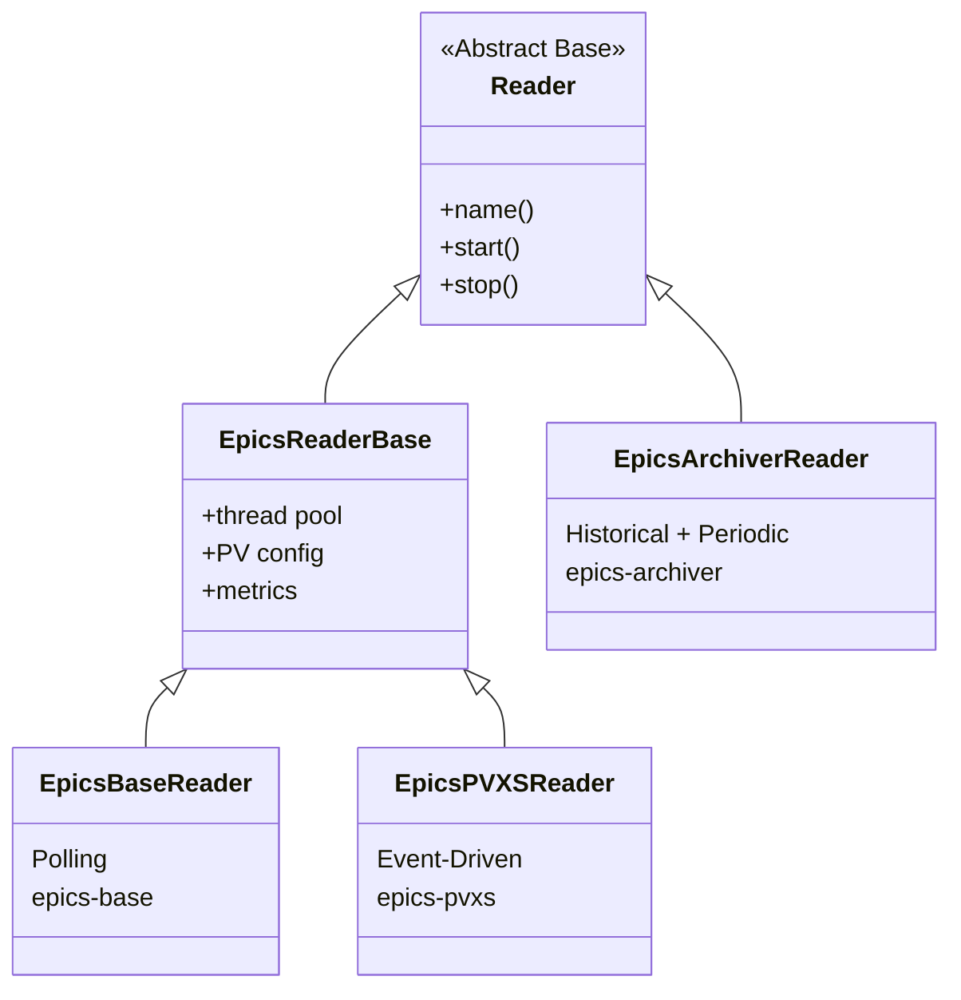

# Reader Implementations

The MLDP PVXS Driver uses an **abstract Reader pattern** to support multiple data sources. The architecture is designed to be extensible, allowing new reader types to be added without modifying the core ingestion pipeline.

> **Related:** [Architecture Overview](architecture.md) | [Implementing Custom Readers](readers-implementation.md)

## Supported Reader Types

| Reader Type      | Status      | Data Source          | Documentation                        |
|------------------|-------------|----------------------|--------------------------------------|
| `epics-base`     | Implemented | EPICS Control System | [EpicsBaseReader](readers/epics-base-reader.md) |
| `epics-pvxs`     | Implemented | EPICS Control System | [EpicsPVXSReader](readers/epics-pvxs-reader.md) |
| `epics-archiver` | Implemented | EPICS Archiver       | [EpicsArchiverReader](readers/epics-archiver-reader.md) |

## Reader Class Hierarchy



## Implemented Readers

### EpicsBaseReader

Polling-based EPICS Channel Access monitoring for legacy systems.

- **Mode**: Polling with configurable interval
- **Best For**: Legacy EPICS installations without PVAccess
- **Key Feature**: Multiple polling threads with mutex-protected queue draining
- **BSAS Support**: SLAC BSAS NTTable mode with per-row timestamps — see [SLAC BSAS NTTable Gen 1](readers/slac-bsas-table-gen1.md), [Gen 2](readers/slac-bsas-table-gen2.md)

→ [Full Documentation: EpicsBaseReader](readers/epics-base-reader.md)

### EpicsPVXSReader

Modern event-driven EPICS PVAccess monitoring with advanced table support.

- **Mode**: Event-driven subscriptions
- **Best For**: High-frequency updates with minimal latency
- **Key Feature**: Smart thread pool decisions + SLAC BSAS NTTable support — see [SLAC BSAS NTTable Gen 1](readers/slac-bsas-table-gen1.md), [Gen 2](readers/slac-bsas-table-gen2.md)

→ [Full Documentation: EpicsPVXSReader](readers/epics-pvxs-reader.md)

### EpicsArchiverReader

Historical data retrieval and continuous tail polling from EPICS Archiver Appliance.

- **Mode**: One-shot historical fetch or periodic polling
- **Best For**: Data backfill, archiver tailing, time-series analysis
- **Key Feature**: PB/HTTP streaming, configurable timeouts, graceful shutdown

→ [Full Documentation: EpicsArchiverReader](readers/epics-archiver-reader.md)

## Architecture Overview

### Core Pattern

All readers follow the same pattern:

1. **Initialization**: Register with `ReaderFactory` using a unique type name
2. **Data Acquisition**: Connect to data source and capture updates
3. **Data Processing**: Convert source data to MLDP protobuf format
4. **Publishing**: Push events to `IDataBus` for downstream processing

### Reader Base Class

All readers inherit from `Reader` and must provide:

```cpp
class MyReader : public Reader {
public:
    MyReader(std::shared_ptr<IDataBus> bus,
             std::shared_ptr<metrics::Metrics> metrics = nullptr);

    virtual ~MyReader();

    // Return human-readable identifier
    virtual std::string name() const override;

protected:
    std::shared_ptr<IDataBus> bus_;       // Event bus
    std::shared_ptr<metrics::Metrics> metrics_; // Optional metrics
};
```

### Common Base: EpicsReaderBase

EPICS-specific readers (base, pvxs, archiver) share `EpicsReaderBase`:

#### Thread Pool Management

- Creates and manages `BS::light_thread-pool` for data conversion
- Configurable via `thread-pool-size` parameter
- Metrics track queue depth

#### Common Features

- PV name list management
- Logging integration
- Protobuf conversion utilities
- Error handling and metrics collection

| File           | Location                                         |
|----------------|--------------------------------------------------|
| Header         | `include/reader/impl/epics/shared/EpicsReaderBase.h`    |
| Implementation | `src/reader/impl/epics/shared/EpicsReaderBase.cpp`      |

## Factory Registration

Readers are registered at compile time using the `REGISTER_READER` macro:

```cpp
// In EpicsBaseReader.h
REGISTER_READER("epics-base", EpicsBaseReader)

// In EpicsPVXSReader.h
REGISTER_READER("epics-pvxs", EpicsPVXSReader)

// In EpicsArchiverReader.h
REGISTER_READER("epics-archiver", EpicsArchiverReader)
```

The `ReaderFactory` creates readers dynamically from configuration:

```cpp
auto reader = ReaderFactory::create("epics-pvxs", config, bus);
```

## Configuration Pattern

All readers use YAML-based configuration:

```yaml
reader:
  - <reader-type>:
      - name: instance_name
        param1: value1
        param2: value2
        pvs:
          - name: PV_NAME_1
          - name: PV_NAME_2
```

Configuration is validated and type-checked before reader instantiation.

## Metrics

All MLDP readers expose consistent Prometheus metrics:

| Metric                                           | Description                       |
|--------------------------------------------------|-----------------------------------|
| `mldp_pvxs_driver_reader_events_received_total`  | Raw PV updates received           |
| `mldp_pvxs_driver_reader_events_total`           | Successfully processed events     |
| `mldp_pvxs_driver_reader_errors_total`           | Conversion/remote errors          |
| `mldp_pvxs_driver_reader_processing_time_ms`     | Event processing time histogram   |
| `mldp_pvxs_driver_reader_queue_depth`            | Monitor queue size (EpicsBase)    |
| `mldp_pvxs_driver_reader_pool_queue_depth`       | Thread pool queue depth           |

## Comparison Matrix

| Feature            | EpicsBaseReader                  | EpicsPVXSReader                  | EpicsArchiverReader             |
|--------------------|----------------------------------|----------------------------------|---------------------------------|
| Protocol           | Channel Access                   | PVAccess (PVXS)                  | HTTP (PB/HTTP streaming)        |
| Event Model        | Polling                          | Event-driven                     | Fetch (one-shot or periodic)    |
| Latency            | Poll interval dependent          | Immediate                        | Variable (depends on window)    |
| Thread Model       | Poll threads + conversion pool   | Callback + conditional pool      | Worker thread + conversion pool |
| Data Source        | Live PVs                         | Live PVs                         | Historical archiver data        |
| Configuration      | `epics-base`                     | `epics-pvxs`                     | `epics-archiver`                |
| Best For           | Legacy systems                   | Modern high-performance          | Backfill and data replay        |

---

## Implementing New Readers

The driver architecture is designed to be extensible. New reader types can be added without modifying the core ingestion pipeline.

For a complete guide on implementing custom readers, including:

- Step-by-step implementation instructions
- A complete working example (CounterReader)
- Best practices for threading, error handling, and metrics
- Testing guidelines

See **[Implementing Custom Readers](readers-implementation.md)**.

### Reader Development Checklist

1. ✅ Understand the `Reader` interface and `IDataBus` API
2. ✅ Design your data source integration (polling, events, streaming, etc.)
3. ✅ Implement data conversion to protobuf format
4. ✅ Create configuration parser (YAML → reader config)
5. ✅ Handle threading and lifecycle (start/stop, shutdown gracefully)
6. ✅ Add Prometheus metrics
7. ✅ Write comprehensive tests
8. ✅ Register with `REGISTER_READER` macro
9. ✅ Update configuration schema documentation

### Key Implementation Patterns

**Pattern 1: Polling Reader** (like EpicsBaseReader)
- Spawn dedicated polling thread(s)
- Drain data into thread-safe queue
- Push to event bus from worker thread
- Handle shutdown cleanly

**Pattern 2: Event-Driven Reader** (like EpicsPVXSReader)
- Register callbacks with data source
- Use thread pool for async processing if needed
- Push events to bus from callback or pool
- Implement proper subscription cleanup

**Pattern 3: Batch/Streaming Reader** (like EpicsArchiverReader)
- Fetch data in background worker
- Stream or batch parse response data
- Split into logical batches by time or size
- Push batches to event bus
- Handle graceful shutdown of in-flight requests


## Implementation Files Organization

```
include/reader/
├── Reader.h                          # Abstract base class
├── ReaderFactory.h                   # Factory registration
└── impl/
    └── epics/
        ├── shared/
        │   ├── EpicsReaderBase.h     # Common EPICS base
        │   └── EpicsReaderConfig.h
        ├── base/
        │   ├── EpicsBaseReader.h
        │   ├── EpicsBaseMonitorPoller.h
        │   └── EpicsPVDataConversion.h
        ├── pvxs/
        │   ├── EpicsPVXSReader.h
        │   ├── EpicsMLDPConversion.h
        │   └── BSASEpicsMLDPConversion.h
        └── epics_archiver/
            ├── EpicsArchiverReader.h
            └── EpicsArchiverReaderConfig.h

src/reader/
├── Reader.cpp
├── ReaderFactory.cpp
└── impl/
    ├── epics/
    │   ├── shared/
    │   │   ├── EpicsReaderBase.cpp
    │   │   └── EpicsReaderConfig.cpp
    │   ├── base/
    │   │   ├── EpicsBaseReader.cpp
    │   │   ├── EpicsBaseMonitorPoller.cpp
    │   │   └── EpicsPVDataConversion.cpp
    │   └── pvxs/
    │       ├── EpicsPVXSReader.cpp
    │       ├── EpicsMLDPConversion.cpp
    │       └── BSASEpicsMLDPConversion.cpp
    └── epics_archiver/
        ├── EpicsArchiverReader.cpp
        └── EpicsArchiverReaderConfig.cpp
```

---

## See Also

- [Architecture Overview](architecture.md) - System-wide architecture and data flow
- [Implementing Custom Readers](readers-implementation.md) - Complete guide with examples
- [Configuration Reference](../config.md) - Full configuration schema
- [SLAC BSAS NTTable Gen 1](readers/slac-bsas-table-gen1.md) - BSAS Gen 1: raw per-pulse sample arrays
- [SLAC BSAS NTTable Gen 2](readers/slac-bsas-table-gen2.md) - BSAS Gen 2: PID-indexed statistical summaries (planned)
