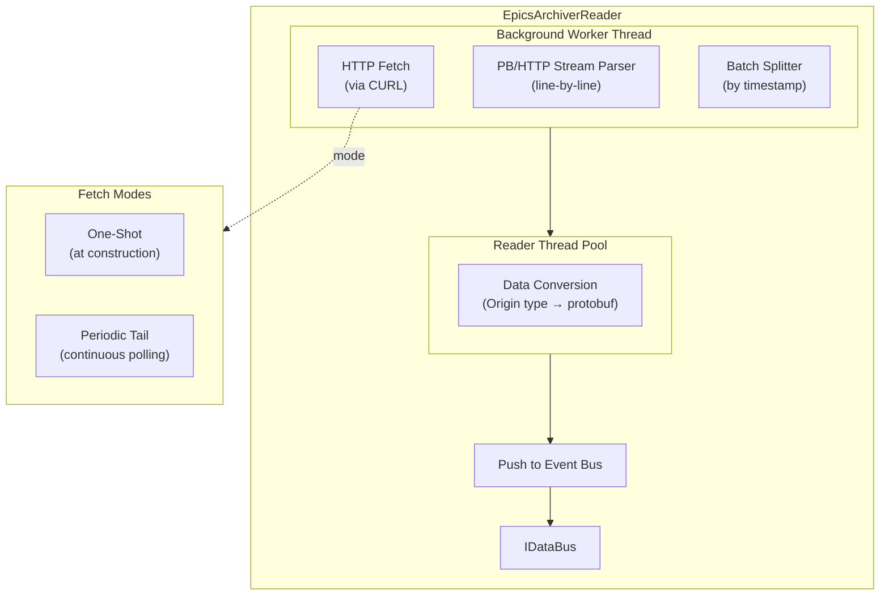

# EpicsArchiverReader (Historical Data Retrieval)

The `EpicsArchiverReader` provides access to historical EPICS data from the EPICS Archiver Appliance. It fetches time-windowed datasets and supports both one-shot historical retrieval and periodic polling modes.

**Registration Type:** `"epics-archiver"`

**Status:** Implemented and actively developed

File           | Location
-------------- | -------------------------------------------------------
Header         | `include/reader/impl/epics/EpicsArchiverReader.h`
Implementation | `src/reader/impl/epics/EpicsArchiverReader.cpp`
Config         | `include/reader/impl/epics/EpicsArchiverReaderConfig.h`

## Architecture



## Operating Modes

### One-Shot Historical Fetch (Default)

1. EpicsArchiverReader constructed with start/end timestamps
2. Background worker thread starts immediately
3. Initiates HTTP GET request to Archiver Appliance `/retrieval/data/getData.raw`
4. Streams PB/HTTP response (PayloadInfo + ScalarDouble samples)
5. Parses protobuf messages line-by-line
6. Batches events by historical sample timestamps (using `batch-duration-sec`)
7. Pushes batches to event bus
8. Completes and thread exits (reader still running but idle)

**Worker thread lifecycle:** Starts, fetches and processes, exits automatically. Shutdown cancels the HTTP request immediately; thread joins before destructor completes.

```yaml
reader:
  - epics-archiver:
      - name: my_archiver_reader
        url: "http://archiver-appliance.example.com"
        start-date: "2024-01-01T00:00:00Z"  # Required
        end-date: "2024-01-02T00:00:00Z"    # Optional
        batch-duration-sec: 1               # Split events by 1-second windows
        thread-pool-size: 2                 # Conversion thread pool
        pvs:
          - name: MY:ARCHIVER:PV
          - name: ANOTHER:HISTORICAL:PV
```

### Periodic Tail Mode

1. Configured with `mode: periodic_tail`
2. Background worker thread runs continuously
3. Each iteration: generates time window from `now - lookback` to `now`
4. Fetches archiver data for that window
5. Processes and pushes new events
6. Waits `poll-interval-sec` (interruptible via condition variable)
7. Repeats until reader destruction

**Worker thread lifecycle:** Runs until reader destruction. Condition variable allows prompt shutdown without waiting for poll interval to expire.

```yaml
reader:
  - epics-archiver:
      - name: continuous_archiver
        url: "http://archiver.example.com"
        mode: periodic_tail             # Enable continuous polling
        poll-interval-sec: 5            # Poll every 5 seconds
        lookback-sec: 60                # Fetch last 60 seconds each time
        batch-duration-sec: 1
        thread-pool-size: 2
        pvs:
          - name: MY:PV:NAME
```

## Configuration

### Required Parameters

Parameter | Type   | Description
--------- | ------ | ------------------------------------------------------------------
`url`     | string | Archiver Appliance base URL (e.g., `http://archiver.example.com`)
`pvs`     | list   | Array of PV names or objects to fetch from archiver

### One-Shot Mode Parameters

Parameter            | Type   | Default | Description
-------------------- | ------ | ------- | -------------------------------------------------------------------
`start-date`         | string | —       | **Required** ISO 8601 timestamp for query start
`end-date`           | string | —       | ISO 8601 timestamp for query end (defaults to `start-date` + 1 day)
`batch-duration-sec` | float  | 1.0     | Split output batches using historical timestamps at this interval

### Periodic Tail Mode Parameters

Parameter            | Type   | Default         | Description
-------------------- | ------ | --------------- | -----------------------------------------------------------------
`mode`               | string | `one_shot`      | Set to `periodic_tail` to enable continuous polling
`poll-interval-sec`  | float  | 5.0             | Polling interval in seconds
`lookback-sec`       | float  | (poll_interval) | Seconds of history to fetch per poll (defaults to poll_interval)
`batch-duration-sec` | float  | 1.0             | Batch split interval

### HTTP and TLS Parameters

Parameter             | Type  | Default | Description
--------------------- | ----- | ------- | ----------------------------------
`connect-timeout-sec` | float | 30.0    | Connection establishment timeout
`total-timeout-sec`   | float | 300.0   | Total operation timeout
`tls-verify-peer`     | bool  | true    | Verify SSL peer certificate
`tls-verify-host`     | bool  | true    | Verify hostname matches certificate

```yaml
reader:
  - epics-archiver:
      - name: secure_archiver
        url: "https://archiver.example.com"
        start-date: "2024-01-01T00:00:00Z"
        connect-timeout-sec: 30         # Connection timeout (default: 30)
        total-timeout-sec: 300          # Total operation timeout (default: 300)
        tls-verify-peer: true           # Verify SSL peer (default: true)
        tls-verify-host: true           # Verify hostname (default: true)
        pvs:
          - name: MY:PV
```

**Validation rules:**

- `total-timeout-sec >= connect-timeout-sec` (enforced)
- All timeout values must be positive (enforced)
- URL must be valid and accessible
- At least one PV required
- Start date required for one-shot mode

## Key Features

- **Time-Windowed Queries**: Query archiver data by start/end timestamps with efficient PB/HTTP streaming
- **Timestamp-Based Batching**: Groups events by historical sample time, not wall-clock processing time — preserves original temporal structure
- **Automated Tail Polling**: Continuously fetch new archiver data at configurable intervals with a configurable lookback window to handle clock skew and backfill
- **Background Worker Thread**: One-shot fetch or periodic polling runs off main reader construction
- **Thread Pool Processing**: Configurable conversion parallelism
- **Secure Defaults**: TLS verification enabled by default; configurable per-instance timeouts
- **Graceful Shutdown**: HTTP request cancellation on reader destruction; thread joins before destructor completes
- **Metrics**: Prometheus metrics for events received, processed, and errors

## Data Types Supported

All standard EPICS Archiver Appliance PB/HTTP payload types are supported:

### Scalars

EPICS Type      | DataFrame Column Type
--------------- | ---------------------
`SCALAR_DOUBLE` | `doublecolumns`
`SCALAR_FLOAT`  | `floatcolumns`
`SCALAR_INT`    | `int32columns`
`SCALAR_SHORT`  | `int32columns`
`SCALAR_ENUM`   | `int32columns`
`SCALAR_STRING` | `stringcolumns`
`SCALAR_BYTE`   | `stringcolumns` (raw bytes)

### Waveforms

EPICS Type        | DataFrame Column Type
----------------- | ---------------------
`WAVEFORM_DOUBLE` | `doublecolumns`
`WAVEFORM_FLOAT`  | `floatcolumns`
`WAVEFORM_INT`    | `int32columns`
`WAVEFORM_SHORT`  | `int32columns`
`WAVEFORM_ENUM`   | `int32columns`
`WAVEFORM_STRING` | `stringcolumns`
`WAVEFORM_BYTE`   | `stringcolumns` (raw bytes)

### Other

EPICS Type         | DataFrame Column Type
------------------ | ---------------------
`V4_GENERIC_BYTES` | `stringcolumns` (raw bytes)

## Use Cases and Patterns

### Backfill Historical Data

```yaml
reader:
  - epics-archiver:
      - name: yesterday_backfill
        url: "http://archiver.example.com"
        start-date: "2024-01-09T00:00:00Z"
        end-date: "2024-01-10T00:00:00Z"
        pvs:
          - name: MY:SCALAR:PV
```

### Continuous Tail (Last Hour)

```yaml
reader:
  - epics-archiver:
      - name: tail_reader
        url: "http://archiver.example.com"
        mode: periodic_tail
        poll-interval-sec: 10
        lookback-sec: 3600            # Keep 1 hour of history per poll
        pvs:
          - name: MY:PV
```

### Fine-Grained Batching

```yaml
reader:
  - epics-archiver:
      - name: high_freq_archiver
        url: "http://archiver.example.com"
        start-date: "2024-01-01T00:00:00Z"
        batch-duration-sec: 0.1       # 100ms batches for high-frequency analysis
        pvs:
          - name: FAST:PV
```

## Metrics

Metric                                            | Description
------------------------------------------------- | -------------------------------------
`mldp_pvxs_driver_reader_events_received_total`   | Total archiver samples received
`mldp_pvxs_driver_reader_events_total`            | Successfully processed events
`mldp_pvxs_driver_reader_errors_total`            | Conversion or HTTP errors
`mldp_pvxs_driver_reader_processing_time_ms`      | Event processing latency (histogram)
`mldp_pvxs_driver_reader_pool_queue_depth`        | Thread pool queue depth

## Implementation Details

### Batch Splitting by Historical Timestamp

Batches are created by grouping events that fall within the same `batch-duration-sec` window using the **archiver sample time**, not the reader's wall-clock processing time.

```cpp
// Example: batch-duration-sec: 1.0
// Event from 2024-01-01T12:34:56.500Z  -> Batch [12:34:56, 12:34:57)
// Event from 2024-01-01T12:34:57.200Z  -> Batch [12:34:57, 12:34:58)
```

### HTTP Transport

- **Chunked Transfer**: Efficient streaming via HTTP chunked encoding
- **Keep-Alive**: TCP keep-alive and compression support enabled
- **Cancellation**: HTTP client cancellation on reader destruction prevents hanging requests
