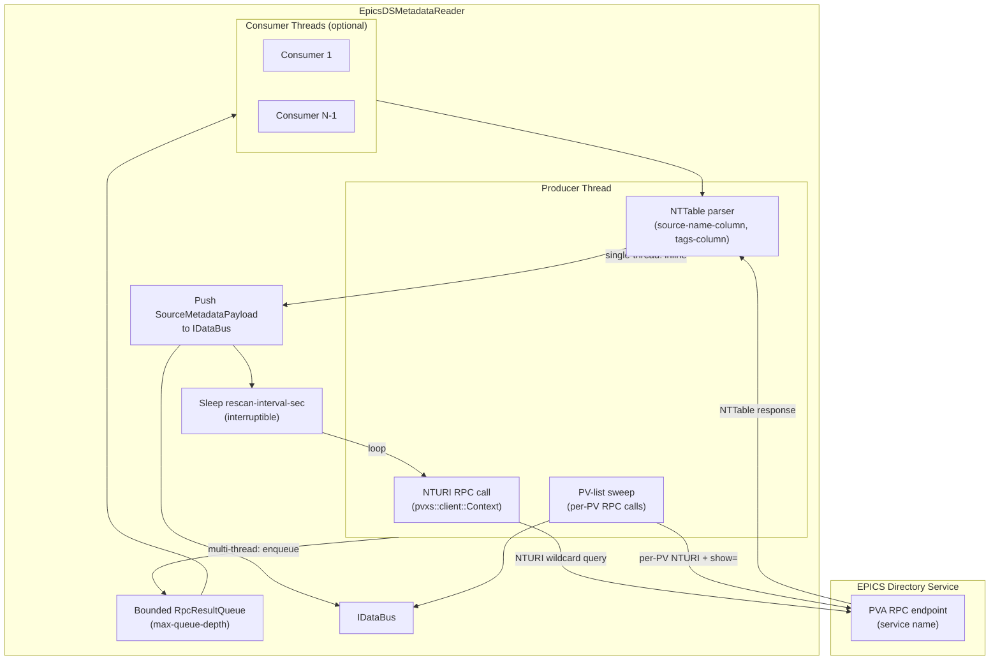

# EpicsDSMetadataReader (EPICS Directory Service Metadata)

The `EpicsDSMetadataReader` fetches PV metadata from an EPICS Directory Service (DS)
via a PVA RPC call and publishes the results as `SourceMetadataPayload` onto the driver
bus. Downstream, an `mldp-pv-metadata` writer persists that payload to the MLDP
annotation service.

**Registration Type:** `"epics-ds-metadata"`

**Status:** Implemented

File           | Location
-------------- | ---------------------------------------------------------------
Header         | `include/reader/impl/epics_ds/EpicsDSMetadataReader.h`
Implementation | `src/reader/impl/epics_ds/EpicsDSMetadataReader.cpp`
Config         | `include/reader/impl/epics_ds/EpicsDSMetadataReaderConfig.h`

## Build Option & Required Libraries

- **Build option:** none (always built)
- **Required libraries/components:**
  - PVXS (`libpvxs`) for the PVA client and RPC support
  - EPICS Base core libraries

## Architecture



## Operating Modes

### One-Shot (Default)

When `rescan-interval-sec` is `0.0` (the default), the reader:

1. Constructs an NTURI request with the configured `query` pattern (and optional `show=` columns).
2. Issues an RPC call to the PVA service named by `service`.
3. Parses the NTTable response — extracts source names from `source-name-column` and
   optionally comma-separated tags from `tags-column`. All other columns are stored as
   per-entry attributes.
4. Pushes the resulting `SourceMetadataPayload` to the bus once.
5. If `pvs` is non-empty, runs the PV-list sweep (see below) before exiting.
6. Worker thread exits; reader stays alive but idle.

```yaml
reader:
  - epics-ds-metadata:
      - name: ds_metadata_once
        service: ds
        query: "%"
        timeout-sec: 5.0
        source-name-column: channelName
        tags-column: tags
```

### Periodic Rescan

When `rescan-interval-sec` is greater than `0`, the worker repeats the fetch on that
interval until the reader is destroyed. The sleep between iterations is interruptible via
a condition variable so shutdown is prompt.

```yaml
reader:
  - epics-ds-metadata:
      - name: ds_metadata_rescan
        service: ds
        query: "%"
        timeout-sec: 5.0
        source-name-column: channelName
        tags-column: tags
        rescan-interval-sec: 300.0   # re-fetch every 5 minutes
```

### Multi-Thread (Producer/Consumer)

When `worker-thread-count` is greater than `1`, one producer thread issues the RPC and
enqueues results into a bounded `RpcResultQueue`. `worker-thread-count - 1` consumer
threads drain the queue and call `processResult`. `max-queue-depth` caps the queue size;
the producer blocks when the queue is full.

```yaml
reader:
  - epics-ds-metadata:
      - name: ds_metadata_mt
        service: ds
        query: "%"
        worker-thread-count: 4    # 1 producer + 3 consumers
        max-queue-depth: 16
        rescan-interval-sec: 60.0
```

### PV-List Sweep

When `pvs` is non-empty, after each wildcard query the reader issues a targeted RPC for
every entry in the list. For each PV it queries the DS for the columns listed in
`pv-show-columns` (one RPC per column), merges the results with any static `metadata`
keys from the config, and pushes a single-entry `SourceMetadataPayload` per PV.

```yaml
reader:
  - epics-ds-metadata:
      - name: ds_pv_enrichment
        service: ds
        query: "%"
        pv-show-columns: "dname,ename,etype,lname,ioc,scheme,z"
        pvs:
          - name: BPMS:LI20:2445:X
            metadata:
              system: bpm
              area: li20
          - name: QUAD:LI21:221:BACT
```

## Configuration

### Required Parameters

Parameter | Type   | Description
--------- | ------ | -----------------------------------------------------------
`name`    | string | **Required.** Unique reader instance name (non-empty).

### Optional Parameters

Parameter              | Type   | Default                             | Description
---------------------- | ------ | ----------------------------------- | ---------------------------------------------------
`service`              | string | `"ds"`                              | PVA service name to call via RPC.
`query`                | string | `"%"`                               | Query pattern sent in the NTURI `query.name` field.
`timeout-sec`          | double | `5.0`                               | RPC call timeout in seconds. Must be positive.
`source-name-column`   | string | `"channelName"`                     | NTTable column that carries the PV / source name.
`tags-column`          | string | `""`                                | NTTable column for comma-separated tags. Empty = disabled.
`show-columns`         | string | `""`                                | Comma-separated columns passed as `show=` in the wildcard NTURI query. Empty = server returns all columns.
`rescan-interval-sec`  | double | `0.0`                               | Repeat fetch interval in seconds. `0` = run once.
`worker-thread-count`  | int    | `1`                                 | `1` = single-thread inline; `N > 1` = 1 producer + N-1 consumers.
`max-queue-depth`      | int    | `16`                                | Bounded queue depth in producer/consumer mode. Ignored when `worker-thread-count` is `1`.
`pvs`                  | list   | `[]`                                | Per-PV enrichment entries for targeted DS lookups (see PV-List Sweep above).
`pvs[].name`           | string | (required per entry)                | Exact PV name to query.
`pvs[].metadata`       | map    | `{}`                                | Static key/value attributes merged into the DS response for this PV.
`pv-show-columns`      | string | `"dname,ename,etype,lname,ioc,scheme,z"` | DS `show=` columns fetched per PV in PV-list mode.

**Validation rules:**

- `name` is required and must be non-empty.
- `timeout-sec` must be strictly positive.
- `rescan-interval-sec` must be `>= 0`.
- `worker-thread-count` must be `>= 1`.
- `max-queue-depth` must be `>= 1`.

## Key Features

- **RPC-based fetch**: Uses `pvxs::client::Context` to issue a synchronous NTURI call
  against any PVA Directory Service endpoint.
- **Column selection (`show=`)**: Optional `show-columns` narrows the DS response to
  specific NTTable columns, reducing network overhead.
- **NTTable parsing**: Extracts source names and optional tags from the configured column
  names; all remaining columns are stored as per-entry attributes.
- **PV-list sweep**: Targeted per-PV RPC calls with configurable `show=` columns and
  static metadata merging.
- **Producer/consumer threading**: Optional multi-thread mode decouples RPC latency from
  result processing using a bounded queue.
- **Periodic rescan**: Optional background loop with an interruptible sleep; no busy-wait.
- **Graceful shutdown**: Condition variable wakeup on destruction; all threads join before
  the destructor returns.

## Typical Use: PV Metadata Pipeline

The most common deployment pairs this reader with an `mldp-pv-metadata` writer:

```yaml
writer:
  mldp-pv-metadata:
    - name: pv_metadata_writer
      thread-pool: 2
      deadline-seconds: 10
      mldp-pv-metadata-pool:
        annotation-url: grpc://annotation-host:50053

reader:
  - epics-ds-metadata:
      - name: ds_metadata
        service: ds
        query: "%"
        timeout-sec: 5.0
        source-name-column: channelName
        tags-column: tags
        show-columns: "channelName,hostName,iocName"
        rescan-interval-sec: 300.0
        worker-thread-count: 2
        max-queue-depth: 16

routing:
  pv_metadata_writer:
    from: [ds_metadata]
```

**What happens:**
1. `EpicsDSMetadataReader` calls the DS RPC and receives an NTTable.
2. Each row becomes a `SourceMetadataEntry`; all rows are bundled into a
   `SourceMetadataPayload` and pushed to the bus.
3. `MLDPPVMetadataWriter` fans the payload into individual `savePvMetadata` RPCs.

### With PV-List Enrichment

```yaml
reader:
  - epics-ds-metadata:
      - name: ds_enriched
        service: ds
        query: "%"
        rescan-interval-sec: 600.0
        pv-show-columns: "dname,ename,etype,lname,ioc,scheme,z"
        pvs:
          - name: BPMS:LI20:2445:X
            metadata:
              system: bpm
              area: li20
          - name: QUAD:LI21:221:BACT
```

After each wildcard sweep, a per-PV `SourceMetadataPayload` is pushed for every entry in
`pvs`, carrying DS-queried attributes merged with any static `metadata` keys.

## Metrics

This reader does not use the standard `EpicsReaderBase` thread pool and therefore does
not expose per-event metrics. Pipeline health can be observed via the writer-side metrics
on the paired `mldp-pv-metadata` writer instance.

## See Also

- [MLDP PV Metadata Writer](../writers/mldp-pv-metadata-writer.md) — consumes `SourceMetadataPayload`
- [Readers Overview](readers.md)
- [Configuration Reference](../guides/configuration.md#epics-ds-metadata-reader)
