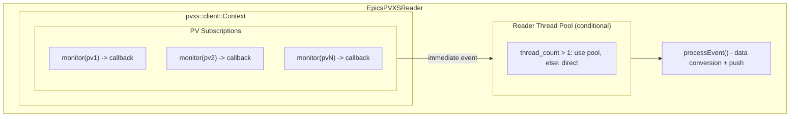

# EpicsPVXSReader (Event-Driven)

The `EpicsPVXSReader` provides modern EPICS PVAccess monitoring using an event-driven subscription model. It uses the PVXS client library for direct PV access with immediate event callbacks.

**Registration Type:** `"epics-pvxs"`

File           | Location
-------------- | -----------------------------------------------
Header         | `include/reader/impl/epics/pvxs/EpicsPVXSReader.h`
Implementation | `src/reader/impl/epics/pvxs/EpicsPVXSReader.cpp`

## Build Option & Required Libraries

- **Build option:** none (always built)
- **Required libraries/components:**
  - PVXS (`libpvxs`)
  - EPICS Base core libs (`libCom`, `libpvData`, `libpvAccess`, `libpvaClient`, `libpvAccessCA`, `libca`)
- **Configure-time hints:** `PVXS_BASE`, `EPICS_BASE`, `EPICS_HOST_ARCH`
- **Optional link mode:** `-DMLDP_PVXS_DRIVER_LINK_EPICS_PVXS_STATIC=ON` for static EPICS/PVXS linking

## Architecture



## Data Flow

1. PVXS context establishes subscriptions via `pva_context_.monitor(pv)`
2. Subscription callbacks fire immediately on PV value changes
3. Events are dispatched to the reader thread pool (or direct if single-threaded)
4. `processEvent()` converts PVXS Value to protobuf
5. Event batch is pushed to the bus

## Configuration

```yaml
reader:
  - epics-pvxs:
      - name: my_pvxs_reader
        thread-pool: 2                # Event conversion thread pool size
        column-batch-size: 50         # NTTable column batch size
        environment:                  # optional, affects only this reader's PVXS context
          EPICS_PVA_ADDR_LIST: "134.79.0.255:5076"
          EPICS_PVA_AUTO_ADDR_LIST: "NO"
          EPICS_PVA_INTF_ADDR_LIST: "10.0.0.10"
          EPICS_PVA_BROADCAST_PORT: "5076"
          EPICS_PVA_NAME_SERVERS: "nameserver.example.org:5076"
          EPICS_PVA_CONN_TMO: "42.5"
        pvs:
          - name: MY:PV:NAME
          - name: BSA:TABLE:PV
            option:                   # For SLAC BSAS NTTable with row timestamps
              type: slac-bsas-table
              tsSeconds: secondsPastEpoch
              tsNanos: nanoseconds
```

### Per-reader PVXS network settings

`environment:` is an optional map of PVXS client settings. The reader begins with the
process `EPICS_PVA_*` environment settings, then applies this map only while building
its own `pvxs::client::Context`. It never changes the process environment, so other
readers retain their independently configured contexts. Omit `environment:` to use
only the inherited process settings.

Any `EPICS_PVA_*` definition with a scalar string value is forwarded to PVXS. For
example, `EPICS_PVA_CONN_TMO: "42.5"` is forwarded with the five settings shown
above. Non-`EPICS_PVA_*` names, a non-map `environment:` block, and non-scalar values
are rejected during reader configuration. PVXS owns interpretation of the forwarded
definitions: unsupported names can be ignored, and malformed values follow PVXS's
logging and handling behavior.

## Key Features

- **Event-Driven**: Immediate response to PV changes (no polling overhead)
- **Smart Threading**: Conditional thread pool usage based on thread count
- **NTTable Support**: Special handling for tabular data with row timestamps
- **PVXS Options**: Support for custom channel options

## Conditional Parallelization

The reader implements smart thread pool decisions to avoid overhead:

```cpp
// Line 132 in EpicsPVXSReader.cpp
reader_pool_->get_thread_count() > 1 ? reader_pool_.get() : nullptr
```

- **Single thread (= 1)**: Bypass thread pool, execute directly
- **Multiple threads (> 1)**: Use thread pool for parallel conversion

## SLAC BSAS NTTable Handling

For PVs that deliver NTTable structures with per-row timestamps (SLAC BSAS
format), enable the mode with:

```yaml
pvs:
  - name: BSA:TABLE:PV
    option:
      type: slac-bsas-table
      tsSeconds: secondsPastEpoch    # column holding per-row epoch seconds
      tsNanos: nanoseconds           # column holding per-row nanoseconds
      column-batch-size: 1           # columns per batch push (0 = all at once)
```

- Each NTTable column (PV name) becomes a separate source in the event batch.
- The two timestamp columns are consumed for row indexing and are not forwarded.
- Source name equals the PV-name column field name.
- `column-batch-size` limits how many columns are pushed per `EventBatch`; 0 means all at once.
- Conversion is handled by `BSASEpicsDataBatchConversion::tryBuildNtTableRowTsBatch()`.

For a full description of the BSAS NTTable structure, field layout, and a
concrete annotated example see
[SLAC BSAS NTTable Gen 1](slac-bsas-table-gen1.md) and [Gen 2](slac-bsas-table-gen2.md).

## Use Cases

- Modern EPICS installations with PVAccess support
- High-frequency PV updates requiring minimal latency
- Applications needing immediate event notification
- Systems with NTTable data structures
