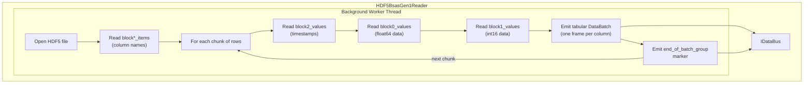

# HDF5BsasGen1Reader (HDF5 BSAS Gen1)

The `HDF5BsasGen1Reader` reads BSAS Gen1 HDF5 files in PyTables "fixed" format
and emits chunked tabular `DataBatch` frames onto the driver bus. It parses
the block structure (`block0` = float64, `block1` = int16, `block2` = uint32
timestamps) and produces one frame per column per chunk.

**Registration Type:** `"hdf5-bsas-gen1"`

**Status:** Implemented

File           | Location
-------------- | ---------------------------------------------------------------
Header         | `include/reader/impl/hdf5_bsas_gen1/HDF5BsasGen1Reader.h`
Implementation | `src/reader/impl/hdf5_bsas_gen1/HDF5BsasGen1Reader.cpp`
Config         | `include/reader/impl/hdf5_bsas_gen1/HDF5BsasGen1ReaderConfig.h`

## Build Option & Required Libraries

- **Build option:** `MLDP_PVXS_ENABLE_HDF5=ON` (default ON)
- **Required libraries/components:**
  - HDF5 C++ (`hdf5_cpp-static` or `hdf5_cpp-shared`)

## HDF5 File Structure

The reader expects PyTables "fixed" format files with a `/data` group containing:

```text
/
├── CLASS = "GROUP"
├── PYTABLES_FORMAT_VERSION = "2.0"
└── data/
    ├── axis0          — 1D string: all column names
    ├── axis1          — 1D int64: row indices
    ├── block0_items   — 1D string: float64 column names
    ├── block0_values  — 2D float64 (rows x float_cols)
    ├── block1_items   — 1D string: int16 column names
    ├── block1_values  — 2D int16 (rows x int_cols)
    ├── block2_items   — 1D string: ["secondsPastEpoch", "nanoseconds"]
    └── block2_values  — 2D uint32 (rows x 2)
```

This matches the format produced by `pandas.HDFStore` with `format='fixed'`
for BSAS Gen1 data exports.

## Architecture



## Operating Mode

The reader runs a single background worker thread that:

1. Opens the HDF5 file read-only
2. Reads column names from `block0_items`, `block1_items`
3. Iterates over rows in chunks of `chunk-size`
4. For each chunk, reads timestamps, float64 data, and int16 data via hyperslab selection
5. Emits one `TimeSeriesPayload` with `is_tabular=true` containing one frame per column
6. Emits an `end_of_batch_group` marker after each chunk
7. Exits when all rows are processed

Int16 columns are widened to int32 in the emitted frames.

## Configuration

```yaml
reader:
  - hdf5-bsas-gen1:
      - name: my_bsas_reader
        file-path: /path/to/bsas-data.h5
        chunk-size: 1000
        group: data
        metadata:
          facility: LCLS
```

Key                 | Default    | Required | Description
------------------- | ---------- | -------- | -------------------------------------------
`name`              | *(none)*   | Yes      | Reader instance name
`file-path`         | *(none)*   | Yes      | Path to the HDF5 file
`chunk-size`        | `1000`     | No       | Number of rows per chunk
`group`             | `data`     | No       | HDF5 group containing the block datasets
`metadata`          | *(empty)*  | No       | Static key-value metadata attached to each batch

## Testing

Tests are in `test/reader/impl/hdf5_bsas_gen1/hdf5_bsas_gen1_reader_test.cpp`.

A `BsasGen1HDF5Mock` generator (`test/mock/BsasGen1HDF5Mock.{h,cpp}`) creates
structurally identical HDF5 files with deterministic data for testing.

### Test Cases

Test                                  | Description
------------------------------------- | ----------------------------------------------------------
`ConfigParsesValidYaml`               | Config parses all fields correctly
`ConfigThrowsOnMissingFilePath`       | Missing `file-path` throws `Error`
`ConfigThrowsOnMissingName`           | Missing `name` throws `Error`
`ReaderEmitsBatches`                  | Single chunk emits data batch + marker
`ChunkedReadingProducesMultipleBatches` | Multiple chunks produce correct batch count
`TimestampsAreCorrect`                | Per-row timestamps match generated values
`Float64ColumnValuesAreCorrect`       | Float64 column data matches `sin()` pattern
`Int16ColumnValuesAreCorrectAsInt32`  | Int16 columns widened to int32 correctly
`ColumnNamesMatchBlockItems`          | Frame column names match `block*_items`
`ReaderNameMatches`                   | `name()` returns configured name
`MockFileMatchesReferenceStructure`   | Mock HDF5 structure matches expected format
`MockMatchesRealReferenceFileStructure` | Mock matches real `bsas-gen1-extract.h5` (opt-in)
`LargeScaleReaderEmitsAllData`        | Env-configurable large-scale verification

### Optional Reference File Test

`MockMatchesRealReferenceFileStructure` compares the mock generator output
against a real BSAS Gen1 file (`data/bsas-gen1-extract.h5`). This test is
**opt-in** because the reference file is not stored in the git repository:

```bash
# Enable the reference file test
BSAS_GEN1_REFERENCE_TEST=1 ./bin/mldp_hdf5_bsas_gen1_reader_test \
    --gtest_filter='*MockMatchesRealReference*'
```

### Large-Scale Test

The `LargeScaleReaderEmitsAllData` test accepts environment variables to
configure scale:

Variable                      | Default | Description
----------------------------- | ------- | --------------------------
`BSAS_GEN1_TEST_FLOAT_COLS`  | 100     | Number of float64 columns
`BSAS_GEN1_TEST_INT_COLS`    | 16      | Number of int16 columns
`BSAS_GEN1_TEST_ROWS`        | 5000    | Number of rows
`BSAS_GEN1_TEST_CHUNK_SIZE`  | 512     | Reader chunk size

## Implementation References

Component             | File
--------------------- | -----------------------------------------------------------
Reader header         | `include/reader/impl/hdf5_bsas_gen1/HDF5BsasGen1Reader.h`
Reader implementation | `src/reader/impl/hdf5_bsas_gen1/HDF5BsasGen1Reader.cpp`
Config header         | `include/reader/impl/hdf5_bsas_gen1/HDF5BsasGen1ReaderConfig.h`
Config implementation | `src/reader/impl/hdf5_bsas_gen1/HDF5BsasGen1ReaderConfig.cpp`
Mock generator header | `test/mock/BsasGen1HDF5Mock.h`
Mock generator impl   | `test/mock/BsasGen1HDF5Mock.cpp`
Tests                 | `test/reader/impl/hdf5_bsas_gen1/hdf5_bsas_gen1_reader_test.cpp`
