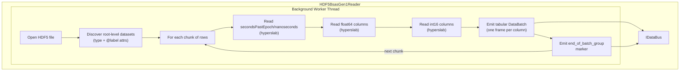

# HDF5BsasGen1Reader (HDF5 BSAS Gen1)

The `HDF5BsasGen1Reader` reads BSAS Gen1 HDF5 files in flat MATLAB-compatible
format and emits chunked tabular `DataBatch` frames onto the driver bus. Each
data column is a separate root-level dataset with shape (N,1), annotated with
`@MATLAB_class` and `@label` attributes. The reader produces one frame per
column per chunk.

**Registration Type:** `"hdf5-bsas-gen1"`

**Status:** Implemented

File           | Location
-------------- | ---------------------------------------------------------------
Header         | `include/reader/impl/hdf5_bsas_gen1/HDF5BsasGen1Reader.h`
Implementation | `src/reader/impl/hdf5_bsas_gen1/HDF5BsasGen1Reader.cpp`
Config         | `include/reader/impl/hdf5_bsas_gen1/HDF5BsasGen1ReaderConfig.h`

## Build Option & Required Libraries

- **Build option:** `MLDP_PVXS_ENABLE_HDF5=ON` (default ON)
- **Required libraries/components:**
  - HDF5 C++ (`hdf5_cpp-static` or `hdf5_cpp-shared`)

## Gen1 HDF5 File Schema

The reader expects a flat HDF5 file where all datasets reside at the root level.
Each data column is stored as an independent dataset with shape `(N, 1)`.

```text
/
├── SIG_0000          — float64 (N,1)  @MATLAB_class="double"  @label="SIG:0000"
├── SIG_0001          — float64 (N,1)  @MATLAB_class="double"  @label="SIG:0001"
│   …
├── FLAG_00           — int16   (N,1)  @MATLAB_class="int16"   @label="FLAG:00"
├── FLAG_01           — int16   (N,1)  @MATLAB_class="int16"   @label="FLAG:01"
│   …
├── secondsPastEpoch  — uint32  (N,1)  @MATLAB_class="uint32"  @label="secondsPastEpoch"
└── nanoseconds       — uint32  (N,1)  @MATLAB_class="uint32"  @label="nanoseconds"
```

### Dataset Requirements

Dataset              | HDF5 Type           | Shape   | Required
-------------------- | ------------------- | ------- | --------
`secondsPastEpoch`   | `H5T_STD_U32LE`    | (N, 1)  | Yes
`nanoseconds`        | `H5T_STD_U32LE`    | (N, 1)  | Yes
Data columns (float) | `H5T_IEEE_F64LE`   | (N, 1)  | At least one data column
Data columns (int)   | `H5T_STD_I16LE`    | (N, 1)  | Optional

### Per-Dataset Attributes

Attribute        | Type   | Description
---------------- | ------ | -------------------------------------------------------
`MATLAB_class`   | string | MATLAB type name (`"double"`, `"int16"`, `"uint32"`)
`label`          | string | Human-readable column name (used as source name when `use-label-as-name: true`)

The `@MATLAB_class` attribute identifies the data type and is written for
MATLAB `hdf5read()` / `h5read()` compatibility. The `@label` attribute
provides the logical column name (typically an EPICS PV name).

## MATLAB Compatibility

Gen1 BSAS HDF5 files are produced by SLAC's MATLAB-based data acquisition
pipeline and follow MATLAB HDF5 conventions:

- **Flat root-level layout** — no groups; each signal is a standalone dataset
- **`@MATLAB_class` attribute** — every dataset carries this attribute so
  MATLAB's `h5read()` can reconstruct the native type without manual casting
- **Column-major (N,1) shape** — each dataset is a single-column matrix,
  matching MATLAB's default array orientation
- **ASCII null-terminated strings** — attribute strings use `H5T_CSET_ASCII`
  with `H5T_STR_NULLTERM` padding, which MATLAB reads natively

Files produced by this pipeline can be read directly in MATLAB:

```matlab
data = h5read('bsas_data.h5', '/SIG_0000');       % returns Nx1 double
ts   = h5read('bsas_data.h5', '/secondsPastEpoch'); % returns Nx1 uint32
info = h5info('bsas_data.h5');                     % shows all datasets + attrs
```

### Label Handling and UTF-8 Sanitization

The reader performs UTF-8 validation on `@label` attributes. Labels containing
invalid UTF-8 sequences (which can occur in legacy MATLAB exports using
non-ASCII encodings) are sanitized:

- Valid ASCII printable characters are preserved
- Invalid byte sequences are stripped
- If sanitization produces an empty string, the dataset name is used as fallback

## Architecture



## Operating Mode

The reader runs a single background worker thread that:

1. Opens the HDF5 file read-only
2. Enumerates root-level datasets, classifying by HDF5 type (float64, int16, uint32)
3. Reads `@label` attributes for column naming (with UTF-8 sanitization)
4. Iterates over rows in chunks of `chunk-size`
5. For each chunk, reads timestamps and data columns via hyperslab selection on (N,1) datasets
6. Emits one `TimeSeriesPayload` with `is_tabular=true` containing one frame per column
7. Emits an `end_of_batch_group` marker after each chunk
8. Exits when all rows are processed

Int16 columns are widened to int32 in the emitted frames. File-path supports glob
patterns — multiple matched files are read sequentially.

### Backpressure and Shutdown

The reader never discards data while it is active. When the downstream bus rejects
a push (queue full), the reader waits 10 ms and retries. Only when the controller
stops the reader (`running_` becomes false) does it bail out immediately — skipping
any unprocessed chunks without pushing them onto the bus.

| Condition | Behaviour |
| --- | --- |
| Bus push succeeds | Continue to next chunk |
| Bus push fails, reader active | Sleep 10 ms, rebuild batch, retry once |
| Bus push fails after retry | Return false, abort read loop |
| Controller stops reader | Exit immediately, no further pushes |

## Configuration

```yaml
reader:
  - hdf5-bsas-gen1:
      - name: my_bsas_reader
        file-path: /path/to/bsas-data*.h5
        chunk-size: 1000
        columns-per-frame: 1367
        use-label-as-name: true
        metadata:
          facility: LCLS
        provenance:
          origin: matlab-daq
```

Key                  | Default    | Required | Description
-------------------- | ---------- | -------- | -------------------------------------------
`name`               | *(none)*   | Yes      | Reader instance name
`file-path`          | *(none)*   | Yes      | Path or glob pattern to HDF5 file(s)
`chunk-size`         | `1000`     | No       | Number of rows per chunk
`use-label-as-name`  | `true`     | No       | Use `@label` attribute as column name instead of dataset name
`columns-per-frame`  | `1`        | No       | Number of columns grouped into each DataBatch frame. Higher values reduce gRPC Write() calls.
`metadata`           | *(empty)*  | No       | Static key-value metadata attached to each batch
`provenance`         | *(empty)*  | No       | Key-value provenance metadata (prefixed with `provenance.`)

## Testing

Tests are in `test/reader/impl/hdf5_bsas_gen1/hdf5_bsas_gen1_reader_test.cpp`.

A `BsasGen1HDF5Mock` generator (`test/mock/BsasGen1HDF5Mock.{h,cpp}`) creates
structurally identical MATLAB-compatible HDF5 files with deterministic data for testing.

### Test Cases

Test                                            | Description
----------------------------------------------- | ----------------------------------------------------------
`ConfigParsesValidYaml`                         | Config parses all fields correctly
`ConfigDefaultsUseLabelTrue`                    | `use-label-as-name` defaults to `true`
`ConfigThrowsOnMissingFilePath`                 | Missing `file-path` throws `Error`
`ConfigThrowsOnMissingName`                     | Missing `name` throws `Error`
`ReaderEmitsBatches`                            | Single chunk emits data batch + marker
`ReaderExpandsGlobPatternsFromConfiguredPath`   | Glob patterns match multiple files
`ChunkedReadingProducesMultipleBatches`         | Multiple chunks produce correct batch count
`TimestampsAreCorrect`                          | Per-row timestamps match generated values
`Float64ColumnValuesAreCorrect`                 | Float64 column data matches `sin()` pattern
`Int16ColumnValuesAreCorrectAsInt32`            | Int16 columns widened to int32 correctly
`ColumnNamesMatchDatasetNames`                  | Frame column names match dataset names
`UseLabelAsNameResolvesLabelAttr`               | `@label` attribute used as column name
`UseLabelAsNameFallsBackWhenLabelContainsInvalidUtf8` | Invalid UTF-8 labels fall back to dataset name
`MatlabStyleLabelsArePreserved`                 | MATLAB-style labels (with colons) preserved correctly
`ReaderNameMatches`                             | `name()` returns configured name
`MockFileMatchesFlatStructure`                  | Mock HDF5 matches flat MATLAB format
`LargeScaleReaderEmitsAllData`                  | Env-configurable large-scale verification
`ProvenanceFlowsToEventBatch`                   | Provenance metadata propagates to bus

### Large-Scale Test

The `LargeScaleReaderEmitsAllData` test accepts environment variables to
configure scale:

Variable                      | Default | Description
----------------------------- | ------- | --------------------------
`BSAS_GEN1_TEST_FLOAT_COLS`  | 100     | Number of float64 columns
`BSAS_GEN1_TEST_INT_COLS`    | 16      | Number of int16 columns
`BSAS_GEN1_TEST_ROWS`        | 5000    | Number of rows
`BSAS_GEN1_TEST_CHUNK_SIZE`  | 512     | Reader chunk size

## Implementation References

Component             | File
--------------------- | -----------------------------------------------------------
Reader header         | `include/reader/impl/hdf5_bsas_gen1/HDF5BsasGen1Reader.h`
Reader implementation | `src/reader/impl/hdf5_bsas_gen1/HDF5BsasGen1Reader.cpp`
Config header         | `include/reader/impl/hdf5_bsas_gen1/HDF5BsasGen1ReaderConfig.h`
Config implementation | `src/reader/impl/hdf5_bsas_gen1/HDF5BsasGen1ReaderConfig.cpp`
Mock generator header | `test/mock/BsasGen1HDF5Mock.h`
Mock generator impl   | `test/mock/BsasGen1HDF5Mock.cpp`
Tests                 | `test/reader/impl/hdf5_bsas_gen1/hdf5_bsas_gen1_reader_test.cpp`
