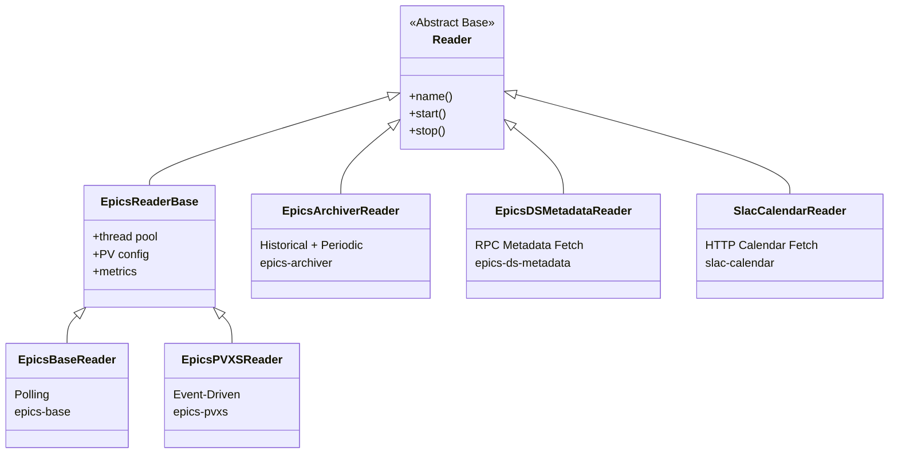

# Reader Implementations

The MLDP PVXS Driver uses an **abstract Reader pattern** to support multiple data sources. The architecture is designed to be extensible, allowing new reader types to be added without modifying the core ingestion pipeline.

> **Related:** [Architecture Overview](../reference/architecture.md) | [Implementing Custom Readers](readers-implementation.md)

## Supported Reader Types

Reader Type           | Status      | Data Source                     | Documentation
--------------------- | ----------- | ------------------------------- | ---------------------------------------------------------
`epics-base`          | Implemented | EPICS Control System            | [EpicsBaseReader](epics-base-reader.md)
`epics-pvxs`          | Implemented | EPICS Control System            | [EpicsPVXSReader](epics-pvxs-reader.md)
`epics-archiver`      | Implemented | EPICS Archiver                  | [EpicsArchiverReader](epics-archiver-reader.md)
`epics-ds-metadata`   | Implemented | EPICS Directory Service (PVA RPC) | [EpicsDSMetadataReader](epics-ds-metadata-reader.md)
`slac-calendar`       | Implemented | SLAC Calendar HTTP API          | [SlacCalendarReader](slac-calendar-reader.md)
`hdf5-bsas-gen1`      | Implemented | HDF5 BSAS Gen1 files (PyTables) | [HDF5BsasGen1Reader](hdf5-bsas-gen1-reader.md)

## Reader Build & Dependency Matrix

Reader Type           | Build Option        | Required Libraries / Components | Notes
--------------------- | ------------------- | ------------------------------- | -----
`epics-base`          | none (always built) | EPICS Base (`libCom`, `libca`, `libpvData`, `libpvAccess`, `libpvaClient`, `libpvAccessCA`) | Uses Channel Access polling path.
`epics-pvxs`          | none (always built) | PVXS (`libpvxs`) + EPICS Base core libs | Uses PVAccess subscriptions.
`epics-archiver`      | none (always built) | libcurl + Protobuf/epicsarchiverap payload types | Uses Archiver PB/HTTP transport.
`epics-ds-metadata`   | none (always built) | PVXS (`libpvxs`) + EPICS Base core libs | RPC-based PV metadata fetch; `pvs` list required (at least one entry).
`slac-calendar`       | none (always built) | libcurl + nlohmann/json | Fetches beamline schedule events; publishes configuration + activation payloads.

EPICS/PVXS discovery is controlled by CMake/env variables used at configure time:

- `EPICS_BASE` and `EPICS_HOST_ARCH`
- `PVXS_BASE`
- `MLDP_PVXS_DRIVER_LINK_EPICS_PVXS_STATIC` (optional static-link mode)

## Reader Class Hierarchy



## Implemented Readers

### EpicsBaseReader

Polling-based EPICS Channel Access monitoring for legacy systems.

- **Mode**: Polling with configurable interval
- **Best For**: Legacy EPICS installations without PVAccess
- **Key Feature**: Multiple polling threads with mutex-protected queue draining
- **BSAS Support**: SLAC BSAS NTTable mode with per-row timestamps — see [SLAC BSAS NTTable Gen 1](slac-bsas-table-gen1.md), [Gen 2](slac-bsas-table-gen2.md)

→ [Full Documentation: EpicsBaseReader](epics-base-reader.md)
→ [Implementation Guide](epics-base-reader-implementation.md)

### EpicsPVXSReader

Modern event-driven EPICS PVAccess monitoring with advanced table support.

- **Mode**: Event-driven subscriptions
- **Best For**: High-frequency updates with minimal latency
- **Key Feature**: Smart thread pool decisions + SLAC BSAS NTTable support — see [SLAC BSAS NTTable Gen 1](slac-bsas-table-gen1.md), [Gen 2](slac-bsas-table-gen2.md)

→ [Full Documentation: EpicsPVXSReader](epics-pvxs-reader.md)
→ [Implementation Guide](epics-pvxs-reader-implementation.md)

### EpicsArchiverReader

Historical data retrieval and continuous tail polling from EPICS Archiver Appliance.

- **Mode**: One-shot historical fetch or periodic polling
- **Best For**: Data backfill, archiver tailing, time-series analysis
- **Key Feature**: PB/HTTP streaming, configurable timeouts

→ [Full Documentation: EpicsArchiverReader](epics-archiver-reader.md)
→ [Implementation Guide](epics-archiver-reader-implementation.md)

### EpicsDSMetadataReader

PV metadata fetcher using EPICS Directory Service via PVA RPC.

- **Mode**: One-shot RPC or periodic rescan
- **Best For**: Populating the MLDP annotation service with PV metadata
- **Key Feature**: `pvs` list is required (at least one entry); DS wildcard query returns all known PVs, then per-PV sweep enriches each listed entry; optional tag extraction from NTTable column

→ [Full Documentation: EpicsDSMetadataReader](epics-ds-metadata-reader.md)

### SlacCalendarReader

Beamline experiment schedule fetcher using the SLAC calendar HTTP API.

- **Mode**: One-shot HTTP fetch or periodic rescan
- **Best For**: Ingesting beamline experiment schedules into the MLDP annotation service
- **Key Feature**: Each event produces a `ConfigurationPayload` + `ConfigurationActivationPayload` pair; multi-experiment support in a single reader instance

→ [Full Documentation: SlacCalendarReader](slac-calendar-reader.md)

## Architecture Overview

### Core Pattern

All readers follow the same pattern:

1. **Initialization**: Register with `ReaderFactory` using a unique type name
2. **Data Acquisition**: Connect to data source and capture updates
3. **Data Processing**: Convert source data to MLDP protobuf format
4. **Publishing**: Push events to `IDataBus` for downstream processing

### EventBatch data contract

Each call to `IDataBus::push()` delivers one `EventBatch` containing one or more `DataFrame` objects. Two optional fields exist on `EventBatch` to support multi-column, row-synchronized table writes:

- **`is_tabular`** — when `true`, the batch carries one column of a structured table. Defaults to `false`.
- **`end_of_batch_group`** — when `true`, signals the end of a column group and triggers a writer flush. Only meaningful when `is_tabular=true`. Defaults to `false`.

Readers that produce scalar values or waveforms must leave both fields at their defaults. Only readers whose data source natively provides synchronized multi-column tables (e.g. EPICS NTTable, SLAC BSAS payloads) should set these fields.

For the full two-phase protocol and writer behaviour, see [Tabular / multi-column batch protocol](readers-implementation.md#eventbatch-tabular-fields) in the implementation guide.


### Reader Base Class

All readers inherit from `Reader` and must provide:

```cpp
class MyReader : public Reader {
public:
    MyReader(std::shared_ptr<IDataBus> bus,
             std::shared_ptr<metrics::Metrics> metrics = nullptr);

    virtual ~MyReader();

    // Return human-readable identifier
    virtual std::string name() const override;

protected:
    std::shared_ptr<IDataBus> bus_;       // Event bus
    std::shared_ptr<metrics::Metrics> metrics_; // Optional metrics
};
```

### Common Base: EpicsReaderBase

EPICS-specific readers (base, pvxs, archiver) share `EpicsReaderBase`:

#### Thread Pool Management

- Creates and manages `BS::light_thread-pool` for data conversion
- Configurable via `thread-pool` parameter
- Metrics track queue depth

#### Common Features

- PV name list management
- Logging integration
- Protobuf conversion utilities
- Error handling and metrics collection

File           | Location
-------------- | ------------------------------------------------------
Header         | `include/reader/impl/epics/shared/EpicsReaderBase.h`
Implementation | `src/reader/impl/epics/shared/EpicsReaderBase.cpp`

## Factory Registration

Readers are registered at compile time using the `REGISTER_READER` macro:

```cpp
// In EpicsBaseReader.h
REGISTER_READER("epics-base", EpicsBaseReader)

// In EpicsPVXSReader.h
REGISTER_READER("epics-pvxs", EpicsPVXSReader)

// In EpicsArchiverReader.h
REGISTER_READER("epics-archiver", EpicsArchiverReader)

// In EpicsDSMetadataReader.h
REGISTER_READER("epics-ds-metadata", EpicsDSMetadataReader)

// In SlacCalendarReader.h
REGISTER_READER("slac-calendar", SlacCalendarReader)
```

The `ReaderFactory` creates readers dynamically from configuration:

```cpp
auto reader = ReaderFactory::create("epics-pvxs", config, bus);
```

## Configuration Pattern

All readers use YAML-based configuration:

```yaml
reader:
  - <reader-type>:
      - name: instance_name
        param1: value1
        param2: value2
        pvs:
          - name: PV_NAME_1
          - name: PV_NAME_2
```

Configuration is validated and type-checked before reader instantiation.

## Metrics

All MLDP readers expose consistent Prometheus metrics:

Metric                                          | Description
----------------------------------------------- | ---------------------------------
`mldp_pvxs_driver_reader_events_received_total` | Raw PV updates received
`mldp_pvxs_driver_reader_events_total`          | Successfully processed events
`mldp_pvxs_driver_reader_errors_total`          | Conversion/remote errors
`mldp_pvxs_driver_reader_processing_time_ms`    | Event processing time histogram
`mldp_pvxs_driver_reader_queue_depth`           | Monitor queue size (EpicsBase)
`mldp_pvxs_driver_reader_pool_queue_depth`      | Thread pool queue depth

## Comparison Matrix

Feature        | EpicsBaseReader                | EpicsPVXSReader                | EpicsArchiverReader
-------------- | ------------------------------ | ------------------------------ | ---------------------------------
Protocol       | Channel Access                 | PVAccess (PVXS)                | HTTP (PB/HTTP streaming)
Event Model    | Polling                        | Event-driven                   | Fetch (one-shot or periodic)
Latency        | Poll interval dependent        | Immediate                      | Variable (depends on window)
Thread Model   | Poll threads + conversion pool | Callback + conditional pool    | Worker thread + conversion pool
Data Source    | Live PVs                       | Live PVs                       | Historical archiver data
Configuration  | `epics-base`                   | `epics-pvxs`                   | `epics-archiver`
Best For       | Legacy systems                 | Modern high-performance        | Backfill and data replay

---

## Implementing New Readers

The driver architecture is designed to be extensible. New reader types can be added without modifying the core ingestion pipeline.

For a complete guide on implementing custom readers, including:

- Step-by-step implementation instructions
- A complete working example (CounterReader)
- Best practices for threading, error handling, and metrics
- Testing guidelines

See **[Implementing Custom Readers](readers-implementation.md)**.

### Reader Development Checklist

1. ✅ Understand the `Reader` interface and `IDataBus` API
2. ✅ Design your data source integration (polling, events, streaming, etc.)
3. ✅ Implement data conversion to protobuf format
4. ✅ Create configuration parser (YAML → reader config)
5. ✅ Handle threading and lifecycle (start/stop, shutdown gracefully)
6. ✅ Add Prometheus metrics
7. ✅ Write comprehensive tests
8. ✅ Register with `REGISTER_READER` macro
9. ✅ Update configuration schema documentation

### Key Implementation Patterns

**Pattern 1: Polling Reader** (like EpicsBaseReader)

- Spawn dedicated polling thread(s)
- Drain data into thread-safe queue
- Push to event bus from worker thread
- Handle shutdown cleanly

**Pattern 2: Event-Driven Reader** (like EpicsPVXSReader)

- Register callbacks with data source
- Use thread pool for async processing if needed
- Push events to bus from callback or pool
- Implement proper subscription cleanup

**Pattern 3: Batch/Streaming Reader** (like EpicsArchiverReader)

- Fetch data in background worker
- Stream or batch parse response data
- Split into logical batches by time or size
- Push batches to event bus
- Handle graceful shutdown of in-flight requests

## Implementation Files Organization

```TEXT
include/reader/
├── Reader.h                          # Abstract base class
├── ReaderFactory.h                   # Factory registration
└── impl/
    └── epics/
        ├── shared/
        │   ├── EpicsReaderBase.h     # Common EPICS base
        │   └── EpicsReaderConfig.h
        ├── base/
        │   ├── EpicsBaseReader.h
        │   ├── EpicsBaseReaderConfig.h
        │   ├── EpicsBaseMonitorPoller.h
        │   └── EpicsPVDataBatchConversion.h
        ├── pvxs/
        │   ├── EpicsPVXSReader.h
        │   ├── EpicsPVXSReaderConfig.h
        │   ├── EpicsMLDPConversion.h
        │   └── BSASEpicsDataBatchConversion.h
        ├── epics_archiver/
        │   ├── EpicsArchiverReader.h
        │   └── EpicsArchiverReaderConfig.h
        ├── epics_ds/
        │   ├── EpicsDSMetadataReader.h
        │   └── EpicsDSMetadataReaderConfig.h
        └── slac_calendar/
            ├── SlacCalendarReader.h
            └── SlacCalendarReaderConfig.h

src/reader/
├── Reader.cpp
├── ReaderFactory.cpp
└── impl/
    ├── epics/
    │   ├── shared/
    │   │   ├── EpicsReaderBase.cpp
    │   │   └── EpicsReaderConfig.cpp
    │   ├── base/
    │   │   ├── EpicsBaseReader.cpp
    │   │   ├── EpicsBaseReaderConfig.cpp
    │   │   ├── EpicsBaseMonitorPoller.cpp
    │   │   └── EpicsPVDataBatchConversion.cpp
    │   └── pvxs/
    │       ├── EpicsPVXSReader.cpp
    │       ├── EpicsPVXSReaderConfig.cpp
    │       ├── EpicsMLDPConversion.cpp
    │       └── BSASEpicsDataBatchConversion.cpp
    ├── epics_archiver/
    │   ├── EpicsArchiverReader.cpp
    │   └── EpicsArchiverReaderConfig.cpp
    ├── epics_ds/
    │   ├── EpicsDSMetadataReader.cpp
    │   └── EpicsDSMetadataReaderConfig.cpp
    └── slac_calendar/
        ├── SlacCalendarReader.cpp
        └── SlacCalendarReaderConfig.cpp
```

---

## See Also

- [Architecture Overview](../reference/architecture.md) - System-wide architecture and data flow
- [Implementing Custom Readers](readers-implementation.md) - Complete guide with examples
- [Configuration Reference](../guides/configuration.md) - Full configuration schema
- [SLAC BSAS NTTable Gen 1](slac-bsas-table-gen1.md) - BSAS Gen 1: raw per-pulse sample arrays
- [SLAC BSAS NTTable Gen 2](slac-bsas-table-gen2.md) - BSAS Gen 2: PID-indexed statistical summaries (planned)
