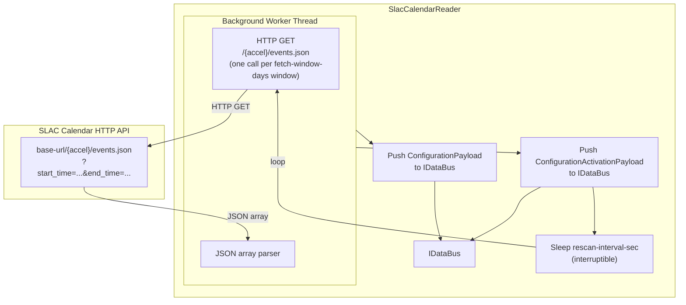

# SlacCalendarReader (SLAC Calendar)

The `SlacCalendarReader` fetches beamline accel/experiment schedule events from the SLAC
calendar HTTP API and publishes them as `ConfigurationPayload` and
`ConfigurationActivationPayload` pairs onto the driver bus. Downstream, an
`mldp-configuration` writer persists those payloads to the MLDP annotation service.

**Registration Type:** `"slac-calendar"`

**Status:** Implemented

File           | Location
-------------- | ---------------------------------------------------------------
Header         | `include/reader/impl/slac_calendar/SlacCalendarReader.h`
Implementation | `src/reader/impl/slac_calendar/SlacCalendarReader.cpp`
Config         | `include/reader/impl/slac_calendar/SlacCalendarReaderConfig.h`

## Build Option & Required Libraries

- **Build option:** none (always built)
- **Required libraries/components:**
  - libcurl (HTTP client)
  - nlohmann/json (JSON parsing)

## Architecture



## Operating Modes

### One-Shot (Default)

When `rescan-interval-sec` is `0.0` (the default), the reader:

1. Computes `[now - lookback-days, now + lookahead-days]` time window (or uses `start-date`/`end-date` on first run).
2. Splits that window into consecutive `fetch-window-days`-sized day windows and issues
   one HTTP GET per window per configured accel (the endpoint has no pagination/cursor
   protocol, so requesting a large range in one call risks silent server-side truncation).
3. Parses the JSON array for each window — each event becomes one `ConfigurationPayload` + one
   `ConfigurationActivationPayload` pushed to the bus.
4. Worker thread exits and calls `signalCompleted()` to support [controller auto-close](readers.md#reader-lifecycle--auto-close); reader stays alive but idle.

```yaml
reader:
  - slac-calendar:
      - name: cal_reader_once
        base-url: https://calendar.slac.stanford.edu
        accel:
          - lcls
          - facet
        lookahead-days: 30
        lookback-days: 1
        fetch-window-days: 7
```

### Periodic Rescan

When `rescan-interval-sec > 0`, the worker repeats the fetch on that interval.
The sleep between iterations is interruptible so shutdown is prompt. Does **not** call `signalCompleted()` — periodic readers never trigger [auto-close](readers.md#reader-lifecycle--auto-close).

```yaml
reader:
  - slac-calendar:
      - name: cal_reader_rescan
        base-url: https://calendar.slac.stanford.edu
        accel:
          - lcls
        lookahead-days: 30
        lookback-days: 1
        rescan-interval-sec: 3600.0   # re-fetch every hour
```

## Configuration

### Required Parameters

Parameter        | Type     | Description
---------------- | -------- | -----------------------------------------------------------
`name`           | string   | **Required.** Unique reader instance name (non-empty).
`base-url`       | string   | **Required.** Base URL of the SLAC calendar API (no trailing slash).
`accel`          | sequence | **Required.** List of accelerator/machine complex names to fetch (e.g. `lcls`, `facet`).
`lookahead-days` | int      | **Required unless `end-date` is set.** Days into the future to include. Must be > 0.

### Optional Parameters

Parameter              | Type   | Default | Description
---------------------- | ------ | ------- | ---------------------------------------------------
`lookback-days`        | int    | `1`     | Days into the past to include. Must be >= 0.
`start-date`           | string | —       | First-run start date override (`YYYY-MM-DD[THH:MM:SS[Z\|±HH:MM]]`). Used only on the first fetch.
`end-date`             | string | —       | Fixed-window end date; requires `start-date`. Incompatible with `lookahead-days`/`lookback-days`/`rescan-interval-sec`.
`category`             | string | —       | Overrides the per-event `calendar` field as the pushed `category`.
`rescan-interval-sec`  | double | `0.0`   | Repeat fetch interval in seconds. `0` = run once.
`connect-timeout-sec`  | int    | `30`    | HTTP connection timeout (seconds).
`total-timeout-sec`    | int    | `60`    | HTTP total request timeout (seconds). Must be >= `connect-timeout-sec`.
`tls-verify-peer`      | bool   | `true`  | Verify TLS peer certificate.
`tls-verify-host`      | bool   | `true`  | Verify TLS hostname against certificate.
`fetch-window-days`    | int    | `7`     | Days of calendar requested per HTTP call. The endpoint has no pagination/cursor, so the whole span is walked in windows of this size instead of one request for the full range.

**Validation rules:**

- `name`, `base-url`, and `accel` are required and must be non-empty.
- `lookahead-days` must be > 0 (unless `end-date` is set).
- `lookback-days` must be >= 0.
- `total-timeout-sec` must be >= `connect-timeout-sec`.
- `fetch-window-days` must be > 0.
- `start-date`/`end-date` (if provided) must match `YYYY-MM-DD` or `YYYY-MM-DDTHH:MM:SS[Z|±HH:MM]` format.

## Published Payloads

For each calendar event the reader pushes **two** `EventBatch` items to the bus:

### 1. `ConfigurationPayload`

Field                    | Source in JSON
------------------------ | -----------------------------------------
`configuration_name`     | `program_name` (suffixed with the source calendar if a duplicate program_name/start/end is seen from a different calendar in the same fetch window)
`category`               | `category` config override, else `calendar`
`description`            | `description`
`tags`                   | `tags[]`
`attributes["accel"]`     | accel name (from config)
`attributes["poc"]`       | `poc` (if present)
`attributes["note"]`      | `note` (if present)
`attributes["config"]`    | `config` (if present)
`attributes["machine"]`   | `machine` (if present)
`attributes["details"]`   | inner text extracted from `details` HTML (if present)
`attributes["hutch_name"]`| `hutch.name` (if present)
`attributes["hutch_color"]`| `hutch.color` (if present)
`attributes["hutch_line"]`| `hutch.line` (if present)

### 2. `ConfigurationActivationPayload`

Field                    | Source in JSON
------------------------ | -----------------------------------------
`client_activation_id`   | `url`
`configuration_name`     | `program_name` (same disambiguation as above)
`start_time`             | `start` (ISO 8601 with timezone)
`end_time`               | `end` (ISO 8601 with timezone)
`description`            | `description`
`tags`                   | `tags[]`
`attributes["accel"]`     | accel name
`attributes["calendar"]` | `calendar`

Both batches carry `root_source = reader_name` and `reader_name = reader_name`.

## Key Features

- **Multi-accel**: Fetches multiple accelerator/machine calendars in a single scan pass.
- **Day-windowed pagination**: Walks the requested date range in `fetch-window-days` chunks
  instead of one large request, avoiding silent server-side truncation.
- **Cross-calendar duplicate disambiguation**: When the same `program_name`+`category`+time
  window is cross-posted under two different source calendars, the second occurrence's
  `configuration_name` is suffixed with the source calendar so both are pushed instead of
  colliding on the server's overlap check.
- **HTML detail extraction**: Strips HTML tags from the `details` field using a plain
  character-scan loop — no external library dependency.
- **Timezone-aware timestamps**: Parses ISO 8601 timestamps with numeric timezone offsets
  and converts to epoch seconds.
- **Periodic rescan**: Interruptible sleep; no busy-wait.
- **Configurable TLS**: Peer and host verification can be disabled for development
  environments with self-signed certificates.

## Typical Use: Beamline Schedule Pipeline

```yaml
writer:
  mldp-configuration:
    - name: cal_writer
      thread-pool: 2
      deadline-seconds: 10
      mldp-annotation-pool:
        annotation-url: grpc://annotation-host:50053
        min-conn: 1
        max-conn: 4

reader:
  - slac-calendar:
      - name: cal_reader
        base-url: https://calendar.slac.stanford.edu
        accel:
          - lcls
          - facet
        lookahead-days: 30
        lookback-days: 1
        rescan-interval-sec: 3600.0

routing:
  cal_writer:
    from: [cal_reader]
```

**What happens:**
1. `SlacCalendarReader` queries the calendar API for each accel, one HTTP call per `fetch-window-days` window.
2. Each event becomes two bus pushes: a configuration + an activation.
3. `MLDPConfigurationWriter` fans each pair into `saveConfiguration` +
   `saveConfigurationActivation` gRPC calls.

## Metrics

This reader does not use the standard `EpicsReaderBase` thread pool and therefore does
not expose per-event metrics. Pipeline health can be observed via the writer-side metrics
on the paired `mldp-configuration` writer instance.

## See Also

- [MLDP Configuration Writer](../writers/mldp-configuration-writer.md) — consumes `ConfigurationPayload` / `ConfigurationActivationPayload`
- [Readers Overview](readers.md)
- [Configuration Reference](../guides/configuration.md#slac-calendar-reader)
