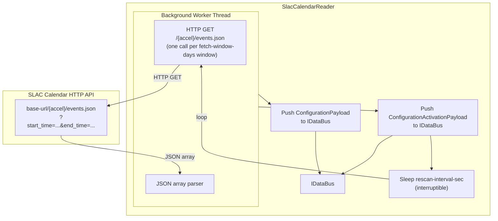

# SlacCalendarReader (SLAC Calendar)

The `SlacCalendarReader` fetches beamline accel/experiment schedule events from the SLAC
calendar HTTP API and publishes them as `ConfigurationPayload` and
`ConfigurationActivationPayload` pairs onto the driver bus. Downstream, an
`mldp-configuration` writer persists those payloads to the MLDP annotation service.

**Registration Type:** `"slac-calendar"`

**Status:** Implemented

File           | Location
-------------- | ---------------------------------------------------------------
Header         | `include/reader/impl/slac_calendar/SlacCalendarReader.h`
Implementation | `src/reader/impl/slac_calendar/SlacCalendarReader.cpp`
Config         | `include/reader/impl/slac_calendar/SlacCalendarReaderConfig.h`

## Build Option & Required Libraries

- **Build option:** none (always built)
- **Required libraries/components:**
  - libcurl (HTTP client)
  - nlohmann/json (JSON parsing)

## Architecture


```mermaid
flowchart TB
    subgraph SlacCalendarReader["SlacCalendarReader"]
        subgraph Worker["Background Worker Thread"]
            Fetch["HTTP GET\n/{accel}/events.json\n(one call per fetch-window-days window)"]
            Parse["JSON array parser"]
        end

        Worker --> PushCfg["Push ConfigurationPayload\nto IDataBus"]
        Worker --> PushAct["Push ConfigurationActivationPayload\nto IDataBus"]
        PushCfg --> Bus["IDataBus"]
        PushAct --> Bus

        PushAct --> Wait["Sleep rescan-interval-sec\n(interruptible)"]
        Wait -->|loop| Fetch
    end

    subgraph API["SLAC Calendar HTTP API"]
        Endpoint["base-url/{accel}/events.json\n?start_time=...&end_time=..."]
    end

    Fetch -->|HTTP GET| Endpoint
    Endpoint -->|JSON array| Parse
```

## Operating Modes

### One-Shot (Default)

When `rescan-interval-sec` is `0.0` (the default), the reader:

1. Computes `[now - lookback-days, now + lookahead-days]` time window (or uses `start-date`/`end-date` on first run).
2. Splits that window into consecutive `fetch-window-days`-sized day windows and issues
   one HTTP GET per window per configured accel (the endpoint has no pagination/cursor
   protocol, so requesting a large range in one call risks silent server-side truncation),
   pacing requests `fetch-window-delay-ms` apart and sending `Cache-Control`/`Pragma: no-cache`
   headers — back-to-back requests were observed to hit an upstream/proxy cache that served
   a stale body for later windows, silently dropping their events even though every call
   returned HTTP 200.
3. Parses the JSON array for each window — each event becomes one `ConfigurationPayload` + one
   `ConfigurationActivationPayload` pushed to the bus.
4. Worker thread exits and calls `signalCompleted()` to support [controller auto-close](readers.md#reader-lifecycle--auto-close); reader stays alive but idle.

```yaml
reader:
  - slac-calendar:
      - name: cal_reader_once
        base-url: https://calendar.slac.stanford.edu
        accel:
          - lcls
          - facet
        lookahead-days: 30
        lookback-days: 1
        fetch-window-days: 7
        fetch-window-delay-ms: 200
```

### Periodic Rescan

When `rescan-interval-sec > 0`, the worker repeats the fetch on that interval.
The sleep between iterations is interruptible so shutdown is prompt. Does **not** call `signalCompleted()` — periodic readers never trigger [auto-close](readers.md#reader-lifecycle--auto-close).

```yaml
reader:
  - slac-calendar:
      - name: cal_reader_rescan
        base-url: https://calendar.slac.stanford.edu
        accel:
          - lcls
        lookahead-days: 30
        lookback-days: 1
        rescan-interval-sec: 3600.0   # re-fetch every hour
```

## Configuration

### Required Parameters

Parameter        | Type     | Description
---------------- | -------- | -----------------------------------------------------------
`name`           | string   | **Required.** Unique reader instance name (non-empty).
`base-url`       | string   | **Required.** Base URL of the SLAC calendar API (no trailing slash).
`accel`          | sequence | **Required.** List of accelerator/machine complex names to fetch (e.g. `lcls`, `facet`).
`lookahead-days` | int      | **Required unless `end-date` is set.** Days into the future to include. Must be > 0.

### Optional Parameters

Parameter              | Type   | Default | Description
---------------------- | ------ | ------- | ---------------------------------------------------
`lookback-days`        | int    | `1`     | Days into the past to include. Must be >= 0.
`start-date`           | string | —       | First-run start date override (`YYYY-MM-DD[THH:MM:SS[Z\|±HH:MM]]`). Used only on the first fetch.
`end-date`             | string | —       | Fixed-window end date; requires `start-date`. Incompatible with `lookahead-days`/`lookback-days`/`rescan-interval-sec`.
`category`             | string | —       | Fixed `category` for every pushed configuration. Default: the event's `configuration_name`.
`rescan-interval-sec`  | double | `0.0`   | Repeat fetch interval in seconds. `0` = run once.
`connect-timeout-sec`  | int    | `30`    | HTTP connection timeout (seconds).
`total-timeout-sec`    | int    | `60`    | HTTP total request timeout (seconds). Must be >= `connect-timeout-sec`.
`tls-verify-peer`      | bool   | `true`  | Verify TLS peer certificate.
`tls-verify-host`      | bool   | `true`  | Verify TLS hostname against certificate.
`fetch-window-days`    | int    | `7`     | Days of calendar requested per HTTP call. The endpoint has no pagination/cursor, so the whole span is walked in windows of this size instead of one request for the full range.
`fetch-window-delay-ms` | int   | `200`   | Delay between window HTTP requests. Guards against an upstream/proxy cache serving a stale body for a later window when requests fire too fast (observed at sub-15ms spacing). Must be >= 0.
`attributes`           | list   | see below | Overrides of the JSON field → attribute association (name and target payload).

### Attribute Mapping

Each calendar JSON field is copied to an attribute on the configuration, the
activation, both, or neither. Defaults:

JSON field     | Attribute     | Target
-------------- | ------------- | -------------
`calendar`     | `calendar`    | both
`machine`      | `machine`     | configuration
`hutch.name`   | `hutch_name`  | both
`hutch.line`   | `hutch_line`  | both
`hutch.color`  | `hutch_color` | configuration
`note`         | `note`        | activation
`config`       | `config`      | activation
`poc`          | `poc`         | activation
`details`      | `details`     | activation (HTML stripped)

`accel` is always written to both payloads and is not remappable.

Each `attributes` entry has:

- `field` (required): JSON key; a dotted path (`hutch.text_color`) reads a nested object key.
- `name` (optional): attribute key to write. Defaults to the default mapping's name, or `field` for a new field.
- `target` (optional): `configuration` | `activation` | `both` | `none`. Defaults to the default mapping's target, or `both` for a new field.

An entry for a default field replaces that default; a new field is added.

```yaml
attributes:
  - field: poc
    name: person_on_shift      # rename, keep target
  - field: note
    target: both               # also keep on configuration
  - field: hutch.color
    target: none               # drop
  - field: hutch.text_color    # add a field not mapped by default
    target: configuration
```

#### Full Example with Attribute Customization

```yaml
reader:
  - slac-calendar:
      - name: cal_reader_custom_attrs
        base-url: https://aosd.slac.stanford.edu/program_calendar
        accel:
          - lcls
        lookahead-days: 30
        lookback-days: 1
        rescan-interval-sec: 3600.0
        fetch-window-days: 7
        fetch-window-delay-ms: 200
        attributes:
          # rename: poc stays on the activation, written as "person_on_shift"
          - field: poc
            name: person_on_shift
          # retarget: beam energy on both configuration and activation
          - field: note
            name: electron_energy
            target: both
          # retarget: photon energy also on both
          - field: config
            name: photon_energy
            target: both
          # move machine to the activation too
          - field: machine
            target: both
          # drop hutch color
          - field: hutch.color
            target: none
          # add a field not mapped by default (nested key)
          - field: hutch.text_color
            name: hutch_text_color
            target: configuration
```

Resulting attributes on each event (when the JSON field is present):

Attribute           | Configuration | Activation
------------------- | ------------- | ----------
`accel`             | yes           | yes
`calendar`          | yes           | yes
`machine`           | yes           | yes
`hutch_name`        | yes           | yes
`hutch_line`        | yes           | yes
`hutch_text_color`  | yes           | —
`electron_energy`   | yes           | yes
`photon_energy`     | yes           | yes
`person_on_shift`   | —             | yes
`details`           | —             | yes

**Validation rules:**

- `name`, `base-url`, and `accel` are required and must be non-empty.
- `lookahead-days` must be > 0 (unless `end-date` is set).
- `lookback-days` must be >= 0.
- `total-timeout-sec` must be >= `connect-timeout-sec`.
- `fetch-window-days` must be > 0.
- `fetch-window-delay-ms` must be >= 0.
- each `attributes` entry needs a non-empty `field` (not `accel`); `name`, if set, must be non-empty; `target` must be `configuration|activation|both|none`.
- `start-date`/`end-date` (if provided) must match `YYYY-MM-DD` or `YYYY-MM-DDTHH:MM:SS[Z|±HH:MM]` format.

## Published Payloads

For each calendar event the reader pushes **two** `EventBatch` items to the bus:

### 1. `ConfigurationPayload`

Field                    | Source in JSON
------------------------ | -----------------------------------------
`configuration_name`     | `program_name` (suffixed with the source calendar if a duplicate program_name/start/end is seen from a different calendar in the same fetch window)
`category`               | `category` config override, else `configuration_name`
`description`            | `description`
`tags`                   | `tags[]`
`attributes["accel"]`     | accel name (from config)
`attributes[...]`         | fields whose mapping target is `configuration` or `both` (see [Attribute Mapping](#attribute-mapping))

### 2. `ConfigurationActivationPayload`

Field                    | Source in JSON
------------------------ | -----------------------------------------
`client_activation_id`   | `url\|start\|end` (unique per occurrence of a recurring event)
`configuration_name`     | `program_name` (same disambiguation as above)
`start_time`             | `start` (ISO 8601 with timezone)
`end_time`               | `end` (ISO 8601 with timezone)
`description`            | `description`
`tags`                   | `tags[]`
`attributes["accel"]`     | accel name
`attributes[...]`         | fields whose mapping target is `activation` or `both` (see [Attribute Mapping](#attribute-mapping))

Both batches carry `root_source = reader_name` and `reader_name = reader_name`.

## Key Features

- **Multi-accel**: Fetches multiple accelerator/machine calendars in a single scan pass.
- **Day-windowed pagination**: Walks the requested date range in `fetch-window-days` chunks
  instead of one large request, avoiding silent server-side truncation.
- **Request pacing**: Paces window requests `fetch-window-delay-ms` apart and sends
  `Cache-Control`/`Pragma: no-cache` headers to avoid an upstream/proxy cache serving a
  stale body for a later window when requests fire too fast.
- **Cross-calendar duplicate disambiguation**: When the same `program_name`+time
  window is cross-posted under two different source calendars, the second occurrence's
  `configuration_name` is suffixed with the source calendar so both are pushed instead of
  colliding on the server's overlap check.
- **HTML detail extraction**: Strips HTML tags from the `details` field using a plain
  character-scan loop — no external library dependency.
- **Timezone-aware timestamps**: Parses ISO 8601 timestamps with numeric timezone offsets
  and converts to epoch seconds.
- **Periodic rescan**: Interruptible sleep; no busy-wait.
- **Configurable TLS**: Peer and host verification can be disabled for development
  environments with self-signed certificates.

## Typical Use: Beamline Schedule Pipeline

```yaml
writer:
  mldp-configuration:
    - name: cal_writer
      thread-pool: 2
      deadline-seconds: 10
      mldp-annotation-pool:
        annotation-url: grpc://annotation-host:50053
        min-conn: 1
        max-conn: 4

reader:
  - slac-calendar:
      - name: cal_reader
        base-url: https://calendar.slac.stanford.edu
        accel:
          - lcls
          - facet
        lookahead-days: 30
        lookback-days: 1
        rescan-interval-sec: 3600.0

routing:
  cal_writer:
    from: [cal_reader]
```

**What happens:**
1. `SlacCalendarReader` queries the calendar API for each accel, one HTTP call per `fetch-window-days` window.
2. Each event becomes two bus pushes: a configuration + an activation.
3. `MLDPConfigurationWriter` fans each pair into `saveConfiguration` +
   `saveConfigurationActivation` gRPC calls.

## Metrics

This reader does not use the standard `EpicsReaderBase` thread pool and therefore does
not expose per-event metrics. Pipeline health can be observed via the writer-side metrics
on the paired `mldp-configuration` writer instance.

## See Also

- [MLDP Configuration Writer](../writers/mldp-configuration-writer.md) — consumes `ConfigurationPayload` / `ConfigurationActivationPayload`
- [Readers Overview](readers.md)
- [Configuration Reference](../guides/configuration.md#slac-calendar-reader)
