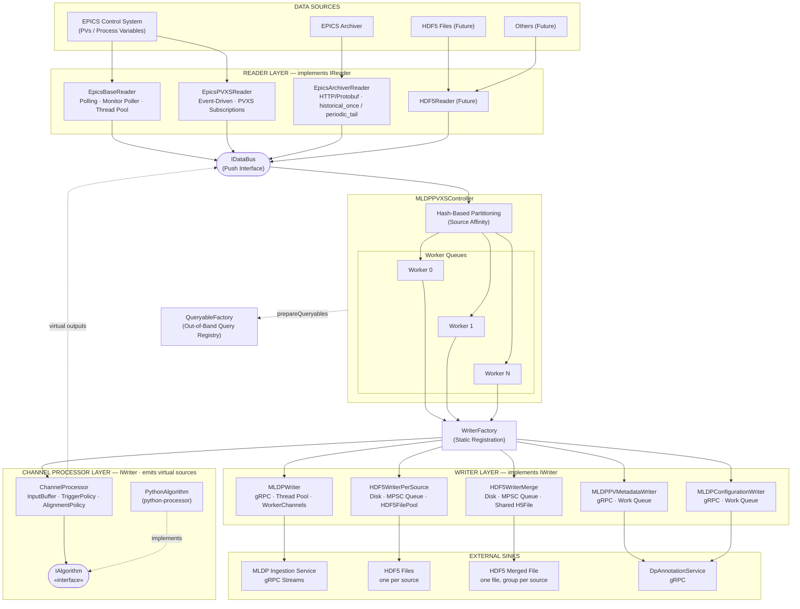
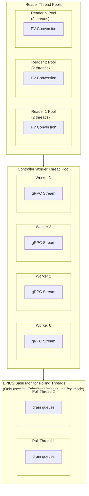
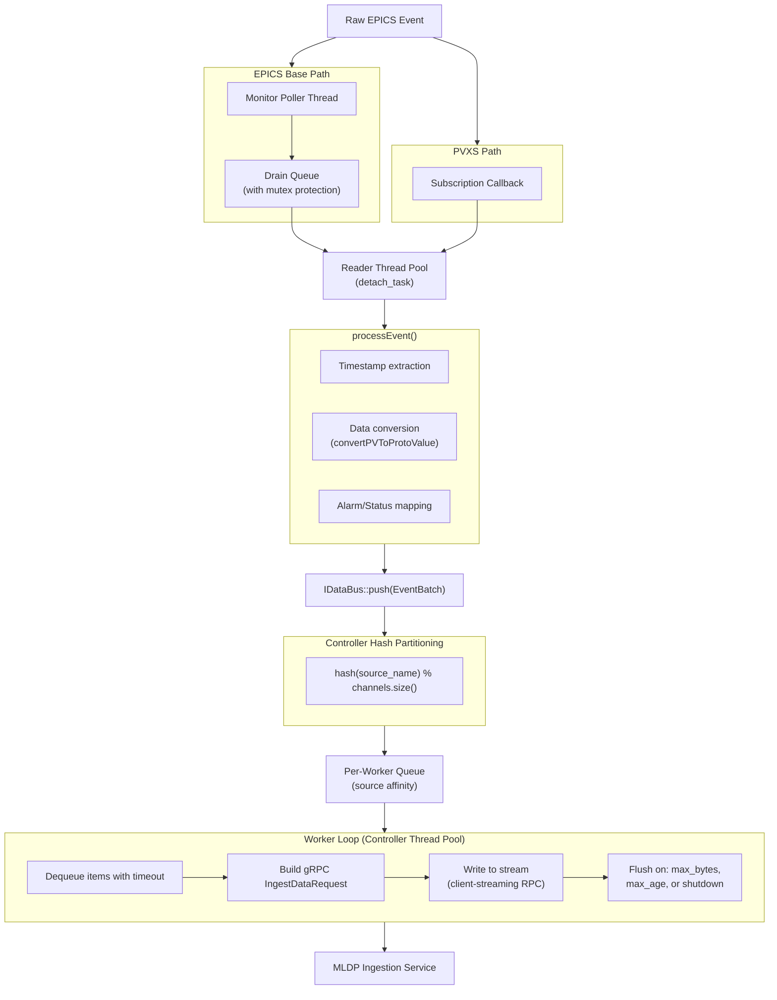

# MLDP PVXS Driver Architecture

## Overview

The MLDP PVXS Driver is a high-performance data ingestion system that bridges various data sources with the MLDP (Machine Learning Data Platform) service. It uses a push-based architecture designed for minimal latency and maximum throughput.

The driver implements an **abstract Reader pattern** that allows plugging in different data sources. Currently implemented are EPICS-based readers, with the architecture designed to support future implementations such as EPICS Archiver, HDF5 files, and other data sources.

## High-Level Architecture



## Reader Abstraction

The driver uses a **factory pattern** with abstract readers to support multiple data sources:

Reader Type      | Status      | Description
---------------- | ----------- | ---------------------------------------
`epics-base`     | Implemented | Polling-based EPICS Channel Access
`epics-pvxs`     | Implemented | Event-driven EPICS PVAccess (PVXS)
`epics-archiver` | Implemented | Historical / tail data from EPICS Archiver Appliance
`hdf5`           | Future      | Data replay from HDF5 files
Others           | Future      | Extensible for new data sources

All readers:

- Inherit from the abstract `Reader` base class
- Register via `REGISTER_READER` macro
- Push events through `IDataBus` interface
- Are decoupled from writer implementation
- Are mirrored on the writer side by `WriterFactory` and `REGISTER_WRITER`

For details on existing readers, see [Reader Types](../readers/readers.md). To implement a custom reader, see [Implementing Custom Readers](../readers/readers-implementation.md).

## Writer Abstraction

Writers are the **output side** of the pipeline. They consume `IDataBus::EventBatch` objects from worker queues and deliver data to a sink.

Writer Type          | Status      | Payload accepted                              | Description
-------------------- | ----------- | --------------------------------------------- | -------------------------------------------
`mldp`               | Implemented | `TimeSeriesPayload`                           | Streams data to MLDP ingestion service (gRPC)
`hdf5`               | Implemented | `TimeSeriesPayload`                           | One rotated HDF5 file per `root_source` on disk
`hdf5-merge`         | Implemented | `TimeSeriesPayload`                           | All sources in one shared rotating HDF5 file (one group per source)
`mldp-annotation`    | Implemented | `SourceMetadataPayload`                       | Persists PV source metadata via annotation gRPC service
`mldp-configuration` | Implemented | `ConfigurationPayload`, `ConfigurationActivationPayload` | Persists configuration objects and activation windows via annotation gRPC service

All writers:

- Implement the `IWriter` pure abstract interface (`include/writer/IWriter.h`)
- Register via `REGISTER_WRITER` macro (static init, before `main`)
- Are instantiated and managed by `WriterFactory`
- Receive `EventBatch` via thread-safe `push()` method

```
IWriter  (pure abstract)
├── MLDPWriter              (type "mldp")               → gRPC → MLDP ingestion service
├── MLDPPVMetadataWriter    (type "mldp-pv-metadata")   → gRPC → DpAnnotationService.savePvMetadata
├── MLDPConfigurationWriter (type "mldp-configuration") → gRPC → DpAnnotationService.saveConfiguration / saveConfigurationActivation
└── HDF5WriterBase          → HDF5 files on local disk  (abstract)
      ├── HDF5WriterPerSource   (type "hdf5"       — one file per root_source via HDF5FilePool)
      └── HDF5WriterMerge       (type "hdf5-merge" — all sources share one rotating H5 file)
```

### EventBatch Payload Variants

`EventBatchStruct` carries a `BatchPayload` variant (`std::variant<…>`) that determines which writer types process it.  Use the free helpers in `IDataBus.h` to inspect the active alternative:

| Payload type | Helper | Accepted by |
|---|---|---|
| `TimeSeriesPayload` | `isTimeSeries(b)` / `asTimeSeries(b)` | `MLDPWriter`, `HDF5WriterPerSource`, `HDF5WriterMerge` |
| `SourceMetadataPayload` | `isSourceMetadata(b)` / `asSourceMetadata(b)` | `MLDPPVMetadataWriter` |
| `ConfigurationPayload` | `isConfiguration(b)` / `asConfiguration(b)` | `MLDPConfigurationWriter` |
| `ConfigurationActivationPayload` | `isConfigurationActivation(b)` / `asConfigurationActivation(b)` | `MLDPConfigurationWriter` |

Each `EventBatchStruct` also carries:
- `reader_name` — identity of the producing reader (used for routing decisions).
- `root_source` — primary PV/signal name for metrics and hash partitioning.
- `metadata` — `unordered_map<string,string>` key/value annotations merged from reader `static-metadata` and per-PV `metadata` config.  Forwarded as `ColumnProvenance.source` labels in gRPC ingestion requests.

### MLDPWriter

- Type key: `"mldp"`
- Owns `MLDPGrpcIngestionPool` (connection pool)
- N worker threads, each with own `WorkerChannel` (mutex + deque)
- `push()` distributes frames across workers via round-robin
- Flushes gRPC stream on `stream-max-bytes` or `stream-max-age-ms`

### HDF5WriterBase (shared base)

- Requires CMake build option: `MLDP_PVXS_ENABLE_HDF5=ON` (which defines `MLDP_PVXS_HDF5_ENABLED`)
- Owns bounded MPSC queue (capacity 8192) drained by dedicated writer thread
- Dedicated flush thread calls `doFlushAll()` every `flush-interval-ms`
- Accumulates tabular (NTTable) frames in `TabularBuffer` per source; flushes on `end_of_batch_group`
- Subclasses implement pure-virtual hooks: `writeFrameImpl`, `flushTabularBufferImpl`, `doFlushAll`, `doStart`, `doStop`

### HDF5WriterPerSource

- Type key: `"hdf5"`
- One HDF5 file per `root_source`, managed by `HDF5FilePool`
- Files rotate on age (`max-file-age-s`) or size (`max-file-size-mb`) inside `pool->acquire()`
- HDF5 layout (columnar): `timestamps` dataset (int64, ns-epoch) + one dataset per column (1-D unlimited + chunked)
- HDF5 layout (NTTable/BSAS): one group per source with `secondsPastEpoch`, `nanoseconds`, and signal datasets

### HDF5WriterMerge

- Type key: `"hdf5-merge"`
- All `root_source`s share a single rotating HDF5 file; each source gets its own group `/<source_name>/`
- `supports_multi_root_source()` returns `true`
- Single `mergeFileMutex_` serialises all file access (writer thread + flush thread)
- Rotation triggered when any source pushes the file past age or size threshold; all groups recreated in new file
- HDF5 layout: `/<source>/timestamps` + `/<source>/<col>` datasets (same types as per-source)

### MLDPPVMetadataWriter

- Type key: `"mldp-pv-metadata"`
- Accepts only `SourceMetadataPayload` batches (`acceptsPayload()` filters others).
- Expands each `{source → SourceMetadataEntry}` map entry into an individual work item.
- N worker threads (configurable `thread-pool`) drain the queue via `savePvMetadata` RPC.
- Connection pool: `MLDPGrpcAnnotationPool` backed by `annotation-url`.

### MLDPConfigurationWriter

- Type key: `"mldp-configuration"`
- Accepts `ConfigurationPayload` and `ConfigurationActivationPayload` batches.
- Dispatches to `saveConfiguration` or `saveConfigurationActivation` RPC based on the active variant.
- Same threading model as `MLDPPVMetadataWriter` (work queue + N workers).
- Shares `MLDPGrpcAnnotationPool` connection pool type with annotation writer.

### QueryableFactory

`QueryableFactory` (singleton) is a type-keyed registry for query clients. It is separate from `IDataBus` (which is push-only) and supports out-of-band metadata and data queries. It sits alongside the controller (see diagram) as an independent access point — not part of the push pipeline.

- **Prepare at startup** (in `MLDPPVXSController::start()`): `prepareQueryables()` iterates `queryable:` config entries and calls `QueryableFactory::instance().prepare<T>(cfg, metrics)` for each known type.
- **Create at runtime**: any component calls `QueryableFactory::instance().create<MLDPQueryClient>()` to get a fresh client; the factory constructs it from the stored config closure.
- **Supported types**: `MLDPQueryClient` (type key `"mldp"`), `MLDPAnnotationQueryClient` (type key `"mldp-annotation"`).
- Thread-safe: uses a `std::shared_mutex` on the internal creators map.

**Current use**: startup initialization and test fixtures that need to issue ad-hoc queries (e.g. verify ingested data, fetch annotation metadata) without going through `IDataBus`.

**Future use**: the factory is positioned as the query interface for decision-making components — for example algorithms that inspect historical data or existing annotations to decide what to ingest, generate derived signals, or trigger additional processing. Because `QueryableFactory` is decoupled from the push path, these consumers can be added without touching the reader/writer pipeline.

→ [Query Client Documentation](../dev/query-client.md)

## Channel Processor Layer

Channel processors are **writer-compatible algorithm engines** that consume input source batches, run an algorithm, and publish virtual output sources back onto `IDataBus`. They implement `IWriter` so the controller routes real-source batches to them via the existing `routing:` mechanism; their algorithm outputs are re-injected into the bus as new `EventBatch` entries and flow through the normal writer pipeline from there.

```
IChannelProcessor  (extends IWriter)
└── ChannelProcessor  (runtime — owns InputBuffer + IAlgorithm)
      ├── AlignmentPolicy: latest-value | interpolate
      └── TriggerPolicy:   any-update | all-updated | interval
```

### Key Types

| Class | Role |
|---|---|
| `IAlgorithm` | Pure-virtual compute interface: `configure()`, `compute(AlignedSnapshot)`, `outputSources()`, `reset()` |
| `ChannelProcessor` | Concrete runtime — buffers source batches, aligns them, fires `IAlgorithm::compute()` on each trigger, pushes outputs back onto `IDataBus` |
| `ChannelProcessorFactory` | Keyed registry (parallel to `WriterFactory`) — processor types register at static-init time |
| `InputBuffer` | Accumulates per-source `DataBatch` entries and produces `AlignedSnapshot` on trigger |

### Built-in Processor Types

| Type key | Algorithm class | Build gate | Description |
|---|---|---|---|
| `linear-transform` | `LinearTransformAlgorithm` | always | `y = scale * x + bias` per source column |
| `python-processor` | `PythonAlgorithm` (one per script) | `BUILD_PYTHON_PROCESSOR=ON` | Bulk-loads `.py` scripts from a directory; each valid script becomes one `ChannelProcessor` |

### Configuration

Processors are declared under the top-level `processors:` sequence in the controller YAML. Each entry has a `type:` key that selects the factory plus standard processor keys (`name`, `sources`, `alignment`, `trigger`) used by all types:

```yaml
processors:
  - type: python-processor
    script-dir: /opt/scripts/my-processors    # required for python-processor
```

→ [Python Processor Documentation](../processors/python-processor.md)
→ [Full `processors:` YAML Reference](../guides/configuration.md#processors-block)

## Push Model Architecture

The driver implements a **high-performance push model** that decouples readers from the ingestion pipeline. This architecture ensures readers can continue monitoring PVs without waiting for gRPC writes to complete.

### Push Flow

1. **Event Detection**: Readers detect PV changes (via subscriptions or polling)
2. **Immediate Push**: Call `bus_->push(EventBatch)` immediately (non-blocking)
3. **Hash Partitioning**: Controller partitions events by source name hash
4. **Queue Distribution**: Events are enqueued to per-worker channels
5. **Async Batching**: Workers asynchronously batch and flush to MLDP

### Source-Affinity Hash Partitioning

The controller uses hash-based partitioning to ensure efficient stream utilization:

```cpp
auto idx = std::hash<std::string>{}(src_name) % channels_.size();
per_channel[idx].emplace_back(src_name, std::move(events));
```

**Benefits:**

- Same source always routes to same worker (stream coherence)
- Different sources can use different workers (parallelism)
- Hash distribution provides automatic load balancing
- Stream affinity enables efficient batching

### Per-Worker Architecture

Each worker maintains its own queue and gRPC stream:

```
WorkerChannel {
    mutex              // Protects queue access
    condition_variable // Signals queue has items
    deque<QueueItem>   // Batched work items
    shutdown flag      // Graceful stop signal
}
```

**Worker Loop Lifecycle:**

1. Block on condition variable with timeout (enables idle detection)
2. Dequeue item (source + columns)
3. Build single gRPC `IngestDataRequest`
4. Write to stream (client-streaming RPC)
5. Manage stream rotation based on thresholds

### Stream Rotation

Streams are rotated based on:

- **max_bytes**: Stream reached byte threshold (default: ~2MB)
- **max_age**: Stream exceeded age limit (default: 200ms)
- **write_failed**: gRPC write error occurred
- **idle**: No activity for max_age duration
- **shutdown**: Controller stopping

## Multithreading Model

### Three-Tier Thread Pool Architecture



### Thread Pool Types

Pool                 | Location             | Purpose                        | Default Size
-------------------- | -------------------- | ------------------------------ | ------------
Reader Pool          | Per-Reader           | Convert EPICS data to protobuf | 2 threads
Controller Pool      | MLDPPVXSController   | Process batches, write to gRPC | 2 threads
Monitor Poll Threads | EpicsBaseReader only | Poll EPICS Base queues         | 2 threads

### Conditional Parallelization

The PVXS reader implements smart threading decisions:

```cpp
// Bypass thread pool overhead for single-threaded scenarios
reader_pool_->get_thread_count() > 1 ? reader_pool_.get() : nullptr
```

- When thread count is 1: bypass thread pool (direct execution)
- When thread count > 1: use thread pool for parallel conversion

## Event Processing Pipeline



## Key Design Patterns

### Factory Pattern (ReaderFactory / WriterFactory)

- Runtime reader type selection via YAML configuration
- Static registration via `REGISTER_READER` macro
- Extensible for new reader backends
- Writer selection follows the same pattern via `WriterFactory` and `REGISTER_WRITER`

### Template Method Pattern (EpicsReaderBase)

- Common threading/configuration logic in base class
- Subclasses implement `addPV()` and `processEvent()`

### RAII (PooledHandle)

- Automatic gRPC connection release on handle destruction
- Prevents connection leaks

### Producer-Consumer (Event Bus)

- `IDataBus` interface decouples readers from controller
- `MLDPQueryClient` handles out-of-band metadata/data queries instead of `IDataBus`
- Async event delivery via thread pools
- Workers dispatch `EventBatch` to registered `IWriter` instances (`MLDPWriter`, `HDF5WriterPerSource`, `HDF5WriterMerge`)
- Optional **reader-to-writer routing** selectively dispatches batches based on config — see [Controller Documentation](controller.md#reader-to-writer-routing)
- Optional **source filtering** per writer via `include`/`exclude` glob patterns on `root_source` — see [Controller Documentation](controller.md#source-filtering)


## Cross-Cutting Utilities

### Logging Abstraction

The driver uses a logging abstraction layer (`util::log`) so library code is not coupled to a specific backend. The executable can install a concrete logger implementation (for example the spdlog-backed adapter).

- Detailed guide: [Logging Abstraction Guide](../dev/logging.md)
- Logging interface and helpers: `include/util/log/ILog.h`, `include/util/log/Logger.h`
- Default/simple logger implementation: `include/util/log/CoutLogger.h`, `src/util/log/CoutLogger.cpp`
- spdlog adapter used by the executable: `include/SpdlogLogger.h`, `src/cli/SpdlogLogger.cpp`

### HTTP Transport Provider (`util/http`)

HTTP-based readers can use the shared `util/http` transport abstraction instead of managing raw `libcurl` directly. This centralizes TLS defaults, timeouts, header handling, and streaming callback plumbing.

- Detailed documentation: [HTTP Transport Provider](../dev/http-provider.md)

## Routing and Source Filtering

By default every reader feeds every writer (**all-to-all**). The optional `routing:` block enables two independent filtering axes:

### Reader-to-Writer Routing

Each writer declares which readers it accepts via `from:`. Use the sentinel `"all"` to accept every reader.

```yaml
routing:
  mldp_main:
    from: [scalar_reader, bsas_reader]  # only these readers feed mldp_main
  hdf5_bsas:
    from: [bsas_reader]                 # only bsas_reader feeds hdf5_bsas
  monitoring:
    from: [all]                         # every reader feeds monitoring
```

- Writer absent from `routing:` → receives **nothing** when routing is active.
- Lookup cost: O(1) per writer per batch (hash map).
- Route table built once at startup; immutable at runtime — no mutex needed in hot path.

### Source Filtering (include / exclude)

Each routing entry can additionally filter by `root_source` name using `fnmatch(3)` glob patterns:

```yaml
routing:
  hdf5_local:
    from: [pvxs_reader]
    include:
      - "LINAC:BPM:*"    # accept only BPM sources
      - "GUN:SOL:*"      # and gun solenoids
    exclude:
      - "LINAC:TEST:*"   # drop test PVs even if matched by include
```

Filter logic per batch (keyed on `root_source`):

| `include` | `exclude` | Result |
|---|---|---|
| absent | absent | all sources pass |
| present | absent | only sources matching an include glob pass |
| absent | present | all sources pass except those matching an exclude glob |
| present | present | sources matching include AND NOT matching exclude pass |

`*` matches `:` in EPICS PV names. Matching is case-sensitive.

### Startup Validation

At startup, the controller:
1. Rejects unknown writer or reader names in `routing:` with `std::runtime_error`.
2. Logs warnings for **orphan readers** (not feeding any writer) and **orphan writers** (receiving no data).

> 📖 Full details and examples: [controller.md](controller.md#reader-to-writer-routing)


## Configuration

### Controller Settings

The controller config (`MLDPPVXSControllerConfig`) holds five top-level keys — no thread-pool or stream knobs at this level; those live in each writer's config.

```yaml
name: my_controller   # optional; default: "default"; used as Prometheus label 'controller'

writer:           # required; at least one writer instance must be present or controller fails to start
  mldp:
      ...

reader:           # list of reader instances (by type)
  - epics-pvxs:
      ...

routing:          # optional; selective reader-to-writer dispatch
  writer_name:
    from: [reader_1, reader_2]   # reader names; use "all" to accept every reader
    include: ["SITE:BPM:*"]      # optional; glob patterns on root_source; absent = accept all
    exclude: ["SITE:TEST:*"]     # optional; glob patterns on root_source; applied after include

metrics:          # optional Prometheus / metrics config
  ...
```

> **Note:** `name` scopes all controller-emitted Prometheus metrics under a `controller` label. Run multiple controller instances with distinct names to avoid metric collisions.

→ [Full Controller Documentation](controller.md)


### Reader Settings

```yaml
reader:
  - epics-pvxs:
      - name: my_reader
        thread-pool: 2
        pvs:
          - name: PV_NAME
```

### Writer Settings

```yaml
writer:
  mldp:
    - name: mldp_main                  # required, unique instance name
      thread-pool: 4                   # worker threads (default: 1)
      stream-max-bytes: 2097152        # gRPC stream flush threshold (~2MB)
      stream-max-age-ms: 200           # gRPC stream age flush (ms)
      mldp-pool:
        provider-name: my_provider
        ingestion-url: grpc://host:50051
        query-url: grpc://host:50052
        min-conn: 1
        max-conn: 4

  hdf5:                                # requires -DMLDP_PVXS_ENABLE_HDF5=ON build option
    - name: hdf5_local                 # required, unique instance name
      base-path: /data/hdf5            # required, output directory
      max-file-age-s: 3600             # rotate after N seconds (default: 3600)
      max-file-size-mb: 512            # rotate at N MiB (default: 512)
      flush-interval-ms: 1000          # flush thread period ms (default: 1000)
      compression-level: 0             # DEFLATE 0–9; 0 = off (default: 0)

  hdf5-merge:                          # requires -DMLDP_PVXS_ENABLE_HDF5=ON build option
    - name: hdf5_merged                # required, unique instance name
      base-path: /data/hdf5-merged     # required, output directory
      max-file-age-s: 3600             # rotate after N seconds (default: 3600)
      max-file-size-mb: 512            # rotate at N MiB (default: 512)
      flush-interval-ms: 1000          # flush thread period ms (default: 1000)
      compression-level: 0             # DEFLATE 0–9; 0 = off (default: 0)

  mldp-pv-metadata:
    - name: pv_metadata_main
      thread-pool: 2
      deadline-seconds: 10
      mldp-pv-metadata-pool:
        annotation-url: grpc://annotation-host:50053
        min-conn: 1
        max-conn: 4

  mldp-configuration:
    - name: cfg_writer
      thread-pool: 2
      deadline-seconds: 10
      mldp-annotation-pool:
        annotation-url: grpc://annotation-host:50053
        min-conn: 1
        max-conn: 4
```

## Metrics & Observability

The driver exposes Prometheus metrics for monitoring:

### Reader Metrics

- `mldp_pvxs_driver_reader_events_received_total`
- `mldp_pvxs_driver_reader_events_total`
- `mldp_pvxs_driver_reader_errors_total`
- `mldp_pvxs_driver_reader_processing_time_ms`
- `mldp_pvxs_driver_reader_pool_queue_depth`

### Bus Metrics

- `mldp_pvxs_driver_bus_push_total`
- `mldp_pvxs_driver_bus_failure_total`
- `mldp_pvxs_driver_bus_payload_bytes_total`
- `mldp_pvxs_driver_bus_stream_rotations_total`

### Controller Metrics

- `mldp_pvxs_driver_controller_send_time_seconds`
- `mldp_pvxs_driver_controller_queue_depth`
- `mldp_pvxs_driver_controller_channel_queue_depth`

### Pool Metrics

- `mldp_pvxs_driver_pool_connections_in_use`
- `mldp_pvxs_driver_pool_connections_available`

### HDF5 Writer Metrics

- `mldp_pvxs_driver_hdf5_batches_written_total`
- `mldp_pvxs_driver_hdf5_rows_written_total` (label: `source`)
- `mldp_pvxs_driver_hdf5_bytes_written_total` (label: `source`)
- `mldp_pvxs_driver_hdf5_queue_depth`
- `mldp_pvxs_driver_hdf5_queue_drops_total`
- `mldp_pvxs_driver_hdf5_file_rotations_total` (label: `source`)
- `mldp_pvxs_driver_hdf5_write_latency_ms`
